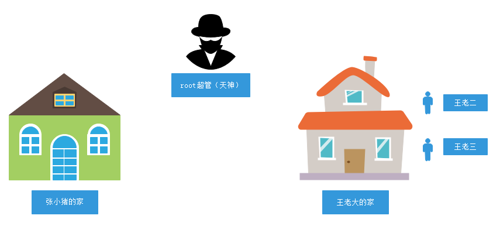
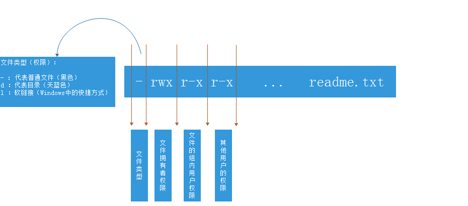
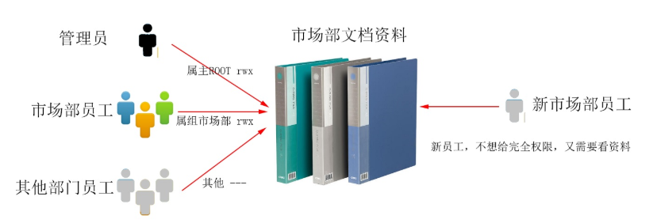

# Linux的权限管理操作

# 一、权限概述

## 1、权限的基本概念

在多用户计算机系统的管理中，权限是指某个特定的用户具有特定的系统资源使用权利。

在Linux 中分别有读、写、执行权限：

|       | 权限针对文件                                                 | 权限针对目录                                                 |
| ----- | ------------------------------------------------------------ | ------------------------------------------------------------ |
| 读r   | 表示可以查看文件内容；cat                                    | 表示可以(ls)查看目录中存在的文件名称                         |
| 写w   | 表示可以更改文件的内容；vim 修改，保存退出                   | 表示是否可以删除目录中的子文件或者新建子目录(rm/touch/mkdir) |
| 执行x | 表示是否可以开启文件当中记录的程序,一般指二进制文件(.sh) => 绿色 | 表示是否可以进入目录中(cd)                                   |

> 注：一般给予目录读权限时，也将会给其执行权限，属于“套餐”组合
>
> 可读权限 read => r（简写），可写权限 write => w（简写），可执行权限 excute => x（简写）

## 2、为什么要设置权限

1）服务器中的数据价值

2）员工的工作职责和分工不同

3）应对自外部的攻击(挂马)

4）内部管理的需要

## 3、Linux用户身份类别

Linux 系统一般将文件权限分为3 类：

read（读）

write（写）

execute（执行）

**==谁==**对文件有读，写，执行的权限呢？ 答：针对三大类用户

## 4、user文件拥有者

文件的拥有者：默认情况下，谁创建了这个文件谁就是文件的拥有者。文件的拥有者可以进行更改并不是一成不变的。

裴凯 => linux.txt，默认情况下，裴凯就是linux.txt文件的拥有者

## 5、group文件所属组内用户

group所属组内用户代表与文件的所属组相同的组内用户。

比如，裴凯与罗新兴、周卓都同属于一个itheima的用户组，罗新兴和周卓就是这个文件的组内用户。

## 6、other其他用户

other其他用户代表这些人既不是文件的拥有者，也不是文件所属组内的用户，我们把这些人就称之为other其他用户。

## 7、特殊用户root

在Linux操作系统中，root拥有最高权限（针对所有文件），所以权限设置对root账号没有效果。



> 在Linux系统中，三大类用户也可以拥有简写形式user(u)、group(g)、other(o)

# 二、普通权限管理

## 1、ls -l命令查看文件权限

基本语法：

```powershell
# ls -l
或
# ll
```

> 备注：ll命令是红帽以及CentOS系统特有的一个命令，在其他操作系统中可能并不支持


## 2、文件类型+权限解析



Linux一共有7种文件类型,分别如下:
-：普通文件
d：目录文件
l： 软链接（类似Windows的快捷方式）

(下面四种是特殊文件)
b：block，块设备文件（例如硬盘、光驱等）
p：管道文件
c：字符设备文件（例如猫(上网猫)等串口设备）
s：套接口文件/数据接口文件（例如启动一个MySql服务器时会产生一个mysql.sock文件）

## 3、文件或文件夹权限设置（字母）

基本语法：ch = change mod简单理解权限

```powershell
# chmod [选项] 权限设置 文件或目录的名称
选项说明：
-R ：递归设置，针对文件夹（目录）
```

> 重点：字母设置并不难，重点看三方面
>
> 第一个：确认要给哪个身份设置权限，u、g、o、ugo(a)
>
> 第二个：确认是添加权限(+)、删除权限(-)还是赋予权限(=) 
>
> 第三个：确认给这个用户针对这个文件或文件夹设置什么样的权限，r、w、x

案例：给readme.txt文件的拥有者，增加一个可执行权限

```powershell
# chmod u+x readme.txt
```

案例：把readme.txt文件的拥有者的可执行权限去除

```powershell
# chmod u-x readme.txt
```

案例：为readme.txt中的所属组内用户赋予rw权限

```powershell
# chmod g=rw readme.txt
```

案例：给shop目录及其内部的文件统一添加w可写权限

```powershell
# chmod -R ugo+w shop
或
# chomd -R a+w shop
```

案例：给shop目录设置权限，要求拥有者rwx，组内用户r-x，其他用户r-x

```powershell
# chmod -R u=rwx,g=r-x,o=r-x shop
```

## 4、文件或文件夹权限设置（数字）

 经常会在技术网站上看到类似于# chmod 777 a.txt 这样的命令，这种形式称之为==数字形式权限==。

文件**权限与数字**的对应关系，我们会发现**没有7**这个数字

| 权限 | 对应数字 | 意义     |
| ---- | -------- | :------- |
| r    | 4        | 可读     |
| w    | 2        | 可写     |
| x    | 1        | 可执行   |
| -    | 0        | 没有权限 |

777 ：

第一个数字7，代表文件拥有者权限

第二个数字7，代表文件所属组内用户权限

第三个数字7，代表其他用户权限

rwx = 4 + 2 + 1 = 7

rw = 4 + 2 = 6

rx = 4 + 1 = 5

案例：给readme.txt设置权限，文件的拥有者rwx，组内用户rw，其他用户r

```powershell
rwx = 7
rw = 6
r = 4
# chmod 764 readme.txt
```

案例：给shop文件夹设置777权限

```powershell
# chmod -R 777 shop
```

## 5、奇葩权限

问题：用超级管理员设置文档的权限命令是# chmod  -R  731 shop，请问这个命令有没有什么不合理的地方？

答：731权限进行拆解

7 = 4 + 2 + 1 = rwx

3 = 2 + 1 = wx

1 = x

问题在权限731中的3权限，3表示写+执行权限，但是写又必须需要能打开之后才可以写，因此必须需要具备可读权限，因此此权限设置不合理。

注：实际工作中，各位小伙伴在设置权限时一定不要设置这种"奇葩权限"，一般情况下，单独出现2、3的权限数字一般都是有问题的权限。

## 6、练习题

1）使用root 用户设置文件夹/root/shop 的权限为：属主全部权限，属组拥有读和执行权限，其他用户没有权限，请使用数字权限的形式设置

```powershell
rwx=7,rx=4+1=5,0
# chmod -R 750 /root/shop
```

2）请置文件/root/readme.txt 的权限，权限要求为：

​        属主拥有**全部**权限，属组要求可以**读写**，其他用户**只读**，要求使用数字形式；

```powershell
rwx=7,rw=4+2=6,r=4
# chmod 764 /root/readme.txt
```

3）请设置/root/email.doc权限，权限要求只有属主可以读写，除此之外任何人没有权限；

```powershell
rw=6,0,0
# chmod 600 /root/email.doc
```

## 7、特殊权限说明

在Linux 中，如果要删除一个文件，不是看文件有没有对应的权限，而是看文件所在的==目录是否有写权限==，如果有才可以删除（同时必须具备执行权限）。

```powershell
/shell/readme.txt
我们想删除readme.txt文件，必须要对shell目录具有可写权限，否则文件无法删除
```

# 三、文件拥有者以及文件所属组设置

文件拥有者：属主

文件所属组：属组

## 1、什么是属主与属组

属主：所属的用户，文档所有者，这是一个账户，这是一个人

属组：所属的用户组，这是一个组

## 2、文件拥有者与所属组的查看

```powershell
# ls -l
或
# ll
```


## 3、了解文件的拥有者与文件所属组来源

在Linux操作系统中，每个文件都是由Linux系统用户创建的。

在Linux操作系统中，每个用户都具有一个用户名称以及一个主组的概念

```powershell
# su - itheima
# touch readme.txt
# ll readme.txt
-rw-rw-r--. 1 itheima itheima 0 Mar 20 15:17 readme.txt
```

## 4、为什么需要更改文件拥有者与所属组

一个财务表格，以前由胡一菲进行更新，她有读写权限，现在胡一菲去阿拉善沙漠找曾老师了，改权限没用，需要把属主改成诸葛大力，由诸葛大力更新。

## 5、文件拥有者设置

基本语法：ch = change ，own = owner

```powershell
# chown [选项] 新文件拥有者名称 文件名称
选项说明：
-R ：代表递归修改，主要针对文件夹
```

案例：把/root/readme.txt文件的拥有者更改为itheima

```powershell
# chown itheima /root/readme.txt
```

案例：把/root/shop文件夹的拥有者更改为linuxuser

```powershell
# chown -R linuxuser /root/shop
```

## 6、文件所属组的设置

基本语法： ch = change , group，chgrp

```powershell
# chgrp [选项] 新文件所属组名称 文件名称
选项说明：
-R : 代表递归修改，主要针对文件夹
```

案例：把/root/readme.txt文件的所属组名称更改为itheima

```powershell
# chgrp itheima /root/readme.txt
```

案例：把/root/shop文件夹的所属组名称也更改为itheima

```powershell
# chgrp -R itheima /root/shop
```

## 7、chown同时修改属主与属组

基本语法：

```powershell
# chown [选项] 文件拥有者名称:文件所属组名称 文件名称
或
# chown [选项] 文件拥有者名称.文件所属组名称 文件名称
选项说明：
-R : 代表递归修改，主要针对文件夹
```

案例：readme.txt文件的拥有者与所属组同时更改为root

```powershell
# chown root:root readme.txt
或
# chown root.root readme.txt
```

案例：更改shop目录的拥有者以及所属组为root

```powershell
# chown -R root:root shop
或
# chown -R root.root shop
```

# 四、特殊权限（扩展）

## 1、设置位S（针对二进制文件）

### ☆ 设置位S的作用

作用：为了让一般使用者临时具有该文件所属主/组的执行权限。

主要针对二进制文件（命令）


例如：/usr/bin/passwd在执行它的时候需要去修改/etc/passwd和/etc/shadow等文件，这些文件除了root外，其他用户都没有写权限，但是又为了能让普通用户修改自己的密码，该怎么办呢？

> whereis命令，主要功能就是查询某个命令所在的路径，基本语法 => whereis  passwd

itheima普通账号 => 执行/usr/bin/passwd => 修改/etc/shadow文件（存放用户的密码）

> /etc/shadow文件比较特殊，其权限为--- --- ---（000），除root外，其他人都没有权限

### ☆ 去除S位权限

```powershell
# chmod u-s /usr/bin/passwd 
或者
# chmod 0755 /usr/bin/passwd
```

### ☆ 添加S位权限

```powershell
# chmod u+s /usr/bin/passwd
或者
# chmod 4755 /usr/bin/passwd
```

## 2、沾滞位T（针对文件夹）

### ☆ 粘滞位作用

基本语法：

```powershell
# chmod -R o+t 文件夹的名称
或
# chmod -R 1777 文件夹的名称
```

==主要功能：只允许文件的创建者和root用户删除文件（防止误删除权限位）==

案例：/tmp文件夹，拥有最高权限777，比如itheima创建了一个文件在此目录，linuxuser用户可以对其进行删除操作，这种显然不太合适。

7 = r + w + x = 可读、可写、可执行

案例：使用ls -l命令查看/tmp目录权限

```powershell
# ls -ld /tmp
或
# ll -d /tmp
```

### ☆ 移除粘滞位

```powershell
# chmod -R o-t /tmp
或
# chmod -R 0777 /tmp
```

### ☆ 添加粘滞位

```powershell
# chmod -R o+t /tmp
或
# chmod -R 1777 /tmp
```

# 五、ACL访问控制

## 1、为什么需要ACL



ACL，是 Access Control List（访问控制列表）的缩写，在 Linux 系统中， ACL 可实现对单一用户设定访问文件的权限。

> 扩展：ACL权限可以针对某个用户，也可以针对某个组。ACL优势就是让权限控制更加的精准。

## 2、获取某个文件的ACL权限

基本语法：

```powershell
# getfacl 文件或目录名称
```

## 3、给某个文件设置ACL权限

```powershell
# setfacl [选项] 文件或目录名称
选项说明：
-m ： 修改acl策略
-x ： 去掉某个用户或者某个组的权限
-b ： 删除所有的acl策略

-R  ：递归,通常用在文件夹
```

案例：针对readme.txt文件给linuxuser设置一个权限=>可读

```powershell
# setfacl -m u:linuxuser:r readme.txt	=>  针对某个用户开通ACL权限
```

案例：针对shop文件夹给itheima组设置一个权限=>可读可写权限rw

```powershell
# setfacl -R -m g:itheima:rw shop	=> 	针对某个用户组开通ACL权限
```

案例：把linuxuser用户权限从readme.txt中移除掉

```powershell
# setfacl -x u:linuxuser readme.txt
```

案例：把itheima用户组权限从shop中移除掉

```powershell
# setfacl -x -R g:itheima shop
```

案例：把readme.txt文件中的所有ACL权限全部移除

```powershell
# setfacl -b readme.txt
```

# 六、umask（了解，不要更改！！！）

## 1、什么是umask

umask表示创建文件时的默认权限（即创建文件时不需要设置而天生的权限）

 root用户下，touch a ，文件a的默认权限是644

 普通用户下，touch b ，文件b的默认权限是664 

644和664我们并没有设置，其中的关键因素就是**umask**

> 扩展：实际上我们创建一个普通文件最高权限666。而创建一个文件夹其最高权限777
>
> 实际文件权限 = 最高权限 - umask的值

## 2、获取用户的umask值

```powershell
# umask
0022
注：0022中第一位0代表特殊权限位，可以不设置。
umask的默认值，在root和普通用户下是不一样的，分别是022和002
```

为什么文件在root下创建就是644，在itheima下就是664

root : 666 - 022 = 644

itheima：666 - 002 = 664

## 3、修改umask值（一定不要改）

### ☆ 临时修改（重启后失效）

```powershell
# umask 002
777 - 002 = 775
```

### ☆ 永久修改

```powershell
# vim ~/.bashrc 
① 在文件末尾添加umask 002
② 保存退出 
③ su切换用户则立即生效
```

