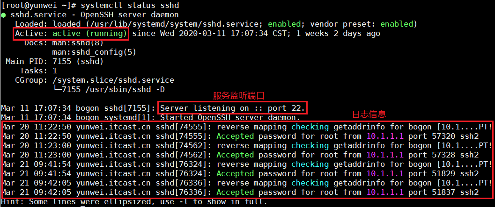
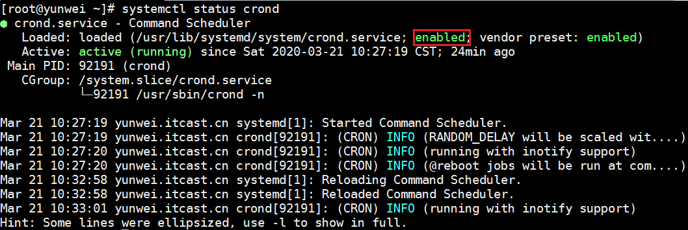
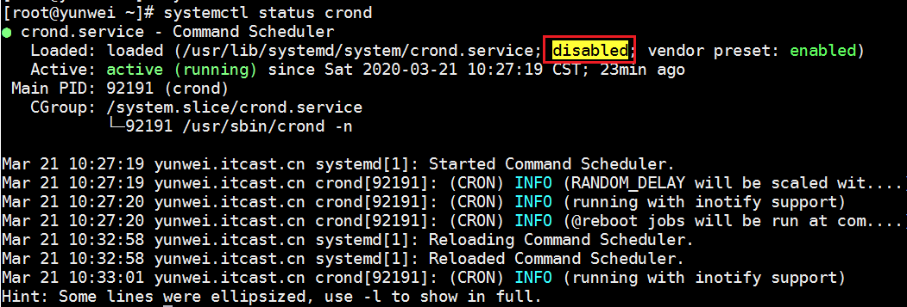
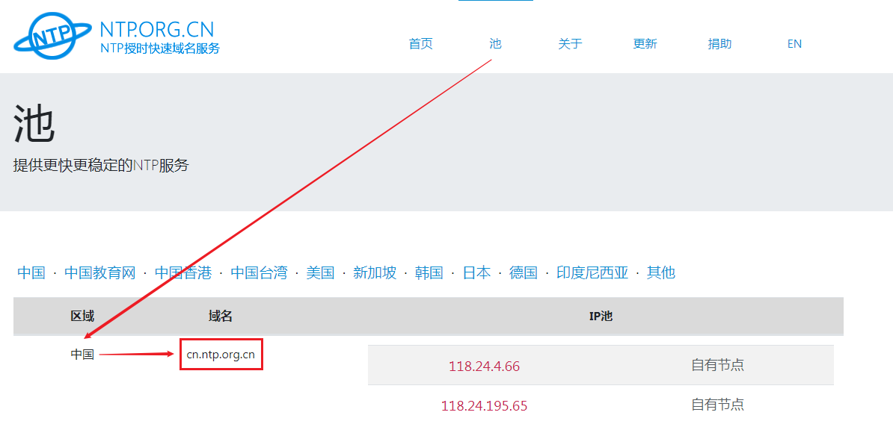

# Linux自有服务与软件包管理

服务是一些特定的进程，自有服务就是系统开机后就自动运行的一些进程，一旦客户发出请求，这些进程就自动为他们提供服务，windows系统中，把这些自动运行的进程，称为"服务"

举例：当我们使用SSH客户端软件连接linux的时候，我们的服务器为什么会对连接做出响应？是因为SSH服务开机就自动运行了。

所谓自有服务，简单来说，可以理解为Linux系统开机自动运行的服务（程序）。

# 一、systemctl管理系统服务

## 1、systemctl概述

CentOS6版本：

service命令（管理服务开启、停止以及重启）+ chkconfig（定义开机启动项）

```powershell
# service network start|stop|restart
```

CentOS7版本：

systemctl命令 = system系统 + control控制（服务管理+开启启动项管理）

```powershell
# systemctl start|stop|restart network
```

## 2、显示系统服务

基本语法：

```powershell
# systemctl [选项]
选项说明：
list-units --type service --all：列出所有服务（包含启动的和没启动的）
list-units --type service：列出所有启动的服务
```

案例：列出Linux系统中所有的服务（包含启动的和没启动的）

```powershell
# systemctl list-units --type service --all
```

案例：只列出已经启动的Linux系统服务

```powershell
# systemctl list-units --type service
```

案例：把systemctl显示系统服务与管道命令相结合，筛选我们想要的服务信息

```powershell
# systemctl list-units --type service | grep sshd
```

## 3、Linux系统服务管理

### ☆ status查看状态

查看系统服务的状态

```powershell
# systemctl status 系统服务的名称
```

案例：查询系统中网络服务的状态信息

```powershell
# systemctl status network
```


案例：查询系统中sshd服务的状态信息

```powershell
# systemctl status sshd
```



### ☆ stop停止服务

```powershell
# systemctl stop 系统服务的名称
```

案例：使用systemctl命令停止network网络服务

```powershell
# systemctl stop network
```

### ☆ start启动服务

```powershell
# systemctl start 系统服务的名称
```

案例：使用systemctl命令启动network网络服务

```powershell
# systemctl start network
```

### ☆ restart重启服务

```powershell
# systemctl restart 系统服务的名称
等价于
# systemctl stop 系统服务的名称
# systemctl start 系统服务的名称
```

案例：使用systemctl命令重启crond计划任务的服务信息

```powershell
# systemctl restart crond
```

### ☆ reload热重载技术

```powershell
# systemctl reload 系统服务名称
```

reload：重新加载指定服务的配置文件（并非所有服务都支持reload，通常使用restart)

> 有些服务，如Nginx，更改了配置文件，但是不能重启Nginx服务，只是想立即让我们配置文件的更改生效，则就可以使用热重载技术了。

案例：使用热重载技术重新加载crond服务

```powershell
# systemctl reload crond
```

## 4、服务持久化（开机自启与开机不自启）

 所谓服务持久化，就是服务在开机的时候，是否自动启动。

### ☆ 开机自启

```powershell
# systemctl enable 系统服务的名称
```

案例：把network网络服务设置为开机自启动

```powershell
# systemctl enable network
network.service is not a native service, redirecting to /sbin/chkconfig.
Executing /sbin/chkconfig network on

以上提示代表network.service不是一个本地的系统服务，所以想设置开机自启需要使用/sbin/chkconfig进行操作
# /sbin/chkconfig network on
```

案例：把crond计划任务的服务信息添加到开机自启动中

```powershell
# systemctl enable crond
```



### ☆ 开机不自启

```powershell
# systemctl disable 系统服务的名称
```

案例：把crond计划任务的服务信息从开机自启动中移除

```powershell
# systemctl disable crond
```



# 二、扩展：系统运行级别

## 1、什么是运行级别

运行级别全称（Running Level），代表Linux系统的不同运行模式

## 2、CentOS6的运行级别

```powershell
# vim /etc/inittab
0   系统关机状态   halt (Do NOT set initdefault to this)
1   单用户工作状态   Single user mode (类似Windows的安全模式，Linux忘记密码)
2   多用户状态（没有NFS） Multiuser, without NFS (The same as 3, if you do not have networking)
3   多用户状态（有NFS）   Full multiuser mode (字符模式,服务基本都是此模式)
4   系统未使用，留给用户   unused
5   图形界面    X11 (图形模式，个人计算机都是此模式)
6   系统正常关闭并重新启动   reboot (Do NOT set initdefault to this)
```

## 3、CentOS7的运行级别

```poweshell
0   shutdown.target
1   emergency.target
2   rescure.target
3   multi-user.target   字符模式
4   无
5   graphical.target    图形模式
6   无
```

## 4、init命令（临时更改运行模式）

```powershell
# init 模式编号
```

案例：立即关机

```powershell
# shutdown -h 0或now
或
# halt -p
或
# init 0
```

案例：立即重启

```powershell
# reboot
或
# init 6
```

案例：把计算机切换到字符模式（黑窗口）

```powershell
# init 3
```

案例：把计算机切换到图形模式（图形界面）

```powershell
# init 5
```

## 5、CentOS6中的chkconfig

问题：在CentOS7中，设置network开机启动时，系统要求使用chkconfig命令

```powershell
# chkconfig network on
```

设置完成后，怎么查看network有没有随开机自动启动呢？

```powershell
# chkconfig --list |grep network 
network        	0:off	1:off	2:on	3:on	4:on	5:on	6:off

0 关机模式
1 单用户模式
2 多用户模式（无NFS）
3 字符模式
4 自定义模式
5 图形模式
6 重启模式
```

# 三、NTP时间同步服务

## 1、什么是NTP服务

 NTP是网络时间协议(Network Time Protocol)，它是用来同步网络中各个计算机的时间的协议。

 工作场景：

​        公司开发了一个电商网站，由于访问量很大，网站后端由100台服务器组成集群。50台负责接收订单，50台负责安排发货，接收订单的服务器需要记录用户下订单的具体时间，把数据传给负责发货的服务器，由于100台服务器时间各不相同，记录的时间经常不一致，甚至会出现下单时间是明天，发货时间是昨天的情况。

## 2、NTP时间同步的原理

问题：标准时间是哪里来的？

​        现在的标准时间是由原子钟报时的国际标准时间UTC（Universal Time Coordinated，世界协调时)，所以NTP获得UTC的时间来源可以是原子钟、天文台、卫星，也可以从Internet上获取。

在NTP中，定义了时间按照服务器的等级传播，**Stratum层的总数限制在15以内**

工作中，==通常我们会直接使用各个组织提供的，现成的NTP服务器==


> 备注：千万不要改Windows系统时间！

## 3、从哪里找合适的NTP服务器呢？

NTP授时网站：http://www.ntp.org.cn/pool.php



## 4、NTP时间同步操作

### ☆ 手工同步

基本语法：

```powershell
# ntpdate NTP服务器的IP地址或域名
```

案例：查看Linux系统时间

```powershell
# date
```

案例：从NTP服务器中同步系统时间

```powershell
# ntpdate cn.ntp.org.cn
```

### ☆ 自动同步

基本语法：

```powershell
① 启动ntpd服务
# systemctl start ntpd
② 把ntpd服务追加到系统开机启动项中
# systemctl enable ntpd
```

问题1：启动ntpd服务后，是不是时间就自动同步了？

启动后就自动同步了

问题2：需不需要让ntpd服务，开机自动运行？

需要

ntpd服务配置文件位置  /etc/ntp.conf

# 四、Linux下的软件包管理

## 1、什么是软件包

这是什么？


由以上图解可知，这个PCQQ2019.exe是Windows中的软件安装包。

> 所谓的Linux软件包就是Linux下软件的安装程序

## 2、Linux下软件的安装方式

① RPM软件包安装   =>   软件名称.rpm

② YUM包管理工具   =>   yum  install  软件名称  -y

③ 源码安装 => 下载软件的源代码 => 编译 => 安装（最麻烦的，但是也最稳定）

## 3、二进制软件包

​        二进制包，也就是源码包经过成功编译之后产生的包。

​        二进制包是 Linux 下默认的软件安装包，目前主要有以下 2 大主流的二进制包管理系统：

- ==RPM 包==管理系统：功能强大，安装、升级、査询和卸载非常简单方便，因此很多 Linux 发行版都默认使用此机制作为软件安装的管理方式，例如 Fedora、==CentOS==、SuSE 等。
- DPKG 包管理系统：由 Debian Linux 所开发的包管理机制，通过 DPKG 包，Debian Linux 就可以进行软件包管理，主要应用在 Debian 和 Ubuntu 中。


​        **RPM**是RedHat Package Manager（RedHat软件包管理工具）的缩写

​        作用：rpm 的作用类似于豌豆荚，华为应用市场，App Store，主要作用是对linux 服务器上的软件包进行对应管理操作，管理分为：查询、卸载、安装/更新。

## 4、获取*.rpm软件包

a. 去官网去下载（http://rpm.pbone.net）；

b. 不介意老版本的话，可以从光盘（或者镜像文件）中读取；CentOS7.6*.iso

## 5、查询系统中已安装的rpm软件

```powershell
# rpm -qa |grep 要搜索的软件名称
选项说明：
-q ：query，查询操作
-a ：all，代表所有
```

案例1：查询计算机中已安装的rpm软件包

 ```powershell
# rpm -qa
 ```

案例2：搜索计算机中已安装的firefox软件包

```powershell
# rpm -qa |grep firefox
```

## 6、卸载CentOS系统中的rpm软件包

```powershell
# rpm -e 软件名称 [选项]
选项说明：
--nodeps ：强制卸载
```

案例：把系统中的firefox浏览器进行卸载操作

```powershell
# rpm -qa |grep firefox
firefox-60.2.2-1.el7.centos.x86_64

# rpm -e firefox-60.2.2-1.el7.centos.x86_64
```

## 7、rpm软件包的安装

基本语法：

```powershell
# rpm -ivh 软件包的名称.rpm
选项说明：
-i：install，安装
-v：显示进度条
-h：表示以"#"形式显示进度条
```

## 8、rpm软件包的获取（光盘）

第一步：在VMware虚拟机中加载CentOS7.6的安装光盘


第二步：使用 # lsblk（list block devices）或者df -T 查看块状设备的信息

```powershell
# lsblk
[root@yunwei ~]# lsblk
NAME            MAJ:MIN RM  SIZE RO TYPE MOUNTPOINT
sda               8:0    0   20G  0 disk
├─sda1            8:1    0    1G  0 part /boot
└─sda2            8:2    0   19G  0 part
  ├─centos-root 253:0    0   17G  0 lvm  /
  └─centos-swap 253:1    0    2G  0 lvm  [SWAP]
sr0              11:0    1  4.3G  0 rom  /run/media/itheima/CentOS 7 x86_64
由以上图解可知，/dev/sr0代表光驱设备 => 挂载点 => /run/media/itheima/CentOS 7 x86_64文件夹
或
# df -T
```

> Linux操作系统的中所有存储设备必须先挂载后使用

第三步：使用cd命令，切换到挂载目录

```powershell
# cd /run/media/itheima/CentOS\ 7\ x86_64
```


第四步：使用cd命令，切换到Packages软件包中

```powershell
# cd Packages
```

第五步：查询我们要安装的软件包

```powershell
# ls |grep firefox
firefox-60.2.2-1.el7.centos.x86_64.rpm
```

第六步：使用rpm -ivh命令安装软件

```powershell
# rpm -ivh firefox-60.2.2-1.el7.centos.x86_64.rpm
```

> 输入firefox + Tab，让其自动补全

## 9、rpm软件包的升级

基本语法：

```powershell
# rpm -Uvh 升级后的软件包名称.rpm
选项说明：
-U ：Update，更新操作
```

案例：使用rpm -Uvh对firefox-60.2.2版本进行升级

```powershell
# rpm -Uvh firefox-68.4.1-1.el7.centos.x86_64.rpm
```

## 10、rpm扩展

### ☆ 依赖关系

一个软件必须先有其他软件才能运行，例如之前xmind启动过程中提示的缺少DLL，称之为依赖

WAMP（Windows + Apache + MySQL + PHP）安装前必须先安装VC++ 2014 x86_64，这种情况就称之为有依赖关系。

60.8.0的firefox可以更新成功

下面我们尝试更新到68.4.1的版本

```powershell
用法：rpm -Uvh 软件包名称

# rpm -Uvh firefox-68.4.1-1.el7.centos.x86_64.rpm
使用rpm命令，安装68.4.1版本的软件包
```


错误提示：

error：Failed dependencies:

提示安装68版本的firefox需要依赖nspr4.21的版本，nss的3.44的版本，这就是我们说的==依赖关系==。

为了解决依赖关系的问题，有另外一个管理工具叫做==yum==，后面我们会讲到。

```powershell
A软件
A软件 => 需要依赖B软件
B软件 => 需要依赖C软件
C软件
```

依赖关系的解决：使用YUM软件包管理工具对其进行安装（自动解决依赖关系）

```powershell
# yum install firefox -y
```

### ☆ 查看文件所属的包名

基本语法：f = file

```powershell
# rpm -qf 文件名称
```

主要功能：判断某个文件所属的包名称

案例：查询/etc/ntp.conf 属于哪个软件包

```powershell
# rpm -qf /etc/ntp.conf
ntp-4.2.6p5-28.el7.centos.x86_64
```

### ☆ 查询软件安装完成后，生成了哪些文件

基本语法：l = list，显示这个软件安装后生成了哪些文件

```powershell
# rpm -ql 软件名称
```

案例1：查询firefox软件生成了哪些文件

```powershell
# rpm -ql firefox

特别说明：软件安装完成后，一共生成了以下几类文件
配置文件类：/etc目录
程序文件本身，二进制文件命令：/usr/bin或/usr/sbin目录
文档手册：/usr/share/doc或man目录
```

案例2：查询openssh软件生成了哪些文件

```powershell
# rpm -ql openssh
```

## 11、光盘的挂载与解挂

在Linux操作系统中，所有的存储设备都必须先挂载然后才能使用。

问题：为什么当我们直接访问/run/media/itheima/CentOS 7 x86_64就相当于访问光盘

答：主要原因就是因为CentOS7的操作系统自动把光驱设备挂载到此目录了，访问这个目录就相当于访问光盘。

### ☆ 解挂

```powershell
# cd ~
# umount /run/media/itheima/CentOS\ 7\ x86_64
```

常见问题：当我们执行以上命令时，系统提示target  is busy！

出现以上问题的主要原因在于我们当前所在的目录为挂载目录。

### ☆ 挂载

```powershell
# mount 设备文件 挂载目录
```

> 提示：光驱的设备文件为/dev/sr0

案例：把光驱挂载到/mnt/cdrom目录

```powershell
# mkdir /mnt/cdrom
# mount /dev/sr0 /mnt/cdrom
mount: /dev/sr0 is write-protected, mounting read-only
```

案例：把/mnt/cdrom进行解挂操作

```powershell
# cd ~
# umount /mnt/cdrom
```

