# LAMP项目部署实战

# 一、LAMP环境部署

## 1、回顾LAMP

LAMP = Linux + Apache + MySQL + PHP


Apache：主要用于接收用户的请求，处理业务逻辑，返回结果给客户端（浏览器）

PHP：编程语言的一种，主要应用于Web开发。主要实现注册、登录、加入购物车、下单、支付等功能

MySQL：数据库，删库到跑路，这里的"库"就是指数据库。永久保存数据

## 2、LAMP部署前期准备

### ☆ 关闭防火墙

```powershell
# systemctl stop firewalld
# systemctl disable firewalld
```

### ☆ 关闭SELinux

*SELinux*(Security-Enhanced Linux) 是美国国家安全局（NSA）对于强制访问控制的实现，是 Linux历史上最杰出的新安全子系统。

获取SELinux的状态：

```powershell
# getenforce
```

临时关闭SElinux：重启后SELinux还会自动启动

```powershell
# setenforce 0
```

永久关闭SELinux：编辑SELinux的配置文件

```powershell
# vim /etc/selinux/config
SELINUX=disabled
```

### ☆ 检查系统中是否已安装Apache

```powershell
# rpm -qa |grep httpd

# rpm -e httpd-2.4.6-90.el7.centos.x86_64
# rpm -e httpd-tools-2.4.6-90.el7.centos.x86_64
```

### ☆ 检查系统中是否已安装MySQL

```powershell
# rpm -qa |grep mysql
```

### ☆ 检查系统中是否已安装PHP

```powershell
# rpm -qa |grep php
```

> AMP安装指南：在Linux中安装AMP必须先安装Apache，在安装MySQL，最后安装PHP

## 3、LAMP环境之Apache安装

Apache：阿帕奇，Apache基金会

httpd软件 => 前身apache，随着时间的推移以及互联网行业的发展，越来越多的软件加入到了Apache的基金会。

第一步：安装httpd软件

```powershell
# yum install httpd -y
```

第二步：配置/etc/httpd/conf/httpd.conf文件

```powershell
# vim /etc/httpd/conf/httpd.conf
/ServerName => 搜索
96 ServerName localhost:80
```

> localhost ： 代表本机，对应的IP地址可以使127.0.0.1或本机的公网IP

第三步：启动httpd服务

```powershell
# systemctl start httpd
```

第四步：把httpd服务添加到开机启动项中

```powershell
# systemctl enable httpd
```

第五步：使用ss或netstat命令查询httpd占用的端口

```powershell
# netstat -tnlp |grep httpd
或
# ss -naltp |grep httpd
```

第六步：在浏览器中，使用公网IP访问阿里云服务器


## 4、LAMP环境之MySQL安装

### ☆ 下载MySQL的官网yum源

由于yum源上默认没有mysql-server。所以必须去官网下载后在安装

```powershell
# wget http://dev.mysql.com/get/mysql-community-release-el7-5.noarch.rpm
```

### ☆ 安装MySQL的官网镜像源

```powershell
# rpm -ivh mysql-community-release-el7-5.noarch.rpm
```

### ☆ 使用yum安装mysql最新版软件

```powershell
# yum install mysql-community-server -y
```

> MySQL软件是一个C/S架构的软件，拥有客户端与服务器端。mysql-server服务器端（内部也包含了客户端），community代表社区版（免费开源）

### ☆ 启动mysql，查看端口占用情况

```powershell
# systemctl start mysqld
# netstat -tnlp |grep mysqld
```

### ☆ MySQL数据库初始化（重要）

默认情况下，数据库没有密码，也没有任何数据，必须要初始化

#### ① 初始化数据，设置root密码（MySQL管理员）

```powershell
# mysql_secure_installation
```


> 扩展：以上说的root和Linux中的root不是同一个用户，这个root代表MySQL数据库的管理员，只不过这个管理员也叫root。


> 学习环境下，密码越简单越好。生产环境下越复杂越好。


#### ② 把mysqld服务添加到开机启动项

```powershell
# systemctl enable mysqld
```

默认已经开机启动，这里可以跳过

#### ③ 连接MySQL数据库，测试

```powershell
# mysql -u root -p 回车
Enter password:输入刚才设置的密码，如123，回车
mysql> show databases;    =>   代表显示所有数据库
mysql> exit
```

## 5、LAMP环境之PHP安装

### ☆ 使用yum命令安装php软件

```powershell
# yum install php -y
```

### ☆ 使用systemctl启动php软件（重启Apache）

```powershell
# systemctl restart httpd
```

> 为什么启动php就是重启Apache呢？答：因为LAMP架构中，PHP是以模块的形式追加到Apache的内核中，所以启动php就相当于重置Apache软件

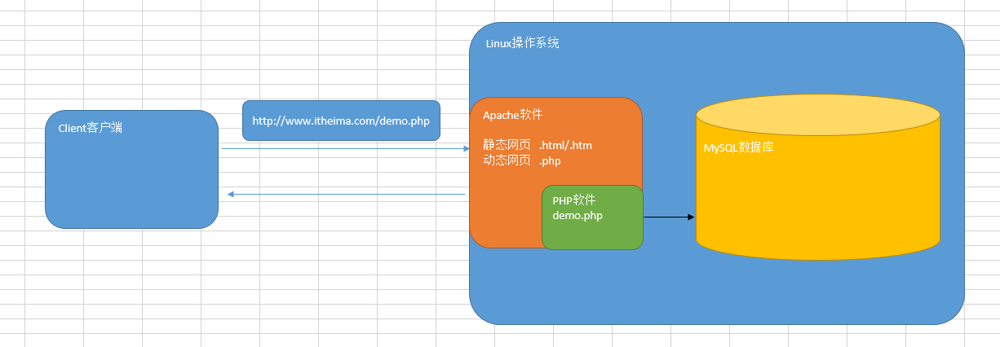

### ☆ 测试LAMP环境是否可以使用

第一步：使用cd命令进入/var/www/html目录

```powershell
# cd /var/www/html
Apache的项目目录 => /var/www/html，以后程序员开发的代码都是放置于此目录
```

第二步：使用vim命令创建demo.php文件

```powershell
# vim demo.php
```

第三步：编写php代码

```php
<?php
	echo 'hello world';
?>
```

编写完成后，保存退出，然后在浏览器中使用http://公网IP/demo.php


# 二、部署Discuz!论坛

## 1、Discuz!论坛概述

Discuz！论坛是基于PHP + MySQL进行开发的一套开源的论坛系统。


## 2、下载源代码

下载地址：https://gitee.com/ComsenzDiscuz/DiscuzX  （码云）

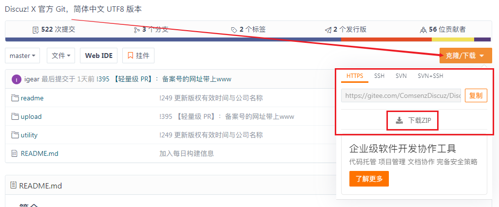

## 3、使用MX软件把Discuz源代码上传

阿里云：


本地Linux类似

## 4、安装unzip解压缩软件

```powershell
# yum install unzip -y
```

## 5、使用unzip对discuz.zip压缩包进行解压

```powershell
# unzip discuz.zip
```

## 6、复制discuz中的文件到/var/www/html目录

```powershell
# mv discuz/* /var/www/html/
或
# cp -vRp disczu/* /var/www/html/
```

## 7、打开浏览器，输入公网IP地址

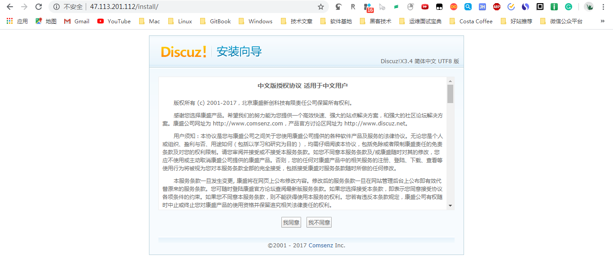

## 8、单击同意许可，继续安装

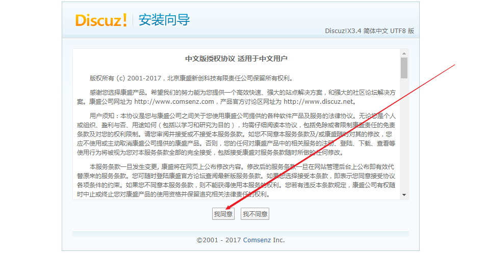

## 9、给/var/www/html目录设置可写权限

```powershell
# chmod -R a+w /var/www/html
```

> 注意：以上操作是给所有文件添加一个w权限，但是生产环境尽量针对指定文件添加权限。

## 10、解决PHP扩展问题


以上提示代表，安装PHP时没有按照php-mysqli扩展，所以会出现以上问题。

```powershell
# yum install php-mysqli -y
# systemctl restart httpd
```

## 11、设置运行环境

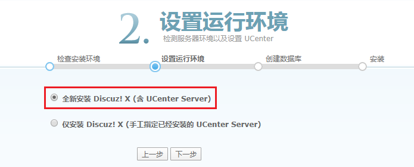

## 12、设置MySQL数据库的相关信息

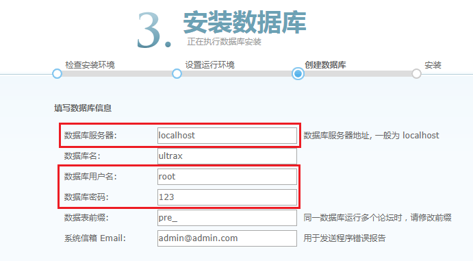

## 13、设置管理员账号和密码


## 14、安装完成后，访问论坛首页


部署后，访问论坛首页，如下图所示：

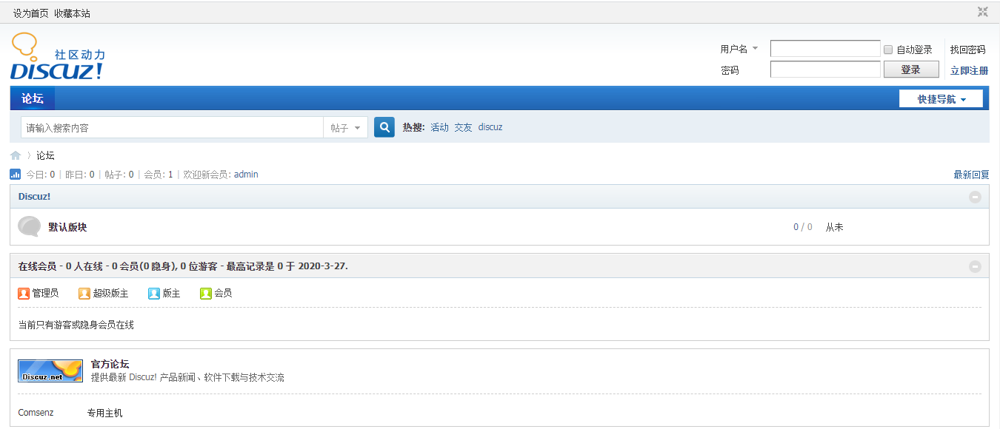

# 三、域名与解析

## 1、为什么需要域名

我们现在访问论坛是通过IP地址实现的，但是IP地址比较复杂，更重要的是不方便用户记忆。

域名 => 代替公网IP地址

## 2、购买域名


登录控制台，然后选择域名菜单：

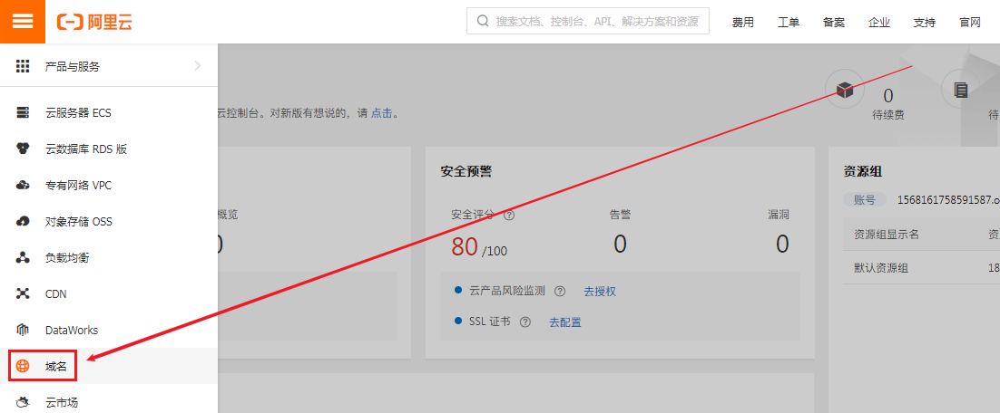

找到域名注册菜单：


找到想要注册的域名，然后加入清单，然后进行立即结算：

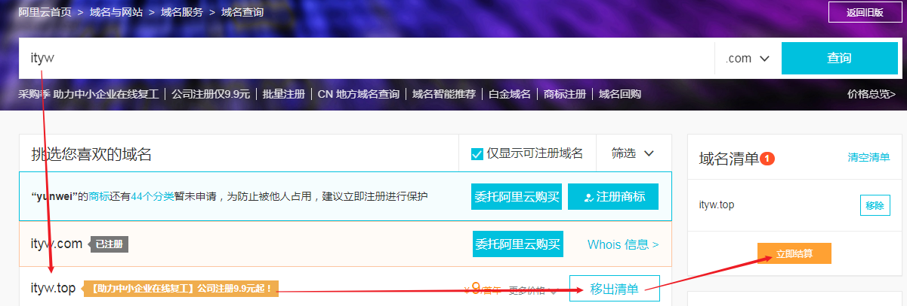

购买完成后，进入域名控制台：


## 3、把域名解析到公网IP


进入解析菜单，然后添加记录：


① 把www.itcast.top解析到公网IP

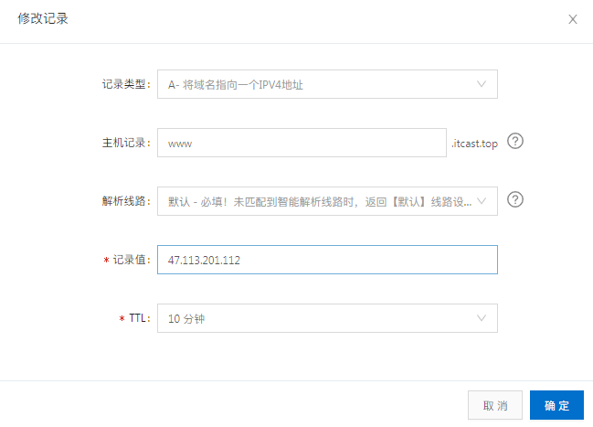

② 把itcast.top解析到公网IP

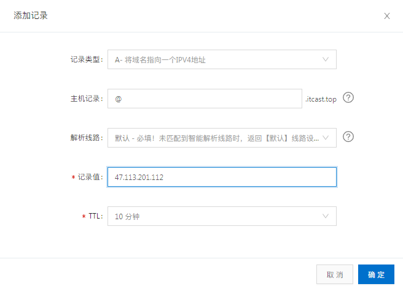

以上记录添加完成后，等待10分钟左右，即可使用域名访问论坛项目了！

## 4、域名备案

如果在国内运行项目，我们使用的域名必须要进行备案操作。

备案就是向工信部提交网站运行的相关资料，比如域名的证书、持有者的身份证号码，以及真人手持身份证照片（背景图）

由于现在监管比较严格，提交资料后，大概5-7个工作日进行审核，完全备案完成大概2周左右。

> https://beian.aliyun.com/


如果不想进行域名备案，可以购买中国香港、中国台湾以及国外的服务器，可以免备案。但是其运行速度略慢一些。