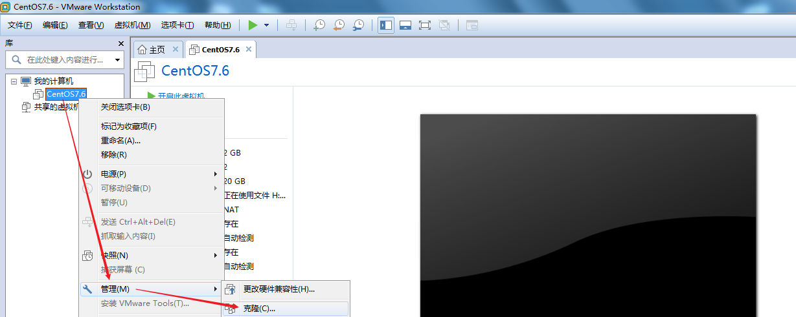
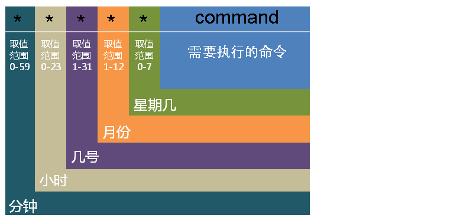

# Linux高级命令（扩展）

# 一、find命令

## 1、find命令作用

在Linux操作系统中，find命令主要用于进行文件的搜索。

## 2、基本语法

```powershell
# find 搜索路径 [选项 选项的值] ...
选项说明：
-name ：根据文件的名称搜索文件，支持*通配符
-type ：f代表普通文件、d代表文件夹
```

案例：搜索计算机中的所有文件，然后找到httpd.conf文件

```powershell
# find /etc -name "httpd.conf" -type f
```

## 3、*星号通配符

在Linux操作系统中，我们想要查找的文件名称不是特别清晰（只记住了前面或后面的字符），这个时候就可以使用*星号通配符了。

案例：获取/etc目录下，所有后缀名为.conf的文件信息

```powershell
# find /etc -name "*.conf" -type f
```

案例：在/etc目录下，搜索所有以httpd开头的文件

```powershell
# find /etc -name "httpd*" -type f
```

## 4、根据文件修改时间搜索文件

### ☆ 聊一下Windows中的文件时间概念？

 

创建时间：代表这个文件什么时间被创建

访问时间：代表这个文件什么时间被访问

修改时间：代表这个文件什么时间被修改

### ☆ 使用stat命令获取文件的最后修改时间

```powershell
# stat 文件名称
Modify: 2020-03-31 10:25:20.609010605 +0800
```

### ☆ 创建文件时设置修改时间以及修改文件的修改时间

基本语法：

```powershell
# touch -m -d "日期时间格式" 文件名称
```

作用：① 如果文件不存在，则自动创建该文件，然后设置其最后的修改时间

​		     ② 如果文件存在，touch命令就是只修改文件的最后修改时间

案例：创建一个a.txt文件，设置最后修改时间为2020-03-30 00:00

```powershell
# touch -m -d "2020-03-30 00:00" a.txt
```

案例：创建一个b.txt文件，然后在设置文件的最后修改时间为2020-03-29 00:00

```powershell
# touch b.txt
# touch -m -d "2020-03-29 00:00" b.txt
```

案例：创建一个c.txt文件，设置最后修改时间为2020-03-28 00:00

```powershell
# touch -m -d "2020-03-28 00:00" c.txt
```

### ☆ 根据文件的==最后修改时间==搜索文件

```powershell
# find 搜索路径 -mtime +days/-day3
-mtime ：根据文件的最后修改时间搜索文件
+ ：加号，代表搜索几天之前的文件信息
- ：减号，代表搜索几天以内的文件信息
```

案例：搜索3天以前的文件信息（不包含第3天的，而且只搜索.txt格式）


```powershell
# find ./ -name "*.txt" -mtime +3
```

案例：搜索3天以内的文件信息（只搜索.txt格式）


```powershell
# find ./ -name "*.txt" -mtime -3
```

## 5、扩展选项-exec选项

案例：删除Linux系统中/var/log目录下10天以前的日志信息（日志文件格式*.log结尾）

```powershell
# find /var/log -name "*.log" -mtime +10
```

第一种解决方案：使用管道命令|

```powershell
# find /var/log -name "*.log" -mtime +10 |rm -rf
```

以上命令并不能正确的执行删除操作，原因在于rm命令和ls命令一样，都不支持管道。

```powershell
# find /var/log -name "*.log" -mtime +10 |xargs rm -rf
```


第二种解决方案：使用find命令 + -exec选项

基本语法：

```powershell
# find /var/log -name "*.log" -mtime +10 -exec rm -rf {} \;
```

## 6、根据文件的大小搜索文件

基本语法：

```powershell
# find 搜索路径 -size [文件大小，常用单位：k，M，G]
size值  : 搜索等于size值大小的文件
-size值 : [0, size值)
+size值 : (size值,正无穷大)
```

案例：搜索/root目录下大小为5M的文件信息

```powershell
# find ./ -type f -size 5M
```

案例：搜索/root目录下大小为5M以内的文件信息（5M>size>=0）

```powershell
# find ./ -type f -size -5M
```

案例：搜索/目录中，文件大小大于100M的文件信息（size>100M）

```powershell
# find / -type f -size +100M
```


## 7、dd扩展命令

基本语法：

```powershell
# dd if=/dev/zero of=文件名称 bs=1M count=1
选项说明：
if代表输入文件
of代表输出文件
bs代表字节为单位的块大小。
count代表被复制的块。
其中/dev/zero是一个字符设备，会不断返回0值字节。
```

主要功能：在Linux操作系统中，生成某个大小的测试文件！

案例：使用dd创建一个1M大小的sun.txt文件

```powershell
# dd if=/dev/zero of=moon.txt bs=1M count=1
```

案例：使用dd创建一个5M大小的moon.txt文件

```powershell
# dd if=/dev/zero of=moon.txt bs=5M count=1

if = input file
of = output file
```

# 二、tree命令

## 1、tree命令的主要作用

Windows和Linux都有tree命令，主要功能是创建文件列表，将所有文件以树的形式列出来

## 2、使用yum命令安装tree

```powershell
# yum install tree -y
```

## 3、以树状结构显示路径下的文件信息

案例：以树状结构显示当前目录下的文件信息

```powershell
# tree 
```

案例：以树状结构显示/var/log目录下的文件信息

```powershell
# tree /var/log
```

# 三、scp命令

## 1、scp命令的主要作用

scp命令的主要作用是实现Linux与Linux系统之间的文件传输。

> 完成以上实战需要两个Linux系统，解决方案可以使用克隆操作（先关机后克隆）快速生成一个Linux系统



## 2、scp效果图


scp传输要求：两台计算机所使用的操作系统都必须是Linux操作系统。

> ssh: connect to host 10.1.1.17 port 22: Connection refused
> lost connection
>
> 出现以上问题的主要原因在于SCP命令时基于SSH协议，所以两台服务器的sshd服务必须处于开启状态，否则无法完成上传与下载操作。

## 3、下载文件或目录

基本语法：

```powershell
# scp [选项] 用户名@linux主机地址:资源路径  linux本地文件路径
选项说明：
-r ：代表递归操作，主要针对文件夹
```

案例：从10.1.1.17服务器下载/root路径下的video.mp4文件到本地的/root目录下

10.1.1.16：

```powershell
# scp root@10.1.1.17:/root/video.mp4 ./
The authenticity of host '10.1.1.17 (10.1.1.17)' can't be established.
ECDSA key fingerprint is SHA256:Wcxibo2ZQulm6bV+jEakz8IniwFgE6CUHopCxYjexrI.
ECDSA key fingerprint is MD5:48:25:21:93:ef:2b:22:25:5f:95:39:56:0c:8e:ff:75.
Are you sure you want to continue connecting (yes/no)? yes
Warning: Permanently added '10.1.1.17' (ECDSA) to the list of known hosts.
root@10.1.1.17's password:123456
```

案例：从10.1.1.17服务器下载/root路径下的shop文件夹到本地的/root目录下

```powershell
# scp -r root@10.1.1.17:/root/shop ./
root@10.1.1.17's password:123456
```

## 4、上传文件或目录

基本语法：

```powershell
# scp [选项] linux本地文件路径 用户名@linux主机地址:远程路径
选项说明：
-r ：递归操作
```

案例：把10.1.1.16服务器上的/root/video.mp4上传到10.1.1.17服务器的/root目录下

10.1.1.16：

```powershell
# scp /root/video.mp4 root@10.1.1.17:/root/
```

案例：把10.1.1.16服务器上的/root/shop文件夹上传到10.1.1.17服务器的/root目录下

10.1.1.16：

```powershell
# scp -r /root/shop root@10.1.1.17:/root/
```

# 四、计划任务+tar命令实现文件备份

## 1、回顾计划任务

基本语法：

```powershell
# crontab [选项]
-l : list缩写，查询当前用户的计划任务信息
-e : edit缩写，编辑计划任务
```

## 2、计划任务格式

```powershell
分 时 日 月 周 执行的命令（要求使用完整路径,which命令）
```



> 周的范围比较特殊，正常情况下，只有周一 ~ 周日 1-7，但是计划任务范围0-7，0和7都代表周日

## 3、案例

案例：每天的凌晨2点0分把/etc目录备份一次/tmp目录下，要求把/etc打包成etc.tar.gz格式

```powershell
# crontab -e
分 时 日 月 周 /usr/bin/tar -zcf /tmp/etc.tar.gz /etc
0 2 * * * /usr/bin/tar -zcf /tmp/etc.tar.gz /etc
```

以上案例虽然可以实现对/etc目录的备份，但是有一个小缺点：每次备份时，生成的文件名称是一致的，这样后面备份的文件就会把前面备份的文件进行覆盖！

==案例：备份文件时，要求按时间作为备份文件的名称==

/tmp/etc-20200331.tar.gz

/tmp/etc-20200401.tar.gz

...

```powershell
# crontab -e
0 2 * * * /usr/bin/tar -zcf /tmp/etc-$(date +"\%Y\%m\%d").tar.gz	/etc

重点：
/tmp/etc-$(date +"\%Y\%m\%d").tar.gz
```

> 经验之谈：如果在编写计划任务时，出现了%百分号，前面必须添加一个反斜杠\进行转义，否则计划任务会失效！
>
> 

## 4、扩展命令：date

基本语法：

```powershell
# date +"时间格式"
%F : 年-月-日
%T : 小时:分钟:秒
%Y : Year,年
%m : month,月
%d : day,日
%H : Hour,小时
%M : Minute,分钟
%S : Second,秒
```


案例：获取计算机的系统时间

```powershell
# date
```

案例：获取年月日信息

```powershell
# date +""
```

