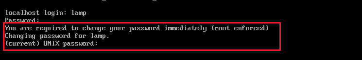
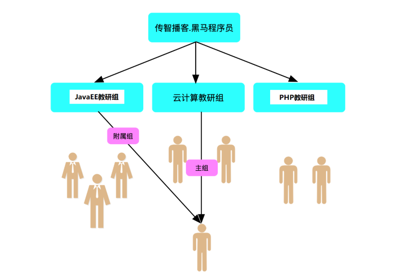
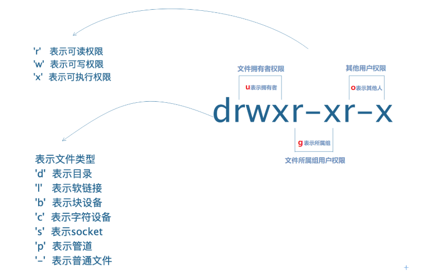

# Linux高级命令（扩展）

# 一、Linux下用户管理

## 1、用户概念以及基本作用

**用户：**指的是==Linux操作系统中==用于管理系统或者服务的==人==

一问：管理系统到底在**管理什么**？

答：Linux下一切皆**文件**，所以用户管理的是相应的==文件==

二问：**如何管理**文件呢？

答：

1. 文件==基本管理==，比如文件的创建、删除、复制、查找、打包压缩等；文件的权限增加、减少等；
2. 文件==高级管理==，比如**程序文件**的安装、卸载、配置等。终极目的是对外提供稳定的服务。

## 2、用户的类别

① root超级管理员，==在Linux系统中拥有至高无上的权力==。

② 系统用户，CentOS6=> 1 ~ 499，CentOS7=> 1 ~ 999，系统账号==默认不允许登录==

```powershell
# useradd -s /sbin/nologin 系统用户
```

③ 普通用户，大部分是由root管理员创建的，UID的取值范围：CentOS6=> 500 ~ 60000，CentOS7=> 1000 ~ 60000，==对系统进行有限的管理维护操作==

总结

① 用户指的是操作系统上==管理系统或服务==的==人==，是人，就有相关的==属性信息==

② 用户的属性信息包括但不限于，如：==家目录、唯一身份标识(UID)、所属组(GID)==等

③ 今天我们讨论的用户指的是==普通用户==，即由管理员创建的用户

## 3、用户管理

与用户管理相关的几个单词 => user（用户）、add（添加）、mod（修改）、del（删除）

① 用户添加  useradd

② 用户修改  usermod

③ 用户删除  userdel

### ☆ useradd用户添加

基本语法：

```powershell
# useradd [选项 选项的值] 新用户名称
-u	指定用户uid，唯一标识，必须唯一
-g	指定用户的默认组(主组)
-G	指定用户附加组(一个用户可以加入多个组，但是默认组只有一个)
-d	指定用户家目录(每个用户都有一个自己的家，并且默认在/home/xxx)
-s	指定用户默认shell，常见/bin/bash或/sbin/nologin

扩展：
-r  指定用户为系统用户，如创建一个系统账号mysql
```

案例：在Linux系统中创建一个账号zhangsan

```powershell
# useradd zhangsan
```

问题：一个用户创建成功后，如何判断是否添加到系统？

答：第一种方案我们可以通过tail命令查看/etc/passwd文件

​		 第二种方案我们可以使用id命令查看zhangsan信息

案例：在Linux系统中创建一个账号lisi，指定用户的家目录为/rhome/lisi

```powershell
# mkdir /rhome
# useradd -d /rhome/lisi lisi
```

> 当我们为用户自定义家目录时，其上级目录必须是真实存在的，如/rhome

案例：在Linux系统中创建一个mysql账号，要求真实存在的，但是其不允许登录操作系统

```powershell
# useradd -s /sbin/nologin mysql
```

案例：在Linux系统中创建一个mysql系统账号，要求真实存在，但是不允许登录操作系统

```powershell
# userdel -r mysql
# useradd -r -s /sbin/nologin mysql
```

### ☆ 与用户相关的文件

Linux中一切皆文件，所以保存用户的信息的也是一个文件 => /etc/passwd

```powershell
# vim /etc/passwd
root:x:0:0:root:/root:/bin/bash

第1列：用户名称
第2列：用户密码，使用一个x占位符，真实密码存储在/etc/shadow文件中
第3列：用户的编号UID，0，1-999，1000 ~ 60000
第4列：用户的主组编号GID
第5列：用户的备注信息（扩展，可以使用-c进行指定） useradd -c "mysql" mysql
第6列：用户的家目录，/root，超级管理员的家/home，普通账号的家
第7列：用户的Shell文件，常见/bin/bash或/sbin/nologin=>/bin/false
```

### ☆ usermod用户修改

基本语法：

```powershell
# usermod [选项 选项的值] 用户名称
-u	指定用户uid，唯一标识，必须唯一	
-g	指定用户的默认组(主组)
-G	指定用户附加组(一个用户可以加入多个组，但是默认组只有一个)
-d	指定用户家目录(每个用户都有一个自己的家，并且默认在/home/xxx)
-s	指定用户默认shell
```

案例：修改zhangsan账号的主组为itheima组（只能指定一个）

① 可以获取itheima组的编号信息GID

② 使用usermod  -g  GID编号修改某个用户的主组信息

> 其实在usermod修改用户的主组中，usermod  -g  可以使用GID编号也可以使用组名称

```powershell
# cat /etc/group |grep itheima
# usermod -g 1000 zhangsan
```

或

```powershell
# usermod -g itheima zhangsan
```

案例：修改lisi账号的附加组，将其添加到itheima中

```powershell
# usermod -G 1000 lisi
```

或

```powershell
# usermod -G itheima lisi
```

案例：创建一个itcast组，在创建一个wangwu的账号，修改wangwu的附加组为itcast与itheima

```powershell
# groupadd itcast
# useradd wangwu
# usermod -G itcast,itheima wangwu
```

问题：如果一个用户同时拥有多个附属组，怎么查看呢？

答：使用id命令即可

案例：修改用户zhangsan的家目录为/rhome/zhangsan（默认/home/zhangsan）

```powershell
# mkdir /rhome/zhangsan
# usermod -d /rhome/zhangsan zhangsan
# su - zhangsan
-bash-4.2$
出现以上问题的主要原因在于：我们迁移用户的家目录时，没有迁移家目录中的配置文件"家具"

解决方案：
① 家目录已经迁移，我们把/etc/skel中的文件，copy到新家中
# cp -a /etc/skel/. /rhome/zhangsan/
选项说明：
-a ：all所有，复制时，保留文件的原有属性
② 家目录还没有迁移，准备迁移时，使用usermod -md /rhome/zhangsan 用户名
-m ：move，迁移家目录时，把"家具"一起迁移到新的家目录
# usermod -md /rhome/zhangsan zhangsan
```

> 注：要求/rhome/zhangsan必须是真实存在的！

案例：当我们创建了某个账号，但是不希望这个账号登录操作系统

```powershell
# usermod -s /sbin/nologin 用户名称
```

### ☆ userdel用户的删除

```powershell
# userdel [选项] 用户名称
选项说明：
-r ：删除用户的同时，删除用户的家目录
-f ：强制删除用户（即使用户处于登录状态）
```

案例：删除zhangsan这个账号

```powershell
# userdel zhangsan
```

案例：删除zhangsan这个账号，同时删除这个账号的家

```powershell
# userdel -r zhangsan
```

案例：删除某个正在使用的账号（强制删除）

```powershell
# userdel -f zhangsan
```

## 4、用户密码

### ☆ passwd修改用户密码

```powershell
# passwd [用户名称]

说明：
1.管理员root可以给任何用户修改密码
2.普通用户可以自己给自己修改密码，但是密码复杂度要符合规范(大小写、特殊字符、长度)
```

案例：使用root账号给itheima用户修改密码，新密码为123456

```powershell
# su - root
# passwd itheima
Changing password for user itheima.
New password:
BAD PASSWORD: The password is shorter than 8 characters
Retype new password:
passwd: all authentication tokens updated successfully.
```

案例：切换到itheima这个账号，自己给自己修改密码（密码规范）

```powershell
# su - itheima
# passwd
Changing password for user itheima.
Changing password for itheima.
(current) UNIX password:
New password:
Retype new password:
passwd: all authentication tokens updated successfully.
```

### ☆ --stdin修改用户密码

--stdin ：标准输入

```powershell
# echo 123 |passwd --stdin itheima
# history -c 						=>    			     清除history历史记录
```

> 注意：以上方式操作非常简单，但是以上命令会留在history历史命令中！

## 5、chage更改用户的账号信息

背景：很多公司运维工程师刚入职，都会默认得到一个服务器的管理账号，密码默认，如123456，我们有没有办法让运维工程师在第一次登陆操作系统后，强制要求其更新密码。

```powershell
# chage --help
-l：列出用户的详细密码状态;
-d 日期：修改 /etc/shadow 文件中指定用户密码信息的第3个字段，也就是最后一次修改密码的日期，格式为 YYYY-MM-DD;
-m 天数：修改密码最短保留的天数，也就是 /etc/shadow 文件中的第4个字段;
注：几天后才能修改一次密码
-M 天数：修改密码的有效期，也就是 /etc/shadow 文件中的第5个字段;
注：每隔多少天更新一次密码
-W 天数：修改密码到期前的警告天数，也就是 /etc/shadow 文件中的第6个字段;
-i 天数：修改密码过期后的宽限天数，也就是 /etc/shadow 文件中的第7个字段;
注：过期后还可以使用的天数，达到这个天数后，账号失效

-E 日期：修改账号失效日期，格式为 YYYY-MM-DD，也就是 /etc/shadow 文件中的第8个字段;
```

==案例：新创建一个账号lamp，设置初始化密码为123456。要求用户第一次登陆后必须强制修改用户的密码。==

解决思路：把密码的最后修改时间重置为0（回到1970年1月1日）

```powershell
# useradd lamp
# echo 123456 |passwd --stdin lamp

# chage -d 0 lamp
```

运行效果：

 

案例：设置lamp账号的过期时间为2010-04-10

```powershell
# chage -E "2020-04-10" lamp
```

案例：设置lamp账号的10天后过期（延伸）

```powershell
# chage -E $(date +%F -d '+10 days') lamp
%F：YYYY-mm-dd，格式2020-04-01
-d：多少天以后的日期
```

案例：设置mysql用户60天后密码过期，至少7天后才能修改密码，密码过期前7天开始收到告警信息

```powershell
# useradd mysql
# echo 123456 |passwd --stdin mysql

# chage -M 60 -m 7 -W 7 mysql
```

## ☆ ==练习题==：

创建3个普通用户stu1~stu3,要求如下：

1. stu1默认创建，密码为123
2. stu2的家目录为/rhome/redhat/stu2,密码为123
3. stu3用户不能登录操作系统，密码为123

```powershell

```


## 6、用户组管理

### ☆ 用户和组的关系



**核心：**==组的目的是为了方便管理用户==

- 用户是操作系统上管理维护系统或服务的人
- 组是用户的一个==属性信息==
- 任何一个用户==默认都会有==一个==主组==(默认组)
- 一个用户除了主组也==可以有多个其他组==(**附加组**)

**一问：**用户的主组和附加组到底有啥关系呢？

**答：**用户的主组和附加组==半毛钱关系都木有==

**二问：**那要这个主组或者附加组有啥用呢？

**答：**肯定是**有用**的，组的目的是方便管理用户，用户的目的是管理==操作文件==，文件就有==权限==这个属性。

1. 用户要操作一些文件，文件是由用户创建，不同用户创建的文件的==属性信息==也就不一样
2. 文件的属性都有啥呢？比如，文件的==创建者==，文件==属于哪个组==，文件大小，文件时间等
3. 其中，不同用户所创建的==文件的属组==就是==该用户的主组==(默认组)
4. A用户附加组也有可能是其他用户的主组，道理同上（权限章节再细细体会组的作用）

###  ☆ 用户组管理

group组，添加add，修改mod，删除del

groupadd 添加用户组

groupmod 修改用户组

groupdel  删除用户组

### ☆ 添加用户组

```powershell
# groupadd [选项 选项的值] 用户组名称
选项说明：
-g ：创建用户组时指定用户组编号GID，0代表超级管理员root组，1-999代表系统用户组，1000以后代表普通用户组
```

案例：在系统中创建一个admin组

```powershell
# groupadd admin
```

案例：在系统中创建一个itcast组，并指定用户组的编号为1200

```powershell
# groupadd -g 1200 itcast
```

问题：用户组创建完成后，如何判断是否创建成功？

```powershell
# tail -1 /etc/group
```

### ☆ 与用户组相关的文件

在Linux系统中，与用户组相关的文件 => /etc/group

```powershell
# vim /etc/group
root:x:0:
第1列：代表用户组的组名称
第2列：代表用户组的组密码，使用一个x占位符（基本已经不使用了）
第3列：代表用户的组ID编号GID的值
第4列：代表用户组内的用户信息
```

### ☆ 修改用户组

```powershell
# groupmod [选项 选项的值] 用户组名称
选项说明：
-g ：gid缩写，代表修改用户所属组的ID编号
-n ：name缩写，代表修改用户组的名称
```

案例：更改itcast用户的GID编号（从1200 => 1005）

```powershell
# groupmod -g 1005 itcast
```

### ☆ 删除用户组

```powershell
# groupdel 用户组的名称
```

> 注意：在Linux操作系统中，如果想删除某个用户组，必须要保证这个组不能是某个用户的主组。

案例：删除itcast用户组

```powershell
# groupdel itcast
```

案例：删除admin用户组

```powershell
# groupdel admin
```

## 7、附属组管理

基本语法：

```powershell
# gpasswd [选项 选项的值] 用户组的名称
-a ：添加用户到组，append追加
-d ：从组中删除成员，delete移除
-A ：指定管理员，Admin管理员
-M ：指定组成员，可以批量添加用户到组中

问题解析：-a与-M到底有啥区别？
-a一次只能追加一个用户到附属组中（-a，append，追加的形式，原有用户不覆盖）
-M一次可以追加多个用户到附属组中（覆盖追加，先把原有用户删除，然后添加我们的用户）
```

案例：创建3个用户user01~user03，将user01添加到sysadmin组里（附属组）

```powershell
# useradd user01
# useradd user02
# useradd user03
# groupadd sysadmin

① 方案1
# usermod -G sysadmin user01
② 方案2
# gpasswd -a user01 sysadmin
```

案例：把user02、user03添加到sysadmin组中

```powershell
① 方案1
# gpasswd -a user02 sysadmin
# gpasswd -a user03 sysadmin

② 方案2
# gpasswd -M user02,user03 sysadmin
```

案例：从附属组中移除某个账号

```powershell
# gpasswd -d 移除的用户名称 附属组名称
```

```powershell
# gpasswd -d user03 sysadmin
Removing user user03 from group sysadmin
```

## ☆ ==练习题==：

1、创建一个admin组，组id为900

2、创建一个用户tom,并且admin组作为tom用户的附加组（要求在建立用户的时候就完成）,密码为123

3、创建一个用户jack,要求在建立用户之后使用gpasswd把jack加入到admin组，密码为123

4、给admin组设定一个默认密码为123 （gpasswd命令）

```powershell
# gpasswd admin组名称
```

> 移除gpasswd -r  admin组名称，代表移除组密码

5、把tom用户设定为admin组的组管理员

> gpasswd -A tom admin

## ☆ ==作业1==

1. 创建一个公司itcast，3个部门财务(cw)，人事(rs)，市场(sc)

   说明：==实际是创建4个组==，分别为itcast、cw、rs、sc，没有包含的关系

2. 每个部门创建2个用户，如 cw01 cw02，rs01，rs02，sc01，sc02；boss01管理公司所有部门；说明：boss01管理所有部门说明，boss01的附加组为财务、人事和市场部门

3. 所有用户账号有效期3个月<90天>，第一次登录强制修改密码，每隔15天更新一次密码；默认密码为123456

## ☆ ==作业2==

1. 添加3个用户，用户harry，natasha，sarsh，要求harry，natasha用户的附加组为admin组，sarsh用户的登录shell为非交互式shell。密码均为redhat
2. 修改harry用户的家目录为/home/heima/redhat/harry
3. 修改natasha，sarsh用户的主组为heima，并且可以登录系统

# 二、文件权限管理

## 1、什么是权限

**权限：**在计算机==系统中==，权限是指某个==计算机用户==具有==使用软件资源的权利==。

## 2、权限的目的

文件权限的设置目的：==是想让某个用户有权利操作文件==

## 3、权限的分类

- **普通权限**rwx

  用户正常情况去操作文件所具有的权限

- **高级权限**st

  用户对某个文件操作有特殊需求，而普通权限不能满足，需要给文件设置高级权限

- **默认权限**umask

  用户在系统中创建一个文件，该文件默认都会有一个权限，该权限是默认有的

**注意：**

权限是==设置在文件上==的，而不是用户

## 4、普通权限rwx（重点）

### ☆ read读权限

- 针对==目录==

  一个目录拥有r权限，说明可以查看该==目录里的内容==（ls命令列出）

- 针对==普通文件==

  一个普通文件拥有r权限，说明可以查看该==文件的内容==(cat/head/tail/less/more等命令查看)

- 读权限==**r**==（read）用数字表示是**==4==**

### ☆ write写权限

- 针对==目录==

  一个目录拥有w权限，说明可以在该目录里==**创建、删除、重命名**==等操作（mkdir/touch/mv/rm等）

- 针对==普通文件==

  一个普通文件拥有w权限，说明可以==**修改**==该==文件的**内容**==（vi/vim编辑器编辑文件）

- 写权限==**w**==（write）用数字表示是==**2**==

### ☆ execute执行权限

- 针对==目录==

  一个目录拥有x权限，说明可以==**进入或切换到**==该目录里（cd命令）

- 针对==普通文件==

  一个普通文件拥有x权限，说明可以==**执行**==该文件（一般程序文件、脚本文件、命令都需要执行权限）

- 执行权限==**x**==（execute）用数字表示是==**1**==

rwx = 读写执行 = 4 + 2 + 1

### ☆ -没有权限

没有任何权限用横杠==-==表示，数字表示是==**0**==

## 5、理解UGO

UGO，指的是==**用户身份**==，每个字母代表==不同的==用户身份。

- U（the user who owns it）

  文件的==拥有者==(owner)或者==创建者==

- G（other users in the file’s ==g==roup）

  在文件的所属组（默认是创建文件的用户的主组）里的用户

- O（==o==ther users ==not in== the file’s group）

  既不是文件的创建者，也不在文件属组里的用户，称为其他人

注意：

​	除了上面ugo以外，还有一个字母==**a**==（all users）,表示==所有用户==，包含ugo

## 6、查看文件的权限

```powershell
# ls -l 文件名称
或
# ll 文件名称
```

> 注：如果查看一个文件夹的权限，建议使用-d

