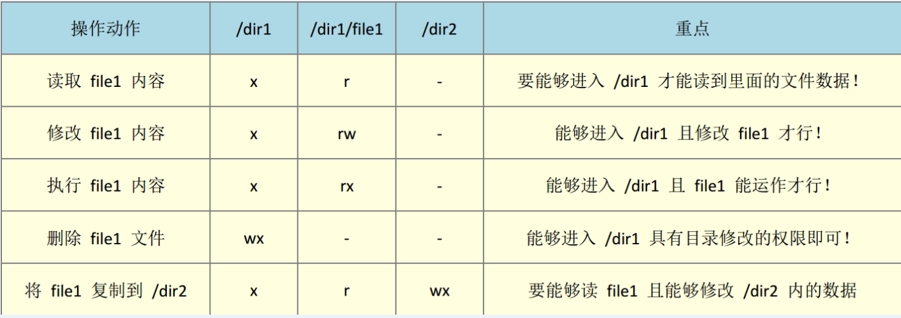
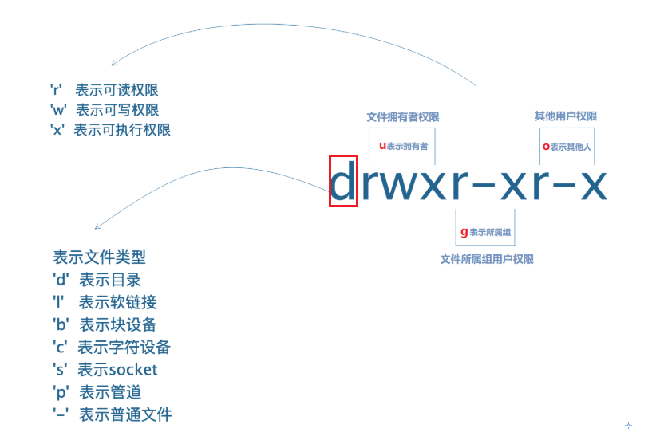
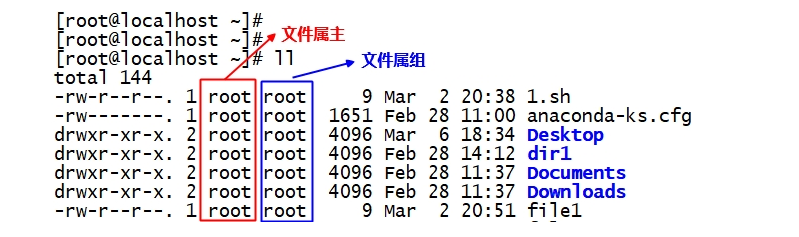
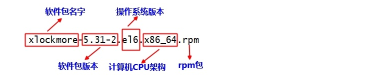
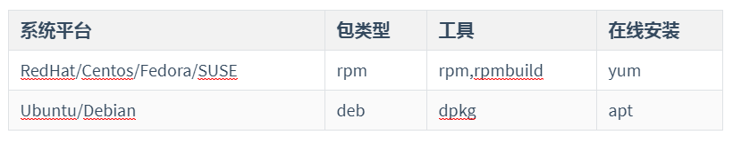
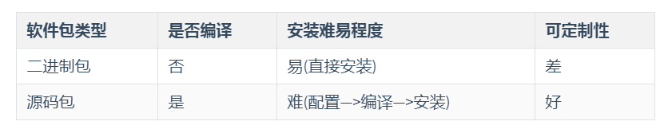

# Linux高级命令（扩展）

# 一、date命令

## 1、date命令的作用

date命令的主要作用：用于获取计算机操作系统的系统时间

## 2、获取计算机的系统时间

```powershell
# date
```

## 3、定制时间格式

```powershell
# date +"%F %T %Y %m %d %H %M %S"
%F : 2020-04-03
%T : 09:45:36
%Y : 年
%m : 月
%d : 日
%H : 小时
%M : 分钟
%S : 秒
```

案例：获取系统时间，时间格式要求20200403

```powershell
# date +"%Y%m%d"
```

## 4、设置计算机的系统时间（慎用）

基本语法：

```powershell
# date -s "年-月-日 小时:分钟:秒"
```

案例：把当前系统时间设置为2020-04-10

```powershell
# date -s "2020-04-10"
```

## 5、ntpdate手工同步时间

如果时间错乱了，没有关系，只需要使用ntpdate手工重置一下即可。

```powershell
# ntpdate cn.ntp.org.cn
```

# 二、普通权限rwx

## 1、rwx对文件的影响

### ☆ r对文件的影响

- 针对==目录==

  一个目录拥有r权限，说明可以查看该==目录里的内容==（ls命令列出）

- 针对==普通文件==

  一个普通文件拥有r权限，说明可以查看该==文件的内容==(cat/head/tail/less/more等命令查看)

- 读权限==**r**==（read）用数字表示是**==4==**

### ☆ w对文件的影响

- 针对==目录==

  一个目录拥有w权限，说明可以在该目录里==**创建、删除、重命名**==等操作（mkdir/touch/mv/rm等）

- 针对==普通文件==

  一个普通文件拥有w权限，说明可以==**修改**==该==文件的**内容**==（vi/vim编辑器编辑文件）

- 写权限==**w**==（write）用数字表示是==**2**==

> 如果我们想在Linux系统中删除某个文件，不是看这个文件有什么权限，而是要看这个文件所处的上级目录是否具有w权限。

### ☆ x对文件的影响

- 针对==目录==

  一个目录拥有x权限，说明可以==**进入或切换到**==该目录里（cd命令）

- 针对==普通文件==

  一个普通文件拥有x权限，说明可以==**执行**==该文件（一般程序文件、脚本文件、命令都需要执行权限）

  shell.sh => 类似Windows中的exe文件

- 执行权限==**x**==（execute）用数字表示是==**1**==

## 2、图解常见操作权限

/

/dir1  /dir2

/dir1/file1



## 3、用户身份

U ： user，代表文件的拥有者（默认为文件的创建者）

G ：group，与文件所属组同组的用户（组内用户）

O ：other，既不是拥有者，也不是所属组内的用户，这些用户就称之为其他用户

a = UGO，代表所有用户

## 4、如何判断不同身份的用户对文件的权限

基本语法：

```powershell
# ls -l
或
# ll

注：ll代表红帽以及CentOS系统专有的一个命令，等价于ls -l。但是其他系统可能并不支持
```



## 5、权限的设置（重点）

① 字母方式（ugo + rwx）

② 数字方式（4 2 1）

基本语法：

```powershell
# chmod [选项] 字母形式或数字形式 文件名称
选项说明：
-R : 递归设置，针对文件家（目录）
```

### ☆ 字母形式(三步走)

第一步：确认给谁设置权限（u，g，o，ugo=a）

第二步：怎么设置权限（+， -， =）

第三步：授予什么样的权限（r，w，x）

案例：给readme.txt设置权限，要求文件拥有者rwx权限，所属组内用户rw，其他用户r权限

```powershell
# chmod u=rwx,g=rw,o=r readme.txt
```

### ☆ 数字形式(421)

read = 4

write = 2

execute = 1

777

644

755

> 7 = 4 + 2 + 1 = r + w + x = rwx
>
> 6 = 4 + 2 = rw
>
> 5 = 4 + 1 = rx

案例：设置shop文件夹权限为777（所有拥有都拥有rwx）

```powershell
# chmod -R 777 shop
```

## ==6、练习题==

1. 创建5个用户user01~user05和一个admin组
2. 将user01~user03用户加入到admin组里
3. user01用户在其家目录里创建file1~file3三个文件
4. user02用户编辑/home/user01/file1文件的内容：good good study,day day up!
5. user05用户往/home/user01/file1文件里追加内容：I known
6. user04用删除/home/user01家目录的所有文件

# 三、高级权限

## 1、在Linux系统中有哪些高级权限

① 冒险位（u + s） => S

- 冒险位，指文件操作者(用户)==临时拥有==文件==拥有者==的权限
- 冒险位，一般针对的是==命令==或者==脚本文件==
- 冒险位，用字母表示是==s或S==；数字表示是==4==
- 冒险位的设置：`chmod u+s 文件名`或者`chmod 4xxx 文件名`

> 主要针对可执行的二进制文件，如/usr/bin/passwd文件

② 强制位（g + s）

- 强制位，一般针对的是==目录==

  如果一个目录拥有强制位，那么==任何用户==在该目录里所创建的任何文件的==属组==都会继承==该目录的属组==。

- 强制位，用字母表示是==s或S==；数字表示是==2==

- 强制位的设置：`chmod g+s 文件名`或者`chmod 2xxx 文件名`

> 主要针对目录进行设置，比如shop目录，文件拥有者root，所属组itheima，g+s
>
> 这样以后我们在shop目录下创建的所有文件的所属组都会继承shop文件夹的itheima

③ 粘滞位（o + t） => T

- 粘滞位，一般针对的是==公共目录==

  如果一个公共目录拥有粘滞位，那么该目录下的文件，只有==root==和==文件的创建==者可以删除，其他人只能自己管理自己。（A用户不能删除B用户创建的文件）

- 粘滞位，用字母表示是==t或T==；数字表示是==1==

- 粘滞位的设置：`chmod o+t 文件名`或者`chmod 1xxx 文件名`

# 四、默认权限(了解)

## 1、什么是文件的默认权限

所谓文件的默认权限(遮罩权限)，是指用户创建文件后，==文件天生==就有的权限，不需要设置。

## 2、文件默认权限由谁控制

文件默认权限由一个叫做**==umask==**的东西来控制。

## 3、文件或目录的最高权限

目录：最高权限0777，简写就是777

文件：最高权限0666，简写就是666


默认目录权限 = 0777 - umask

默认文件权限 = 0666 - umask

## 4、获取umask值

```powershell
# umask
```

默认umask值，root账号0022

## 5、临时或永久更改umask值（慎用，只了解）

### ☆ 临时设置umask值

```powershell
# umask 0002
只在当前终端当前进程中有效
```

### ☆ 永久设置umask值（写入系统配置）

配置文件说明：

```powershell
全局配置文件（针对所有用户所有进程） =>  针对所有用户有效
/etc/profile
系统和用户的环境变量信息，当用户第一次登录时,该文件被读取
/etc/bashrc
每个运行的bash信息（系统别名、函数及默认权限的定义），当bash被打开时,该文件被读取

局部配置文件（针对某个特定用户以及用户的所有进程）	=>  针对当前用户有效
~/.bashrc
当前用户的bash信息，当用户登录和每次打开新的shell时该文件被读取
~/.bash_profile
当前用户的环境变量，当用户登录时，该文件被读取
~/.bash_history
保存当前用户历史命令的文件
~/.bash_logout
当用户退出bash或者终端时，会首先执行该文件里的代码，然后再退出
```

案例：更改umask值，针对所有用户有效，umask值设置为0002

```powershell
# vim /etc/bashrc
...
umask 0002

# source /etc/bashrc   =>   让umask值立即生效
```

案例：更改umask值，只针对itheima用户有效，umask值设置为0002

```powershell
# su - itheima
[itheima@localhost ~] # vim ~/.bashrc
...
umask 0002
```

# 五、更改文件的拥有者以及所属组

## 1、什么是拥有者什么是所属组



## 2、更改文件的拥有者与所属组

有些软件或程序要求比较特殊，其如果想正常运行，拥有者与所属组必须是某个值。

> 如mysql数据库，其要求系统中必须有一个mysql的系统账号，而且要求其安装目录的文件拥有者以及所属组都必须是mysql

## 3、chown更改文件拥有者

```powershell
# chown [选项] 新文件拥有者 文件名称
选项说明：
-R ：递归设置，主要针对文件夹
```

## 4、chgrp更改文件的所属组

```powershell
# chgrp [选项] 新文件所属组 文件名称
选项说明：
-R ：递归设置，主要针对文件夹
```

## 5、chown同时修改文件属主以及属组

```powershell
# chown [选项] 新的文件拥有者:新的文件所属组 文件名称
# chown [选项] 新的文件拥有者.新的文件所属组 文件名称

选项说明：
-R ：递归设置，主要针对文件夹
```

# 六、ACL访问权限控制（扩展）

## 1、ACL能做什么

1. ACL访问控制策略可以作为前面所讲==权限的补充==，==更加细==的来控制文件的权限
2. ACL策略可以==只针对某个用户==在文件上有相应权限
3. ACL策略也可以==只针对多个用户或者一个组==里的所有用户在文件上有相应权限

## 2、getfacl

基本语法：

```powershell
# getfacl = get + file + acl => 获取某个文件的ACL权限
```

案例：获取readme.txt文件的ACL权限

```powershell
# getfacl readme.txt
```

## 3、setfacl

```powershell
常用选项：
-m 修改或者设置ACL策略
-R 递归授权，对目录下已存在的目录或文件有acl策略，但新建的文件没有
-x 去掉某个用户或者某个组的权限
-b 删除所有的acl策略
-d 默认ACL策略，只针对目录，该目录下新建的目录和文件都会继承acl策略
mask: 定义除其他人和所有者外的最大权限
```

案例：修改readme.txt文件的ACL权限（给itheima这个账号开通rw权限）

```powershell
# setfacl -m u:itheima:rw readme.txt

u代表user
itheima代表具体的某个用户
rw代表权限
```

案例：修改shop文件夹的ACL权限（给itheima组开通rwx权限）

```powershell
# setfacl -R -m g:itheima:rwx shop

g代表group
itheima代表具体的某个用户组名称
rwx代表用户组权限
```

案例：删除某个用户权限

```powershell
# setfacl -x u:itheima readme.txt
```

案例：删除所有的ACL权限

```powershell
# setfacl -b readme.txt
```

# 七、Linux下软件的安装方式

## 1、Linux下有哪些软件安装方式

① RPM软件包管理（软件名称.rpm）

② YUM软件包管理（使用yum命令install + 软件名称） => 下载 + 安装一体化

③ 源码编译安装（相对来说是最复杂的一种方式）

## 2、软件包类型

### ☆ 二进制软件包(rpm包)



1. 二进制包，指的是已经[^编译]好了的软件包，只需要==直接安装==就可以使用。
2. 二进制包，==不需要编译==，直接下载安装即可
3. 二进制包，需要根据自己的计算机CPU以及操作系统去==选择合适==的

> 类似Windows中的.exe文件，如qq.exe

### ☆ 软件源码包（重点）

什么是源码包？有什么特点？

1. 源码包，指的是程序员写的原始的==程序代码文件==，==不能==够==直接==在计算机上==运行==。
2. 源码包，需要进行==编译==，变成==二进制的软件包后==，才可安装使用
3. 源码包，一般可以在任何的计算机上安装使用
4. 源码包，命名方式一般为：
   - `软件包名.tar.gz`
   - `软件包名.tar.bz2`
   - `软件包名.tar.xz`
   - `软件包名.zip`

> 类似于腾讯QQ开发工程师 => QQ的源代码发给你了 .c =>  编译 => QQ.exe文件

### ☆ 二进制源码包(.src.rpm)

什么是二进制源码包？有什么特点？

1. 二进制源码包，是一个==半成品==，安装后不能直接使用
2. 二进制源码包，需要使用`rpmbuild`工具重建成真正的`rpm`包或者重建成源码包才可安装使用
3. 二进制源码包，命名方式一般为：
   - mysql-community-5.7.25-1.el6.==src.==rpm
   - mysql-community-5.7.25-1.el7.==src==.rpm

## 3、常见的二进制软件包



## 4、总结二进制包和源码包区别



## 5、二进制软件包的安装方式

① 基于RPM进行安装（先下载软件然后本地进行安装）

② 基于YUM进行安装（在线下载然后安装）

## 6、RPM软件包安装

### ☆ 获取软件

Linux只是内核，Linux发行版本：GNU/Linux

1. RedHat/Centos光盘或官方网站 ftp://ftp.redhat.com
2. 推荐网站
   - www.rpmfind.net
   - rpm.pbone.net
3. 相应软件官方网站 
   - http://www.mysql.com
   - http://nginx.org/packages/

### ☆ 如何选择合适的软件

1. 选择==适合当前系统==的版本号
   - 找不到适合的，才去尝试别的系统版本号  
   - el6兼容el5；el5无法安装 el6
2. 选择==适合当前计算机cpu==的架构
   - x86_64包，只能安装在64位的系统上 
   - i386,i586,i686的软件包可以安装在32和64位系统上  
   - noarch表示这个软件包与硬件构架无关，可以通用  
   - 32位系统不能安装64位包

**建议**： 建议不要跨大版本号去安装软件包，尽量使用当前系统版本自带软件包安装

### ☆ rpm软件包的安装、卸载以及升级

安装：

```powershell
# rpm -ivh 软件包名称
```

卸载：

```powershell
# rpm -e 软件包名称 [--nodeps强制]
```

查询：

```powershell
# rpm -q 软件名称
或
# rpm -qa |grep 软件名称
```

升级：

```powershell
# rpm -Uvh 软件包名称
```

> 注：rpm -Uvh不仅可以升级软件，其实它也可以安装软件。

RPM包管理：以上操作都比较简单，但是在实际应用过程中，可能会遇到问题，很多rpm软件包在安装时都会提示软件依赖。那这个问题如何解决呢？

方法一：根据提示一个一个软件包安装，先解决依赖在回来安装软件

方法二：使用yum  install 安装rpm软件包

```powershell
# yum install 软件名称.rpm
```

> 以上安装方式的最大好处是，如果安装软件时，产生了依赖，不用担心，yum会自动帮助我们解决这些问题的！

## 7、源码安装

### ☆ 获取软件的源码包

可以去某个软件的官网获取，官网一般摆放的都是源码包*.tar.gz

### ☆ 源码安装三步走

① 配置./configure（配置软件安装路径，也可以不配置，不配置使用默认路径）

② 编译make（把软件的源代码做成类似rpm的可以直接按照的软件）

③ 安装make install（把刚才编译好的程序进行安装到Linux系统）

### ☆ 使用源码安装安装cmatrix代码雨

第一步：对软件进行解压缩

```powershell
# tar -zxf cmatrix-1.2a.tar.gz
```

> \# tar   xf   cmatrix-1.2a.tar.gz，因为默认解压都是使用gzip工具

第二步：进入到cmatrix文件夹，然后对软件进行配置

```powershell
# cd cmatrix-1.2a
# ./configure		=>  设置软件默认安装的位置等信息
```

第三步：编译软件，使用make命令

```powershell
# make
```

常见错误：

```powershell
cmatrix.c:37:20: fatal error: curses.h: No such file or directory
出现以上问题的主要原因在于系统中没有找到ncurses-devel软件包
```

解决方案：

```powershell
# yum install gcc gcc-c++ ncurses-devel -y
```

第四步：安装软件

```powershell
# make install
```

总结：

进入解压后的软件目录  =>  ./configure => make => make install

### ☆ 测试代码雨效果

```powershell
# cmatrix
```

