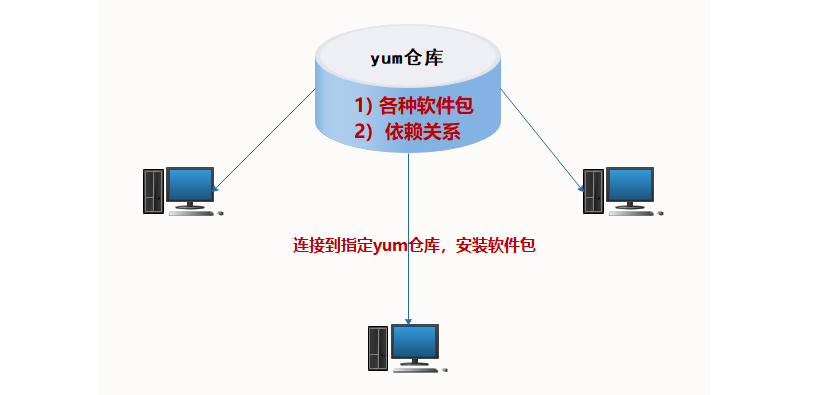
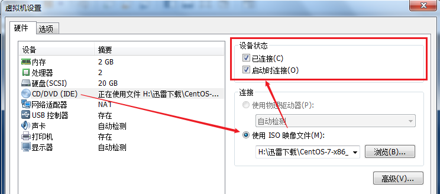
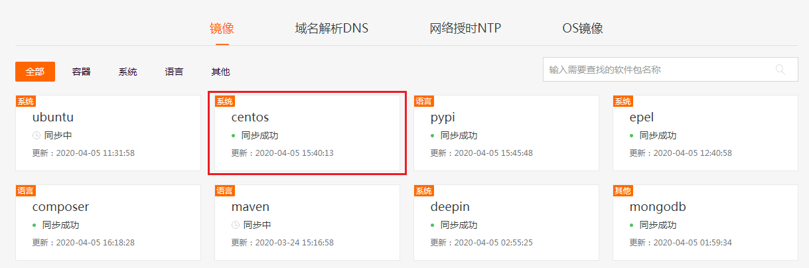

# Linux下yum源配置实战

# 一、Linux下软件包的管理

## 1、软件安装方式

① RPM包管理（需要单独解决依赖问题）

② YUM包管理（需要有网络及YUM仓库的支持，会自动从互联网下载软件，自动解决依赖）

③ 源码安装（安装过程比较复杂，源码安装三步走。优点：定制性很强）

软件：主线版（mainline），稳定版（stable）

## 2、源码安装的配置过程

在Linux系统中，源码安装一共分为三步（三步走）：

第一步：配置过程（配置软件的安装路径）

第二步：编译过程（把软件由源代码编译成可以安装的程序）

第三步：安装过程（把编译后的程序进行安装）

```powershell
# ./configure && make && make install
```

## 3、详解源码安装的配置过程（定制）

```powershell
# cd 软件源码包
# ./configure [选项]
# ./configure --help

--prefix=... Directories to put files in /usr/local 软件家目录
--bindir=... $prefix/bin 	命令的目录
--etcdir=... $prefix/etc 	配置文件的目录 httpd => /etc/httpd/httpd.conf
--mandir=... $prefix/share/man man	文档路径
--locale=... $prefix/share/locale 	语言编码
...
```

## 4、详解编译过程

```powershell
# make
```

> 在Linux操作系统中，make主要功能就是将其他语言的源代码打包成Linux可以识别安装的程序。编译过程需要一个gcc软件（开发工具）的支持！

## 5、安装过程

```powershell
# make install
```

## 6、axel多线程下载软件源码安装

第一步：获取axel多线程下载软件

第二步：上传axel软件包到Linux系统中

第三步：安装axel软件(源码安装三步走=>配置+编译+安装)

① 对软件进行解压缩操作

```powershell
# tar -zxf axel-2.4.tar.gz
或
# tar -xf axel-2.4.tar.gz
```

② 使用cd命令切换到axel目录中

```powershell
# cd axel-2.4
```

③ 对axel软件进行配置（不采用默认配置）

```powershell
# ./configure --help
Usage: ./configure [OPTIONS]
Option          Description                             Default
--prefix=...    Directories to put files in             /usr/local
--bindir=...                                            $prefix/bin
--etcdir=...                                            $prefix/etc
--mandir=...                                            $sharedir/man
--locale=...                                            $sharedir/locale
```

设置axel软件的安装路径为/opt/axel

```powershell
# ./configure --prefix=/opt/axel
```

④ 对axel软件进行编译与安装

```powershell
# make
# make install
或
# make && make install
&& ：逻辑与，如果make编译成功会立即执行右边的make install安装程序，如果make编译失败，则以上程序会停止执行，然后抛出错误。
```

第四步：测试与使用

```powershell
[root@yunwei ~]# axel http://mirrors.163.com/centos/7/os/x86_64/RPM-GPG-KEY-CentOS-7
bash: axel: command not found...
```

出现以上问题的主要原因在于：我们没有采用默认的安装方式，所以导致当我们执行axel命令时，其找不到对应的软件。

第五步：解决命令无法访问问题

```powershell
第一种方式：采用软链接形式（类似Windows中的快捷方式）
第二种方式：使用环境变量（重要，Linux中的环境变量）
```

## 7、使用软链接解决command not found

```powershell
# which axel
/usr/bin/which: no axel in (/usr/local/sbin:/usr/local/bin:/usr/sbin:/usr/bin:/root/bin)

# ll /opt/axel/bin
axel

解决方案：给/opt/axel/bin/axel创建一个快捷方式到/usr/local/bin
# ln -s /opt/axel/bin/axel /usr/local/bin/axel 

基本语法：
# ln -s  源文件路径 软链接路径

# axel http://mirrors.163.com/centos/7/os/x86_64/RPM-GPG-KEY-CentOS-7
```

## 8、使用环境变量解决command not found

环境变量

```powershell
终端 => 命令 => 系统的环境变量(PATH => /etc/profile) => 一些命令的存放路径
```

axel多线程下载软件，通过源码的方式安装成功后，由于没有使用默认的安装路径，导致axel这个命令没有出现在系统的环境变量中，所以其会出现command not found。

第一步：查询当前系统的环境变量

```powershell
# echo $PATH
/usr/local/sbin:/usr/local/bin:/usr/sbin:/usr/bin:/root/bin
```

第二步：把axel所在目录添加到环境变量

```powershell
① 使用vim编辑/etc/profile文件，追加到最后一行
# vim /etc/profile
...
export PATH=$PATH:/opt/axel/bin
# source /etc/profile			=>   		代表让以上配置立即生效

② 使用echo命令向/etc/profile文件中追加一行
# echo 'export PATH=$PATH:/opt/axel/bin' >> /etc/profile
# source /etc/profile
```

第三步：测试axel命令是否可以使用

```powershell
# axel http://mirrors.163.com/centos/7/os/x86_64/RPM-GPG-KEY-CentOS-7
```

## 9、解决源码安装软件手册找不到问题

问题重现：

```powershell
[root@localhost axel]# man axel
No manual entry for axel
原因：找不到指定的man文档
```

解决方案：

```powershell
[root@localhost axel]# vim /etc/man.config
...
增加如下内容：
MANPATH /opt/axel/share/man
```

## 10、卸载源码安装的软件

```powershell
第一步：进入到源码的安装包中
# cd axel-2.4
# make uninstall	=>   安装软件的安装包等程序
# make distclean    =>   卸载编译与配置过程
第二步：删除软件的目录
# rm -rf /opt/axel
```

# 二、YUM源概述

## 1、yum源作用

==软件包管理器==，类似360的软件管家



## 2、yum源优点

RPM安装（下载软件、单独安装、需要解决依赖关系）

源码安装（下载软件的源码包，解压，进入目录=>配置+编译+安装）

yum源：相当于rpm软件包管理的升级版

能够==解决软件包之间的依赖关系==，提高运维人员的工作效率。

> yum源底层还是基于RPM进行软件安装操作的，所以yum安装软件后，我们也可以通过rpm  -qa  |grep  软件名称

## 3、yum源分类

### ☆ 本地yum源

yum仓库在==本地==（系统光盘/镜像文件） =>  不需要网络的支持

### ☆ 网络yum源

yum仓库不在本地，在==远程==

- 国内较知名的网络源（aliyun源，163源，sohu源，知名大学开源镜像等）

  ​	阿里源：<https://opsx.alibaba.com/mirror>

  ​	网易源：<http://mirrors.163.com/>

  ​	搜狐源：<http://mirrors.sohu.com/>

  ​	清华源：<https://mirrors.tuna.tsinghua.edu.cn/>

- 国外较知名的网络源（centos源、redhat源、扩展[^epel]源等）

- ==特定软件==相关的网络源（Nginx、MySQL、Zabbix等）

## 4、本机yum源备份（重要）

第一步：使用cd命令切换到/etc/yum.repos.d目录

```powershell
# cd /etc/yum.repos.d/
```

第二步：对所有的仓库文件进行备份

```powershell
# tar -zcf repo.tar.gz *.repo
```

第三步：删除所有的以.repo结尾的仓库文件

```powershell
# rm -rf *.repo
```

# 三、本地YUM源配置

## 1、本地YUM配置

① 使用光盘镜像作为YUM源仓库

② 下载很多软件，使用软件包作为YUM源仓库

## 2、使用光盘镜像作为YUM源仓库

第一步：在VMware系统中装在CentOS7.6系统的光盘镜像

 

第二步：把光盘挂载到某个目录下

```powershell
# cd ~

# rm -rf /mnt/*
# mount -o ro /dev/sr0 /mnt
选项说明：
-o ：挂载方式，ro代表以readonly=>只读的方式进行挂载
              rw代表以read/write=>读写的方式进行挂载
# lsblk
NAME            MAJ:MIN RM  SIZE RO TYPE MOUNTPOINT
sda               8:0    0   20G  0 disk
├─sda1            8:1    0    1G  0 part /boot
└─sda2            8:2    0   19G  0 part
  ├─centos-root 253:0    0   17G  0 lvm  /
  └─centos-swap 253:1    0    2G  0 lvm  [SWAP]
sr0              11:0    1  4.3G  0 rom  /mnt
```

> 卸载或解挂可以使用umount /mnt

第三步：把光盘挂载添加到开机启动文件中

```powershell
# chmod +x /etc/rc.local
# echo 'mount -o ro /dev/sr0 /mnt' >> /etc/rc.local
```

> /etc/rc.local，属于系统的开机启动文件。系统启动后，会自动加载并执行这个文件

第四步：编写本地YUM仓库文件

```powershell
# cd /etc/yum.repos.d/
创建一个以*.repo结尾的文件，名称任意
# vim local.repo
[local]
name=local yum
baseurl=file:///mnt
gpgcheck=0
enabled=1
# yum clean all
# yum makecache
# yum repolist all

注：file://本地协议路径，后面跟仓库的具体路径
```

> yum仓库的标准格式
>
> [仓库标识名称]，名称任意，在一个文件中可以拥有多个标识
>
> name=仓库名称
>
> baseurl=仓库的路径，支持多种格式，file://本地路径，ftp://，http://或https://
>
> gpgcheck=gpg密钥，值可以是0（代表不检测），1（代表检测，如果是1，下方还要定义一个gpgkey=密钥连接）
>
> enabled=是否启动当前仓库，值可以0，也可以是1，默认为1，代表启动仓库

第五步：测试本地YUM仓库是否可用

```powershell
# yum install httpd -y
```

## 3、扩展man 5

在Linux系统中，给定我们一个配置文件，怎么查询这个文件中每一个选项的作用呢？

```powershell
# man 命令
```

扩展：man  5   配置文件名称

```powershell
# man 5 yum.conf
```


# 四、网络YUM源配置

## 1、网络YUM源的分类

① 使用比较知名平台的YUM源（阿里云、腾讯、清华）

② 有些特定软件（如Nginx、MySQL、Zabbix等等）需要根据官网文档自定义网络YUM源

## 2、使用知名平台的YUM源

​	阿里源：<https://opsx.alibaba.com/mirror>

​	网易源：<http://mirrors.163.com/>

​	搜狐源：<http://mirrors.sohu.com/>

​	清华源：<https://mirrors.tuna.tsinghua.edu.cn/>

腾讯源、华为源...

> 百度搜索 => 华为 mirror镜像源

案例：配置阿里云的yum源

第一步：百度，搜索你想要的YUM源，进入官网，找到CentOS



第二步：根据官网提示，配置阿里云的YUM源

```powershell
# mv /etc/yum.repos.d/CentOS-Base.repo /etc/yum.repos.d/CentOS-Base.repo.backup

# wget -O /etc/yum.repos.d/CentOS-Base.repo http://mirrors.aliyun.com/repo/Centos-7.repo

# yum clean all
# yum makecache
```

## 3、扩展：EPEL源配置

什么是EPEL源？

答：EPEL是对官网源的一个扩展。

CentOS-Base.repo文件 => 基础源（官方在带的YUM源）

epel.repo文件 => 扩展源，是对官方YUM源的一个补充

```powershell
# yum install epel-release -y
```

比如：会跑的小火车就是在epel源中

```powershell
# yum install sl -y
# sl
```

## 4、特定软件的YUM源配置

比如特殊的几个软件，如Nginx、MySQL、Zabbix

Nginx：http://www.nginx.org

MySQL：https://www.mysql.com/

Zabbix：https://www.zabbix.com/

找到官方文档，把YUM源配置，写入到一下文件中（repo文件）

```powershell
# cd /etc/yum.repos.d
# vim nginx.repo
[nginx-stable]
name=nginx stable repo
baseurl=http://nginx.org/packages/centos/$releasever/$basearch/
gpgcheck=1
enabled=1
gpgkey=https://nginx.org/keys/nginx_signing.key
module_hotfixes=true
```

清理缓存：

```powershell
# yum clean all
# yum makecache
```

安装Nginx：

```powershell
# yum install nginx -y
```

# 五、自建YUM源仓库

## 1、缓存安装软件包

什么时候需要缓存软件？

- 下次还需要安装相同版本的软件包
- 由于网络原因导致网络安装非常慢，将软件包缓存下来，配置本地仓库

## 2、如何缓存软件安装包

```powershell
# vim /etc/yum.conf
[main]
cachedir=/var/cache/yum/$basearch/$releasever	定义软件包的缓存路径
keepcache=1			1开启缓存；0关闭
debuglevel=2
logfile=/var/log/yum.log
...
```

## 3、把软件及依赖软件全部下载到某个路径

只下载不安装软件：

```powershell
# yum install --downloadonly --downloaddir=保存路径 软件名称
```

案例：下载samba软件及依赖软件

```powershell
# mkdir /soft
# yum install --downloadonly --downloaddir=/soft samba
```

## 4、自定义YUM仓库

第一步：在系统中安装createrepo制作仓库的软件

```powershell
# yum install createrepo -y
```

第二步：把/soft文件夹做成一个本地的自建仓库

```powershell
# createrepo /soft
```

第三步：在/etc/yum.repos.d目录中创建一个soft.repo的仓库

```powershell
# cd /etc/yum.repos.d/
# vim soft.repo
[soft]
name=soft yum
baseurl=file:///soft
gpgcheck=0
enabled=1
```

清理缓存+重建缓存：

```powershell
# yum clean all
# yum makecache
```

