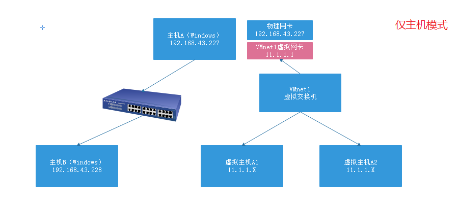

# SSH远程管理服务

# 一、SSH概述

​	     熟悉Linux的人那肯定都对SSH不陌生。ssh是一种用于安全访问远程服务器的协议，远程管理工具。它之所以集万千宠爱为一身，就是因为它的安全性。那么它到底是怎么样来保证安全的呢？到底是如何工作的呢？

## 1、加密算法（了解）

### ☆ 对称加密算法(DES)


1. Jack想要给Harry发送信息一个信息Ａ，为了安全起见，Jack使用一种加密算法，比如给信息通过加一个数字B得到一个新的数字C，然后以公开的方式发送给Harry
2. Harry接受到数字C后，通过减去一个数字B得到最终的真正的信息A
3. Jack发送给Harry的信息A称为明文；加密后的信息C称为密文；加密用的B称之为密钥
4. 加密算法（方法）可以很复杂，不一定是加和减，也可以是乘和除等等
5. 以上过程中，加密和解密的秘钥是同一个密钥B

**总结：**

1. 发送方使用**==密钥==**将==**明文数据**==加密成**==密文==**，然后发送出去
2. 接收方收到密文后，使用==同一个密钥==将密文解密成明文进行读取

### ☆ 非对称加密算法(RSA)


1. 首先Harry生成一对有相互关系的密钥对，比如e（公钥）和f（私钥）；其中公钥是可以公开给所有人的，私钥必须Harry本人私自留存，不得泄露。
2. 当Jack发送请求时，Harry会把自己的公钥e发送给Jack
3. Jack拿着Harry的公钥e通过一种加密算法将信息Ａ加密成密文Ｃ，以公开的方式发送给Harry
4. Harry收到密文Ｃ后，通过自己本地留存的私钥ｆ将密文解密成最终的信息A
5. 以上过程中，加密使用的是公钥e，解密使用的是私钥f；使用不同的秘钥加解密

**总结：**

1. 发送方使用接收方发送过来的**==公钥==**将==**明文数据**==加密成**==密文==**，然后发送出去
2. 接收方收到密文后，使用自己本地留存的==**私钥**==将密文解密成明文进行读取

### ☆ 对称加密与非对称加密区别

- ==**对称加密**==
  1. 使用==同一个密钥==进行加密和解密，密钥容易泄露
  2. ==加密速度快==，效率高，==数据传输==速度==快==，安全性较==低==
- ==**非对称加密**==
  1. 使用==不同的密钥==（公钥和私钥）进行加密和解密
  2. ==加密速度==远远==慢==于对称加密，==数据传输==速度==慢==，安全性较==高==

## 2、环境准备（任务背景）

第一步：把现有的CentOS7操作系统恢复快照（刚装完系统的Linux服务器） => 母机（模板机）

第二步：对CentOS7操作系统进行克隆，生成JumpServer与RealServer（线上生产服务器）

| 编号 | IP地址                                | 主机名称             | 角色信息   |
| ---- | ------------------------------------- | -------------------- | ---------- |
| 1    | 10.1.1.37(NAT)<br />11.1.1.10(仅主机) | jumpserver.itcast.cn | JumpServer |
| 2    | 11.1.1.100(仅主机)                    | realserver.itcast.cn | RealServer |

## 3、SSH基于用户名密码的认证原理

基本语法：

```powershell
# ssh [选项] 远程服务器的用户名@远程服务器的IP地址
选项说明：
-p：指定ssh服务的端口号，默认为22
```

案例：通过JumpServer与RealServer远程连接，了解SSH基于用户名密码的认证原理

JumpServer：

```powershell
# ssh root@10.1.1.38
```

认证原理：


1. SSH客户端向SSH服务端发起一个登录请求

2. SSH服务端将自己的公钥发送给SSH客户端

   注意：如果是第一次访问，则提示以下内容：

```powershell
# ssh远程登录操作 首次
ssh 192.168.19.101
# 显示结果
# 无法确认主机的真实性
The authenticity of host '192.168.19.101 (192.168.19.101)' can't be established.
ECDSA key fingerprint is SHA256:Y/cQNWWkX15o2MsJ5HOQBI2m8S33qIA+x3zys8J4pOY.
ECDSA key fingerprint is MD5:76:61:86:8b:d5:ee:bf:9c:60:e6:12:fa:f6:f0:74:36.
Are you sure you want to continue connecting (yes/no)?yes
Warning: Permanently added '192.168.19.101' (ECDSA) to the list of known hosts.
#说明：
#当客户端输入yes确认对方的公钥指纹后,server端的公钥就会被存放到客户机的用户家目录里~/.ssh/known_hosts文件中，下次再访问就直接通过密码登录，不需要再确认公钥。
```

1. SSH客户端使用服务端发过来的公钥将自己的密码加密并且发送给SSH服务端

2. SSH服务端收到SSH客户端发过来的加密密码后使用本地留存的私钥进行解密

3. SSH服务端将解密出来的密码和`/etc/shadow`文件里的用户密码对比认证

4. SSH服务端认证成功，则返回登录成功结果，并发送一个随机会话口令给客户端，该口令用于后面两台主机进行数据传输的一个临时加密会话口令

## 4、SSH总结

- SSH是Linux下远程管理的工具，相比Telnet安全，运维人员必备的神器！
- SSH的全称Secure Shell，安全的shell，是Client/Server架构，默认==端口号为22，TCP协议==
- SSH其实用于商业，而OpenSSH即为开源的，在Linux中默认安装

# 二、SSH服务搭建

## 1、所有服务的搭建思路

- 关闭防火墙和selinux(实验环境都先关闭掉)
- 配置yum源(公网源或者本地源)
- 软件安装和检查
- 了解并修改配置文件（核心）
- 启动服务检查运行状态并设置开机自启动

## 2、搭建SSH服务器（JumpServer与RealServer）

第一步：关闭防火墙与SELinux

```powershell
# systemctl stop firewalld
# systemctl disable firewalld

# setenforce 0
# vim /etc/selinux/config
SELINUX=disabled
```

第二步：配置YUM源


JumpServer配置外网YUM源 => 阿里云

```powershell
# mv /etc/yum.repos.d/CentOS-Base.repo /etc/yum.repos.d/CentOS-Base.repo.backup
# wget -O /etc/yum.repos.d/CentOS-Base.repo https://mirrors.aliyun.com/repo/Centos-7.repo
# yum clean all
# yum makecache
```

RealServer配置本地YUM源 => 把光盘镜像作为仓库（自建YUM仓库）

① 挂载光盘

```powershell
# mkdir /mnt/cdrom
# mount -o ro /dev/sr0 /mnt/cdrom

# chmod +x /etc/rc.local
# echo 'mount -o ro /dev/sr0 /mnt/cdrom' >> /etc/rc.local
```

② 编写local.repo文件

```powershell
# cd /etc/yum.repos.d
# vim local.repo
[local]
name=local yum
baseurl=file:///mnt/cdrom
enabled=1
gpgcheck=0
```


## 3、VMware中的三种网络


 

由上图可知：在VMware中，一共存在3种网络模式。

| 选择网络连接属性                                      | 意义                                                         |
| ----------------------------------------------------- | ------------------------------------------------------------ |
| Use bridged networking（使用桥接网络）                | 使用（连接）VMnet0虚拟交换机，此时虚拟机相当于网络上的一台独立计算机，与主机一样，拥有一个独立的IP地址 |
| Use network address translation（NAT）（使用NAT网络） | 使用（连接）VMnet8虚拟交换机，此时虚拟机可以通过主机单向访问网络上的其他工作站（包括Internet网络），其他工作站不能访问虚拟机 |
| Use Host-Only networking（仅主机网络）                | 使用（连接）VMnet1虚拟交换机，此时虚拟机只能与虚拟机、主机互连，与网络上的其他工作站不能访问 |

VMnet0 桥接模式 ： 和物理真机连接在同一交换机，相当于系统与Windows处于同一个网段

① 与物理真机同网段，如192.168.43.X

② 桥接模式可以连接外网（有网络）

桥接模式中，Linux系统就相当于一台独立的计算机，与Windows物理真机处于同一个网络环境中。


VMnet1 仅主机模式：封闭的网络环境，仅能与Windows物理真机进行连接。无法连接外网

① 与物理真机不在同一个网段，拥有独立的IP网段

② 仅主机模式仅能用于内部连通（VMware=>JumpServer、RealServer）

③ 仅主机模式无法连接外网




VMnet8 NAT模式：相当于一个独立的网络环境，与物理真机不处于同一个网段。但是其可以通过虚拟网络路由器（NAT地址转化）连接外网。

①  与物理真机不在同一个网段，拥有独立的IP网段

② 不仅可以进行内部连接（VMware=> CentOS6、CentOS7）

③ 拥有一个虚拟的路由器（NAT设备）可以让我们虚拟机连接到外网环境


## 4、静态IP配置

### ☆ JumpServer网卡配置

给JumpServer配置两张网卡（NAT模式 + 仅主机模式）

 

添加仅主机模式网卡：

 

重启network网络，然后使用ifconfig获取仅主机模式的网卡信息。

```powershell
# systemctl restart network
# ifconfig
```


由上图可知，仅主机模式的网卡为ens37，NAT模式网卡为ens33。遇到一个问题，ens37这张网卡没有配置文件：

```powershell
# cd /etc/sysconfig/network-scripts/
# ls
```

添加ens37配置文件：

```powershell
# cp ifcfg-ens33 ifcfg-ens37
# vim ifcfg-ens37
TYPE="Ethernet"
BOOTPROTO="none"
IPADDR=11.1.1.10
NETMASK=255.255.255.0
NAME="ens37"
DEVICE="ens37"
ONBOOT="yes"
```

重启计算机网络：

```powershell
# systemctl restart network
```

### ☆ 关闭NetworkManager

Linux图形化界面中的网络管理器，有些时候我们设置了静态IP。但是重启网络后，其并没有生效或者和你设置的IP地址不一致，很可能是由于NetworkManager工具的影响。

```powershell
# systemctl stop NetworkManager
# systemctl disable NetworkManager
```

### ☆ RealServer网卡配置

把NAT模式的网卡更改为仅主机模式，然后设置一个静态IP地址。

 

由于现在只有一张网卡，所以仅主机模式对应的网卡为ens33，配置：

```powershell
# vim /etc/sysconfig/network-scripts/ifcfg-ens33
TYPE="Ethernet"
BOOTPROTO="none"
IPADDR=11.1.1.100
NETMASK=255.255.255.0
NAME="ens33"
DEVICE="ens33"
ONBOOT="yes"
```

设置完成后，重启计算机网络

```powershell
# systemctl stop NetworkManager
# systemctl disable NetworkManager

# systemctl restart network
```

