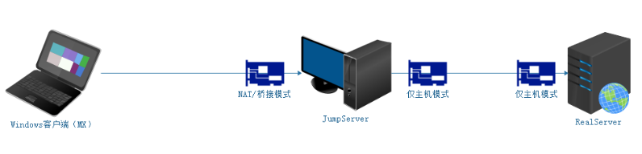

# 远程管理SSH服务

# 一、搭建SSH服务

## 1、关闭防火墙与SELinux

```powershell
# 关闭firewalld防火墙
# 临时关闭
systemctl stop firewalld
# 关闭开机自启动
systemctl disable firewalld

# 关闭selinux
# 临时关闭
setenforce 0
# 修改配置文件  永久关闭
vim /etc/selinux/config
SELINUX=disabled
```

## 2、配置yum源



JumpServer配置外网YUM源 => 阿里云

```powershell
# mv /etc/yum.repos.d/CentOS-Base.repo /etc/yum.repos.d/CentOS-Base.repo.backup
# wget -O /etc/yum.repos.d/CentOS-Base.repo https://mirrors.aliyun.com/repo/Centos-7.repo
# yum clean all
# yum makecache
```

RealServer配置本地YUM源 => 把光盘镜像作为仓库（自建YUM仓库）

① 挂载光盘

```powershell
# mkdir /mnt/cdrom
# mount -o ro /dev/sr0 /mnt/cdrom

# chmod +x /etc/rc.local
# echo 'mount -o ro /dev/sr0 /mnt/cdrom' >> /etc/rc.local
```

② 编写local.repo文件

```powershell
# cd /etc/yum.repos.d
# vim local.repo
[local]
name=local yum
baseurl=file:///mnt/cdrom
enabled=1
gpgcheck=0
```

## 3、openssh软件的安装

SSH服务底层的软件名称叫做openssh，open开源，ssh就是ssh服务。openssh属于C/S架构软件，其拥有客户端与服务器端。

客户端：ssh

服务端：openssh-server

安装步骤：

```powershell
# yum install openssh -y
```

检查openssh是否安装成功

```powershell
# rpm -qa |grep openssh
或
# yum list installed |grep openssh
```

获取openssh生成的文件列表

```powershell
# rpm -ql openssh-server

# 配置文件
/etc/ssh/sshd_config					    =>      ssh服务的主配置文件
/etc/sysconfig/sshd
# 服务管理脚本
/usr/lib/systemd/system/sshd.service		=>      systemctl start sshd
# 文件共享服务 提供文件上传下载的服务
/usr/libexec/openssh/sftp-server
# 二进制文件程序文件
/usr/sbin/sshd
# 公钥生成工具
/usr/sbin/sshd-keygen
# man手册
/usr/share/man/man5/sshd_config.5.gz
/usr/share/man/man8/sftp-server.8.gz
/usr/share/man/man8/sshd.8.gz
```

```powershell
# rpm -ql openssh-clients

# 客户端配置文件
/etc/ssh/ssh_config
# 远程copy命令 服务器间进行文件传输
/usr/bin/scp
# sftp客户端  上传下载文件操作
/usr/bin/sftp
/usr/bin/slogin
/usr/bin/ssh
/usr/bin/ssh-add
/usr/bin/ssh-agent
/usr/bin/ssh-copy-id
/usr/bin/ssh-keyscan
# 客户端man手册
/usr/share/man/man1/scp.1.gz
/usr/share/man/man1/sftp.1.gz
/usr/share/man/man1/slogin.1.gz
/usr/share/man/man1/ssh-add.1.gz
/usr/share/man/man1/ssh-agent.1.gz
/usr/share/man/man1/ssh-copy-id.1.gz
/usr/share/man/man1/ssh-keyscan.1.gz
/usr/share/man/man1/ssh.1.gz
/usr/share/man/man5/ssh_config.5.gz
/usr/share/man/man8/ssh-pkcs11-helper.8.gz
```

## 4、查看并修改ssh服务端的配置文件

```powershell
# man 5 sshd_config
```

RealServer：禁止root账号远程登录

```powershell
# man 5 sshd_config
PermitRootLogin	=> yes or no，默认为yes 代表允许通过root账号远程登录此服务器
```

```powershell
# vim /etc/ssh/sshd_config
38行 PermitRootLogin no
```

## 5、sshd服务管理

```powershell
# systemctl restart sshd	=>   重启
# systemctl status sshd		=> 	 状态
# systemctl stop sshd		=>   停止
# systemctl start sshd		=>   启动

# systemctl enable sshd		=>	 开机自启动
# systemctl disable sshd	=> 	 开机不自启

# ps -ef |grep sshd			=>	 进程
或
# netstat -tnlp |grep sshd	=> 	 端口
或
# ss -naltp |grep sshd
```

# 二、SSH服务任务解决方案

## 1、创建用户并授权

JumpServer跳板机创建用户并授权

第一步：创建用户与用户组（html前端组，tom与jerry）

```powershell
# 创建html前端组
# groupadd html

# 创建组内用户tom与jerry
# useradd -g html tom
# useradd -g html jerry
```

第二步：为用户添加密码

```powershell
# echo 123456 |passwd --stdin tom
# echo 123456 |passwd --stdin jerry
```

第三步：为开发人员创建数据目录并且设置相应的权限

① 创建用户的数据目录：

```powershell
# mkdir -p /code/html		=>    前端组
# ll -d /code/html
drwxr-xr-x. 2 root root 6 May 24 10:36 /code/html
```

② 更改目录的文件所属组（更改为html，代表html组内成员可以对这个目录进行管理）

```powershell
# chgrp -R html /code/html
drwxr-xr-x. 2 root html 6 May 24 10:36 /code/html
# chmod -R g+w /code/html
drwxrwxr-x. 2 root html 6 May 24 10:36 /code/html
```

③ 添加粘滞位权限，防止误删除操作

```powershell
# chmod 1770 /code/html
drwxrwx--T. 2 root html 6 May 24 10:36 /code/html
```

## 2、测试用户权限

测试用户权限是否设置成功，可以结合第1步一起完成

## 3、禁用root登录

RealServer服务器端：

```powershell
# vim /etc/ssh/sshd_config
PermitRootLogin no
```

## 4、更改SSH默认端口

RealServer服务器端：

```powershell
# vim /etc/ssh/sshd_config
17行 Port 3712
```

## 5、重启SSH服务

```powershell
# systemctl restart sshd
或
# systemctl reload sshd
```

restart与reload的本质区别：

① restart其实相当于stop然后在start

② reload不停止现有业务，只是重新加载sshd对应的配置文件

## 6、在RealServer创建一个code账号

```powershell
# useradd code
# echo 123456 |passwd --stdin code
```

测试：在JumpServer远程连接RealServer

```powershell
# ssh -p 3721 code@11.1.1.100
```

## 7、SSH客户端不验证指纹

第一次连接远程服务器时：

```powershell
The authenticity of host '11.1.1.100 (11.1.1.100)' can't be established.
ECDSA key fingerprint is SHA256:Y/cQNWWkX15o2MsJ5HOQBI2m8S33qIA+x3zys8J4pOY.
ECDSA key fingerprint is MD5:76:61:86:8b:d5:ee:bf:9c:60:e6:12:fa:f6:f0:74:36.
Are you sure you want to continue connecting (yes/no)?yes
Warning: Permanently added '11.1.1.100' (ECDSA) to the list of known hosts.
```

如果我们不想验证指纹，可以通过更改SSH客户端的配置文件

JumpServer：

```powershell
# vim /etc/ssh/ssh_config
35行 StrictHostKeyChecking no
```

## 8、用专业工具pwgen生成用户密码

在实际生产环境中，其用户密码一定不要手工设置，建议使用专业的密码生成工具如pwgen。

① 安装随机密码生成工具pwgen

② 使用pwgen工具生成随机密码

③ 给账号code设置密码

第一步：创建code开发者账号

```powershell
# useradd code
```

第二步：配置EPEL源，安装pwgen工具

```powershell
# wget -O /etc/yum.repos.d/epel.repo http://mirrors.aliyun.com/repo/epel-7.repo
# yum clean all
# yum makecache
```

第三步：安装pwgen密码生成工具

```powershell
# yum install pwgen -y
```

第四步：使用pwgen生成随机密码

```powershell
# pwgen -cnBs1 10 1
```

扩展：pwgen密码生成器的使用

```powershell
# pwgen --help
# 用法: pwgen 选项参数 长度 生成个数
Usage: pwgen [ OPTIONS ] [ pw_length ] [ num_pw ]

# 密码中至少包含一个大写字母
-c or –capitalize

# 密码中不包含大写字母
-A or –no-capitalize

# 密码中至少包含一个数字
-n or –numerals

# 密码中不包含数字
-0 or –no-numerals

# 密码中至少包含一个特殊符号
-y or –symbols

# 生成完全随机密码
-s or –secure

# 密码中不包含歧义字符（例如1,l,O,0）
-B or –ambiguous

# 使用SHA1 hash给定的文件作为一个随机种子
-H or –sha1=path/to/file[#seed]

# 在列中打印生成的密码
-C

# 不要在列中打印生成的密码，即一行一个密码
-1

# 不要使用任何元音，以避免偶然的脏话
-v or –no-vowels
```

# 三、SSH服务补充

## 1、scp命令

主要功能：用于Linux系统与Linux系统之间进行文件的传输（上传、下载）

上传：

```powershell
# scp [选项] 本地文件路径 远程用户名@远程服务器的IP地址:远程文件存储路径
-r : 递归上传，主要针对文件夹
-P : 更换了SSH服务的默认端口必须使用-P选项
```

下载：

```powershell
# scp [选项] 远程用户名@远程服务器的IP地址:远程文件路径 本地文件存储路径
-r : 递归上传，主要针对文件夹
-P : 更换了SSH服务的默认端口必须使用-P选项
```

## 2、踢出用户

```powershell
# 查看当前在线用户
w
# 踢出某个账号
pkill -kill -t pts/1
```

# 四、SSH免密登录解决方案

## 1、为什么需要免密登录


## 2、SSH认证原理（基于用户名密码+基于密钥对）

① 回顾基于用户名密码的认证方式


② 基于密钥对（公钥与私钥）的认证方式 => 免密登录


A主机 => JumpServer，B主机 => RealServer

第一步：在A主机（JumpServer）生成一个密钥对（公钥和私钥）

第二步：把A主机的公钥通过网络拷贝到B主机（RealServer）上，然后把其内容追加到B主机的~/.ssh/authorized_keys

第三步：由A主机（JumpServer）向B主机（RealServer）发起登录请求，然后直接在B主机上进行公钥比对（判断A主机的公钥是否已经存储在B主机的authorized_keys文件中），如果存在且正确，则生成一个随机的字符串（如itcast），然后使用A主机的公钥对其加密得到加密的后字符串（如dXdh,34njasz!z.）

第四步：通过网络，由B主机讲刚才生成的加密后的字符串传输给主机A，主机A接收到加密后的字符串以后，使用自己本地存储的私钥进行解密操作（得到itcast）

第五步：把解密得到的itcast发送到B主机，然后验证与刚才生成的字符串是否一致，如果一致，返回登录成功。反之，则返回登录失败。

到此免密登录全部完成！

## 3、SSH免密登录的具体实现

SSH免密的实现思路一共分为三个步骤（三步走）

第一步：在A主机针对某个账号（tom或jerry）生成公钥与私钥

第二步：使用某些方法把公钥发送到B主机中，然后追加到authorized_keys文件中

第三步：测试是否实现免密登录

### ☆ 方法一：比较常用(tom)

① 在A主机针对某个账号生成公钥与私钥

```powershell
# ssh-keygen
```


> 注：如果不想一路确认，可以在ssh-keygen -P ""，直接生成公私钥

② 使用ssh-copy-id把公钥文件中的内容传输到服务器端的~/.ssh/authorized_keys文件中

```powershell
# ssh-copy-id -p 3712 code@11.1.1.100
code@11.1.1.100's password:123456
```

③ 在JumpServer客户端测试免密登录是否成功

```powershell
# ssh -p 3721 code@11.1.1.100
```

### ☆ 方法二：集群常用(jerry)

① 生成公钥与私钥

```powershell
# ssh-keygen
```

② 把id_rsa.pub文件，scp到RealServer服务器端

```powershell
# scp -P 3721 ~/.ssh/id_rsa.pub code@11.1.1.100:/home/code/
```

③ 在RealServer服务器端，把id_rsa.pub文件中的内容追加到~/.ssh/authorized_keys文件中

```powershell
# cd ~
# cat id_rsa.pub >> ~/.ssh/authorized_keys
```

> 注意事项：以上配置也比较简单，但是实际应用时要注意文件的权限

```powershell
RealServer：
~/.ssh : 700
~/.ssh/authorized_keys : 600
```

④ 测试免密是否成功

```powershell
# ssh -p 3721 code@11.1.1.100
```

