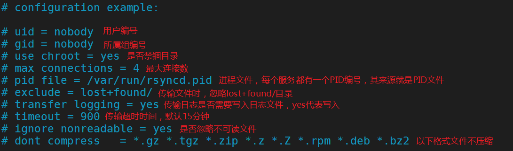
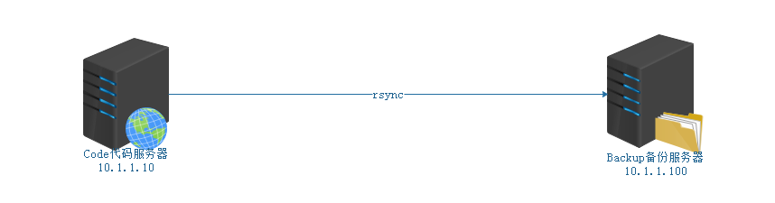

# Linux系统下数据同步服务RSYNC

# 一、RSYNC概述

## 1、什么是rsync

rsync的好姐妹

- sync 同步：刷新文件系统缓存，强制将修改过的数据块写入磁盘，并且更新超级块。
- async 异步：将数据先放到缓冲区，再周期性（一般是30s）的去同步到磁盘。
- rsync 远程同步：==remote  synchronous==

数据同步过程

sync数据同步 => 保存文件（目标）=> 强制把缓存中的数据写入磁盘（立即保存），实时性要求比较高的场景

asyn数据异步 => 保存文件（目标）=> 将数据先放到缓冲区，再周期性（一般是30s）的去同步到磁盘，适合大批量数据同步的场景

## 2、rsync特点

- 可以镜像保存整个目录树和文件系统

- 可以保留原有的权限(permission,mode)，owner,group,时间(修改时间,modify time)，软硬链接，文件acl，文件属性(attributes)信息等

- 传输==效率高==，使用同步算法，只比较变化的（增量备份）

  file1.txt file2.txt file3.txt(A服务器)

  rsync实现数据同步	=>  只同步file3.txt => 增量备份

  file1.txt file2.txt(B服务器)

- 支持匿名传输，方便网站镜像；也可以做验证，加强安全

## 3、rsync与scp的区别

两者都可以实现远程同步，但是相对比而言，rsync能力更强

① 支持增量备份
② 数据同步时保持文件的原有属性

# 二、RSYNC的使用

## 1、基本语法

```powershell
# man rsync
NAME
       rsync — a fast, versatile, remote (and local) file-copying tool
       //一种快速、通用、远程（和本地）的文件复制工具
SYNOPSIS
	   //本地文件同步
	   Local:rsync [OPTION...] SRC... [DEST]
	   //远程文件同步
       Access via remote shell:
         Pull: rsync [OPTION...] [USER@]HOST:SRC... [DEST]
         Push: rsync [OPTION...] SRC... [USER@]HOST:DEST        
OPTION选项说明
-v    	详细模式输出
-a    	归档模式，递归的方式传输文件，并保持文件的属性，equals -rlptgoD
-r    	递归拷贝目录
-l		保留软链接
-p    	保留原有权限
-t     	保留原有时间（修改）
-g    	保留属组权限
-o     	保留属主权限
-D    	等于--devices  --specials    表示支持b,c,s,p类型的文件
-R	    保留相对路径
-H    	保留硬链接
-A    	保留ACL策略
-e     	指定要执行的远程shell命令，ssh更改端口常用选项
-E     	保留可执行权限
-X     	保留扩展属性信息  a属性
```

> PUSH：推，相当于上传；PULL：拉，相当于下载

## 2、本地文件同步

本地文件同步简单理解就是把文件从一个位置（同步=>拷贝）到另外一个位置（类似cp）

案例：/dir1、/dir2与/dir3，/dir1中创建三个文件file1、file2、file3，使用rsync本地同步

```powershell
# mkdir /dir1
# mkdir /dir2
# mkdir /dir3

# touch /dir1/file{1..3}

# rsync -av /dir1/ /dir2		=>   把/dir1目录中的所有文件拷贝到/dir2目录中
# rsync -av /dir1 /dir3			=>   把/dir1目录整体同步到/dir3目录中
```

案例：rsync -R选项的应用（保留相对路径）

```powershell
# rsync -avR /dir1/ /dir2
```

案例：rsync --delete（删除目标目录里多余的文件）

/dir1   				 ===  			/dir2

file1、file2							 file1、file2、file3

rsync --delete同步后，会自动删除file3文件。（让dir1与dir2目录中的文件高度一致）

```powershell
# rsync -av --delete /dir1/ /dir2
```

## 3、远程文件同步

Push：上传文件到远程服务器端

```powershell
# rsync -av 本地文件或目录 远程用户名@远程服务器的IP地址:目标路径
```

案例：把linux.txt文档传输到远程服务器端（10.1.1.100）

```powershell
# rsync -av linux.txt 
```

案例：把shop文件夹传输到远程服务器端（10.1.1.100）

```powershell
# rsync -av shop root@10.1.1.100:/root
```

Pull：下载文件到本地服务器端

```powershell
# rsync -av 远程用户名@远程服务器的IP:目标文件或目录 本地存储位置
```

案例：把远程服务器（10.1.1.100）的/etc/hosts文件下载到本地

```powershell
# rsync -av root@10.1.1.100:/etc/hosts ./
```

案例：把远程服务器（10.1.1.100）的/shop文件夹下载到本地

```powershell
# rsync -av root@10.1.1.100:/shop ./
```

**思考：**

问题1：rsync远程同步数据时，默认情况下为什么需要密码？如果不想要密码同步怎么实现？

rsync在远程同步时，之所以要输入密码的主要原因在于其底层还是基于SSH服务的。SSH有两种认证方式，如果没有配置免密则默认使用用户名+密码的认证方式。

不想要密码同步，可以考虑使用SSH免密操作。

Code => Backup

Code：

```powershell
# ssh-keygen -t rsa -P ""
# ssh-copy-id root@10.1.1.100
```

问题2：如果Backup服务器端更改了SSH的默认密码，那这个数据该如何？

```powershell
#  rsync -e "ssh -p 10086" -av rsync.txt root@10.1.1.100:/root
```

## 4、rsync作为系统服务

默认情况下，rsync只是作为一个命令来进行使用的（ps在查询进程时，找不到对应的服务），但是rsync提供了一种作为系统服务的实现方式。

Linux系统服务的思路：

对外提供服务——>端口监听——>==启动服务==——>启动脚本——>配置文件

第一步：启动rsyncd服务（CentOS6中没有，CentOS7中有这个服务）

```powershell
# systemctl start rsyncd
```

如果企业中使用到操作系统为CentOS6版本，则没有启动脚本。必须求帮助：

```powershell
# man rsync
# rsync --help
Use "rsync --daemon --help" to see the daemon-mode command-line options.

CentOS6：rsync作为系统服务
# touch /etc/rsyncd.conf
# rsync --daemon

# ps -ef|grep rsync
# netstat -tunlp |grep rsync	=>  -t tcp  -u udp
```

> 注：如果rsync作为系统服务单独运行，则其底层就不需要SSH服务了！

第二步：rsyncd服务的配置文件/etc/rsyncd.conf

```powershell
# man 5 rsyncd.conf
```



# 三、任务解决方案(重点)

## 1、环境准备



| 编号 | IP地址     | 主机名称         | 角色             |
| ---- | ---------- | ---------------- | ---------------- |
| 1    | 10.1.1.10  | code.itcast.cn   | Code（MIS）      |
| 2    | 10.1.1.100 | backup.itcast.cn | Backup（Backup） |

第一步：关闭防火墙与SELinux

```powershell
# systemctl stop firewalld
# systemctl disable firewalld

# setenforce 0
# vim /etc/selinux/config
SELINUX=disabled
```

第二步：更改主机名称

```powershell
# hostnamectl set-hostname code.itcast.cn
# hostnamectl set-hostname backup.itcast.cn

# su
```

第三步：更改IP地址（静态IP）

```powershell
# vim /etc/sysconfig/network-scripts/ifcfg-ens33
TYPE="Ethernet"
BOOTPROTO="none"
IPADDR=10.1.1.10
NETMASK=255.255.255.0
GATEWAY=10.1.1.2
DNS1=8.8.8.8
DNS2=114.114.114.114
NAME="ens33"
UUID="a5bb176c-c05c-4bdb-8975-a4aafa2fc90u"			=>    更改UUID的后3位
DEVICE="ens33"
ONBOOT="yes"
# vim /etc/sysconfig/network-scripts/ifcfg-ens33
TYPE="Ethernet"
BOOTPROTO="none"
IPADDR=10.1.1.100
NETMASK=255.255.255.0
GATEWAY=10.1.1.2
DNS1=8.8.8.8
DNS2=114.114.114.114
NAME="ens33"
UUID="a5bb176c-c05c-4bdb-8975-a4aafa2fc56y"			=>    更改UUID的后3位
DEVICE="ens33"
ONBOOT="yes"

# systemctl restart network
```

第四步：关闭NetworkManager

```powershell
# systemctl stop NetworkManager
# systemctl disable NetworkManager
```

第五步：配置YUM源

```powershell
略
```

第六步：时间同步

```powershell
# ntpdate cn.ntp.org.cn
```

## 2、任务解决方案

==Code：10.1.1.10服务器==

第一步：准备代码文件

```powershell
# mkdir /app/java_project -p
# mkdir /app/java_project/aa{1..3}
# touch /app/java_project/file{1..9}.java
```

第二步：把rsync作为系统服务运行

```powershell
# vim /etc/rsyncd.conf
[app]
path=/app/java_project
log file=/var/log/rsync.log

# systemctl start rsyncd

# ps -ef |grep rsync
# netstat -tnlp |grep rsync
```

==Backup：10.1.1.100==

第三步：创建备份目录

```powershell
# mkdir /backup/app1_java -p
```

第四步：测试rsync是否可以连接到rsync服务

```powershell
# rsync -a root@10.1.1.10::
app
-a：获取rsync服务对应的同步目录标签
```

下载文件到本地

```powershell
# rsync -av root@10.1.1.10::app /backup/app1_java
```

第五步：编写计划任务 + Shell的脚本文件，自动实现代码备份

① 编写计划任务

```powershell
# crontab -e
3 1 * * * /root/rsync_java.sh 
```

② 编写rsync_java.sh脚本程序

```powershell
# vim rsync_java.sh
#!/bin/bash
rsync -av root@10.1.1.10::app /backup/app1_java &>/dev/null

# chmod +x rsync_java.sh
```

## 3、任务总结

Code代码服务器 => 10.1.1.10	/app/java_project

Backup备份服务器 => 10.1.1.100

Code：

① 准备代码

② 编写/etc/rsyncd.conf文件，定义同步代码目录

③ 启动rsyncd服务

Backup：

① 测试rsync是否可以连接到Code服务器上的rsyncd服务

② 创建备份目录

③ 编写计划任务，凌晨1点03去Code服务器同步代码

④ 编写rsync_java.sh文件，实现同步操作

# 四、RSYNC课程扩展

## 1、给RSYNC服务添加密码

Code服务器：

① 打开/etc/rsyncd.conf配置文件

```powershell
# vim /etc/rsyncd.conf
[app]
path=/app/java_project
log file=/var/log/rsync.log
auth users = user1,user2				=>   用户名
secrets file = /etc/rsyncd.secrets		=>   密码文件
```

② 在/etc目录下创建rsyncd.secrets文件

```powershell
# vim /etc/rsyncd.secrets
user1:123							 	=>   设置密码，用户名:密码
user2:123
```

③ 更改密码文件权限为600

```powershell
# chmod 600 /etc/rsyncd.secrets 
```

④ 重启rsyncd服务

```powershell
# systemctl restart rsyncd
```

Backup备份服务器：

```powershell
# rsync -av user1@10.1.1.10::app ./
Password:123
```

## 2、RSYNC集合INOTIFY工具实现代码实时同步(重点)

第一步：在Code服务器端安装inotify-tools工具（监控器）

```powershell
# tar xf inotify-tools-3.13.tar.gz -C /usr/local/
# cd /usr/local/inotify-tools-3.14
# ./configure
# make 
# make install

安装完后，就会产生下面两个命令
/usr/local/bin/inotifywait      等待
/usr/local/bin/inotifywatch     看守

/usr/local/bin/inotifywait
-m : 一直监控某个目录，create、delete、modify等行为
-r : 递归，不仅仅监控目录还要监控目录下的文件
-q : 获取操作信息，但是不输出

-e : 哪些行为需要被监控，modify,delete,create,attrib,move
modify: 文件被修改
delete: 文件被删除
create: 文件被创建
attrib: 文件属性被修改
move: 文件被移动
```

第二步：编写inotify.sh

```powershell
# vim inotify.sh
/usr/local/bin/inotifywait -mrq -e modify,delete,create,attrib,move /app/java_project |while read events
do
	rsync -av --delete /app/java_project/ root@10.1.1.100:/backup/app1_java
	echo "`date +%F\ %T`出现事件$events" >> /var/log/rsync.log 2>&1
done

我对/app/java_project做了两件事
① 在目录下创建了一个file9.java	=>   create
② 在目录下删除了一个file5.java	=>   delete
create,delete => while => 执行两次
create
rsync数据同步
delete
rsync数据同步
```

> /usr/local/bin/inotifywait -mrq -e modify,delete,create,attrib,move

第三步：添加可执行权限

```powershell
# chmod +x inotify.sh
```

第四步：让inotify.sh文件一直执行下去

```powershell
# nohup ./inotify.sh  &
& : 让inotify.sh在计算机后台运行，可以使用jobs命令查看，kill %编号结束，当我们退出终端时，这个执行会自动结束
nohup : 让程序一直在后台运行，即使我们关闭了终端
```

扩展：如何查看rsync.log日志文件

```powershell
# cat /var/log/rsync.log
```

