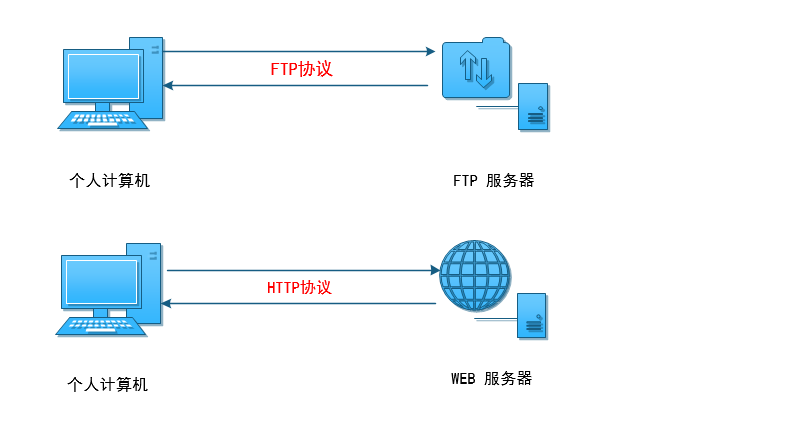
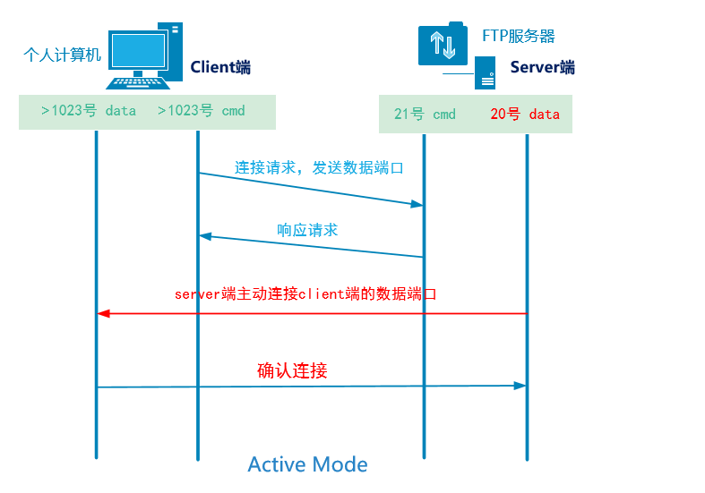
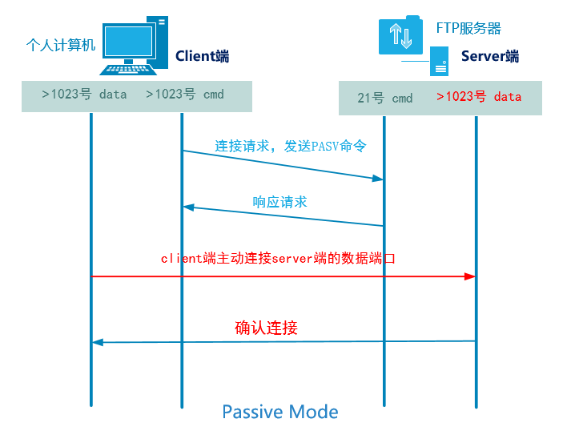
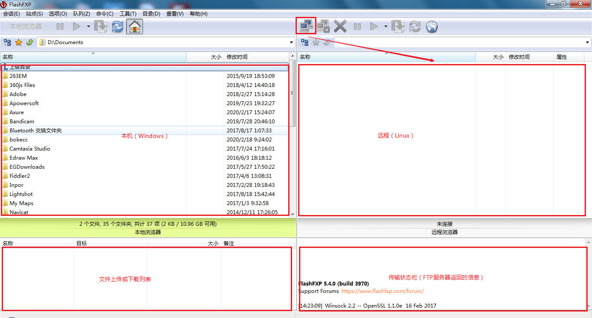
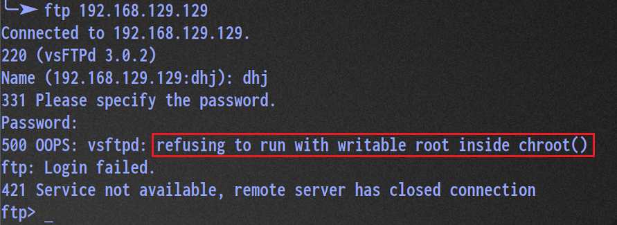

# FTP、NFS、SAMBA系统服务

# 一、rsync托管xinetd

## 1、为什么要进行服务托管

独立服务：独立启动脚本  ssh  ftp nfs dns ...

依赖服务:   没有独立的启动脚本   rsync telnet  依赖xinetd服务（独立服务）

## 2、如何将rsync托管给xinetd服务去管理？

第一步：在系统中安装xinetd服务

```powershell
# yum -y install xinetd

# rpm -ql xinetd
```

第二步：编写xinetd.conf文件（/etc/xinetd.conf）

```powershell
# man 5 xinetd.conf
defaults
{
only_from		只允许访问
no_access		拒绝访问
access_times	控制访问服务的时间段
log_type		指定日志类型
interface		并发连接数
per_source		每个IP的最大连接数
}
includedir /etc/xinetd.d	子配置文件目录（追加rsync、telnet）
```

第三步：手工创建/etc/xinetd.d/rsync

```powershell
# vim /etc/xinetd.d/rsync
service rsync
{
	disable = no
	flags = IPv6
	socket_type = stream
	wait = no
	user = root
	server = /usr/bin/rsync
	server_args = --daemon
	log_on_failure += USERID
}

备注:disable = no //开关；no表示开启该服务；yes表示关闭服务
```

第四步：重启xinetd服务（xinetd服务重启后，rsync服务也会随之重启，检查端口占用）

```powershell
# pkill rsync
# systemctl restart xinetd
# ss -naltp |grep 873
LISTEN     :::873      users:(("xinetd",pid=45079,fd=5))
```

> 在查询873端口占用时，发现只有xinetd服务，没有rsync服务，原因：rsync => xinetd

常见问题（经验值）

```powershell
如果我们在启动xinetd服务时，发现系统中的873端口一直没有被占用，只能有一个问题：配置文件有错误！
解决方案：cat /var/log/messages
一定要注意颜色的变化，有颜色变化代表是正确选项，没有，就肯定你在复制时惨咋了一些看不见的字符。
```

# 二、FTP服务概述

## 1、FTP服务介绍

FTP（File Transfer Protocol）是一种应用非常广泛并且古老的一个互联网文件传输协议。

> 文件传输：文件上传与文件下载



- 主要用于互联网中==文件的双向传输==（上传/下载）、文件共享
- 跨平台   Linux、Windows
- FTP是==C/S==架构，拥有一个客户端和服务端，使用==TCP协议==作为底层传输协议，提供可靠的数据传输
- FTP的默认端口 ==21号==（命令端口）    ==20号==（数据端口，主动模式下） **默认被动模式**下
- FTP程序（软件）**==vsftpd==**

> FTP软件名称 => vsftpd => vs（very secure ftp daemon） 

## 2、FTP服务的客户端工具

- Linux：ftp、lftp（客户端程序）
- Windows：FlashFXP(虚拟主机)、FileZilla、IE、Chrome、Firefox
- lftp和ftp工具区别：
  - lftp：默认是以==匿名用户==访问
  - ftp：默认是以==用户名/密码==方式访问
  - lftp可以批量并且下载目录

## 3、FTP的两种运行模式（了解）

在FTP服务中，其一共拥有两种模式（主动模式 + 被动模式）

> 参考点，FTP的服务器端。如果是FTP服务器端主动连接客户端=>主动模式，如果是客户端主动连接FTP服务器端=>被动模式。

### ☆ 主动模式



cmd：命令端口（发送FTP请求）

data：数据端口（后期用于传输数据）

```powershell
1. 客户端打开大于1023的随机命令端口和大于1023的随机数据端口向服务的的21号端口发起请求
2. 服务端的21号命令端口响应客户端的随机命令端口
3. 服务端的20号端口主动请求连接客户端的随机数据端口
4. 客户端的随机数据端口进行确认
```

### ☆ 被动模式



```powershell
1. 客户端打开大于1023的随机命令端口和大于1023的随机数据端口向服务的的21号端口发起请求
2. 服务端的21号命令端口响应客户端的随机命令端口
3. 客户端主动连接服务端打开的大于1023的随机数据端口
4. 服务端进行确认
```

FTP默认使用的就是被动模式！

## 4、搭建FTP服务（重要）

```powershell
1. 关闭防火墙和selinux
2. 配置yum源(mount /dev/sr0 /mnt)
3. 软件三部曲
4. 了解配置文件
5. 根据需求修改配置文件来完成服务的搭建
6. 启动服务，开机自启动
7. 测试验证
```

第一步：关闭防火墙与SELinux

```powershell
# systemctl stop firewalld
# systemctl disable firewalld

# setenforce 0
# vim /etc/selinux/config
SELINUX=disabled
```

第二步：配置YUM源

```powershell
有网配置公网YUM源（阿里、清华、华为），没网就配置本地YUM源
# mount /dev/sr0 /mnt
# yum clean all
# yum makecache
```

第三步：安装vsftpd软件（FTP => vsftpd）

```powershell
# yum install vsftpd -y
```

第四步：启动ftp服务并添加到开机启动项中

```powershell
# systemctl start vsftpd
# systemctl enable vsftpd
```

第五步：测试FTP是否安装成功

```powershell
# ifconfig ens33
inet 10.1.1.10  netmask 255.255.255.0  broadcast 10.1.1.255
```

☆ 基于浏览器的访问


☆ 基于Windows资源管理器的访问


☆ 基于FlashFxp、FileZilla软件



☆ 基于ftp以及lftp命令进行连接（Linux与Linux之间的FTP文件传输）

```powershell
 yum install ftp lftp -y
# ftp 10.1.1.10
```

## 5、FTP的配置文件详解（重要）

在Server服务器端，使用rpm  -ql  vsftpd

```powershell
# rpm -ql vsftpd
/usr/lib/systemd/system/vsftpd.service	启动脚本
/etc/vsftpd								配置文件的目录
/etc/vsftpd/ftpusers				    用户列表文件，黑名单
/etc/vsftpd/user_list				    用户列表文件，可黑可白（默认是黑名单）
/etc/vsftpd/vsftpd.conf					配置文件(主配置文件)
/usr/sbin/vsftpd						程序本身（二进制的命令）
/var/ftp								匿名用户的默认数据根目录
/var/ftp/pub							匿名用户的扩展数据目录
```

vsftpd配置文件详解：

```powershell
# grep -v ^# /etc/vsftpd/vsftpd.conf
anonymous_enable=YES			支持匿名用户访问	
local_enable=YES				支持非匿名用户,普通账号登录，默认进入到自己家目录
write_enable=YES				写总开关
local_umask=022					反掩码  file:644  rw- r-- r-- dir:755
dirmessage_enable=YES			启用消息功能
xferlog_enable=YES				开启或启用xferlog日志
connect_from_port_20=YES		支持主动模式（默认被动模式）
xferlog_std_format=YES			xferlog日志格式
listen=YES					    ftp服务独立模式下的监听

pam_service_name=vsftpd			指定认证文件
userlist_enable=YES				启用用户列表
tcp_wrappers=YES				支持tcp_wrappers功能(FTP限速操作)
```

> \# man  5  vsftpd.conf 

# 三、FTP任务解决方案

## 1、任务背景

简单来说：根据我们所学的内容（FTP）搭建一个客户服务系统（主要涉及客服资料上传与下载）

```powershell
1. 客服人员必须使用用户名密码(kefu/123)的方式登录服务器来下载相应文档
2. 不允许匿名用户访问
3. 客服部门的相关文档保存在指定的目录里/data/kefu    local_root=/data/kefu
4. 客服用户使用用户kefu/123登录后就只能在默认的/data/kefu目录里活动
```

## 2、创建客服账号(Server)

```powershell
# useradd kefu
# echo 123 |passwd --stdin kefu
```

## 3、不允许匿名用户访问

```powershell
# vim /etc/vsftpd/vsftpd.conf
12行 anonymous_enable=NO
```

配置修改完毕后，一定要重启vsftpd服务

```powershell
# systemctl restart vsftpd
```

## 4、指定账号访问的目录

```powershell
# mkdir /data/kefu -p
# vim /etc/vsftpd/vsftpd.conf
17行 local_root=/data/kefu
```

## 5、限定kefu/123只能在/data/kefu目录下活动

禁锢kefu用户只能在/data/kefu目录下

```powershell
# vim /etc/vsftp/vsftpd.conf
18行 chroot_local_user=YES
```

配置修改完毕后，一定要重启vsftpd服务

```powershell
# systemctl restart vsftpd
```

# 四、经验值

## 1、500 OOPS



以上问题主要出现在FTP2.3.5以后的版本中，当然你可以使用

```powershell
# rpm -qi vsftpd 查看版本信息
```

解决方案：

① 去除写权限（治标不治本）

```powershell
# chmod a-w /home/dhj
```

② 核心解决方案，添加一个选项

```powershell
# vim /etc/vsftpd/vsftpd.conf
19行 allow_writeable_chroot=YES
```

## 2、无法上传

之所以无法上传，主要原因在于kefu这个账号对于/data/kefu文件夹没有w写权限

```powershell
# setfacl -R -m u:kefu:rwx /data/kefu
# systemctl restart vsftpd
```

## 3、禁锢目录补充

```powershell
18行 chroot_local_user=YES  禁锢所有用户
```

需求：我们能不能给一小部分用户开通非禁锢权限。

```powershell
# vim /etc/vsftpd/vsftpd.conf
105行 chroot_list_enable=YES					    开启用户列表文件
107行 chroot_list_file=/etc/vsftpd/chroot_list	指定用户列表文件

echo kefu >> /etc/vsftpd/chroot_list        代表客服这个账号不会被禁锢在指定目录

# systemctl restart vsftpd
```

