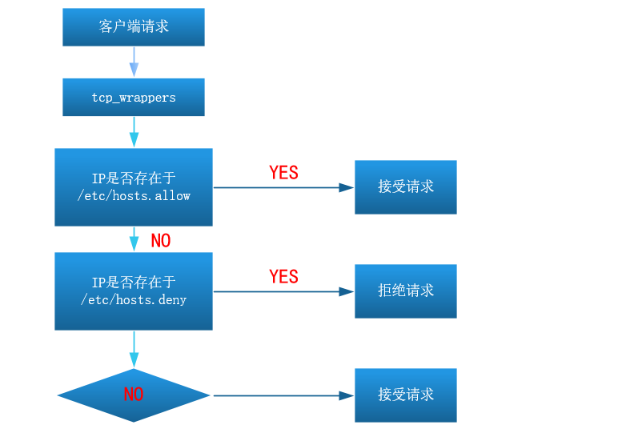
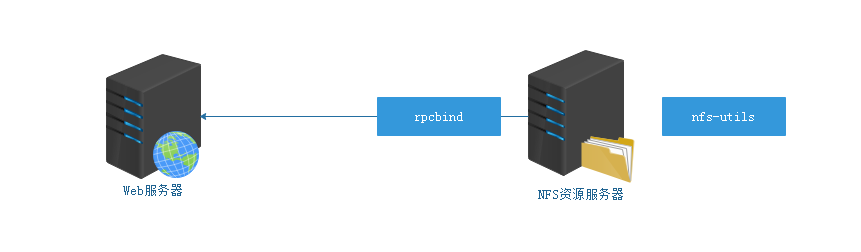

# FTP、NFS以及SAMBA服务

# 一、FTP服务

## 1、Linux下ftp客户端管理工具

ftp、lftp都是Linux下ftp的客户端管理工具，但是需要独立安装

```powershell
# yum install ftp lftp -y
```

### ☆ ftp工具

```powershell
# ftp 10.1.1.10
Connected to 10.1.1.10 (10.1.1.10).
220 (vsFTPd 3.0.2)
Name (10.1.1.10:root): 输入FTP的账号

331 Please specify the password.
Password: 输入FTP账号对应的密码

230 Login successful.
Remote system type is UNIX.
Using binary mode to transfer files.
ftp>
```

求帮助：

```powershell
ftp> ?或help
Commands may be abbreviated.  Commands are:

!               debug           mdir            sendport        site
$               dir             mget            put             size
account         disconnect      mkdir           pwd             status
append          exit            mls             quit            struct
ascii           form            mode            quote           system
bell            get             modtime         recv            sunique
binary          glob            mput            reget           tenex
bye             hash            newer           rstatus         tick
case            help            nmap            rhelp           trace
cd              idle            nlist           rename          type
cdup            image           ntrans          reset           user
chmod           lcd             open            restart         umask
close           ls              prompt          rmdir           verbose
cr              macdef          passive         runique         ?
delete          mdelete         proxy           send
```

第一个命令：ls命令

```powershell
ftp> ls
```

查看当前连接的FTP目录下有哪些文件。

第二个命令（快捷键）：Ctrl  + Shift + L

Ctrl + Shift + L代表清屏命令

第三个命令：help命令

```powershell
ftp> help put
put             send one file
```

第四个命令：put与get命令

```powershell
ftp> put 本地文件路径+名称	 上传
ftp> get 远程文件路径+名称	 下载
```

第五个命令：批量上传或下载多个文件

```powershell
ftp> mput 文件名称1 文件名称2 文件名称3 ...
ftp> mget 文件名称1 文件名称2 文件名称3 ...
```

第六个命令：prompt屏蔽批量输出信息

```powershell
ftp> prompt
Interactive mode on.	=> 开启提示

ftp> prompt
Interactive mode off.	=> 关闭提示
```

第七个命令：quit命令

```powershell
ftp> quit
```

### ☆ lftp工具：批量操作

```powershell
# lftp 用户名称@远程IP地址
Password:用户名称对应的密码
```

求帮助：help

```powershell
lftp> help
```

针对某个命令求帮助：help + 命令

```powershell
lftp> help mirror
```

案例：批量上传（把shop文件夹上传到FTP服务器端）

```powershell
lftp> mirror -R 本地文件夹名称
```

案例：批量下载（把整个FTP下载到本地）

```powershell
lftp> mirror 远程FTP路径
```

## 2、FTP知识点补充

### ☆ FTP访问对象控制（黑名单）

ftpusers		黑名单	

user_list		默认是黑名单（可以成为白名单）

案例：默认情况下，root账号是否允许登录FTP服务器

```powershell
[root@localhost ftp]# ftp 10.1.1.10
Connected to 10.1.1.10 (10.1.1.10).
220 (vsFTPd 3.0.2)
Name (10.1.1.10:root): root
530 Permission denied.
Login failed.
ftp>
原因：root用户在黑名单里/etc/vsftpd/ftpusers黑名单中
```

案例：ftpusers		与       user_list黑名单效果不同点

```powershell
ftpusers：
[root@localhost ftp]# ftp 10.1.1.10
Connected to 10.1.1.10 (10.1.1.10).
220 (vsFTPd 3.0.2)
Name (10.1.1.10:root): kefu
331 Please specify the password.
Password:
530 Login incorrect.			=>       ftpusers被禁用，可以输入密码，返回530
Login failed.


user_list：
[root@localhost ftp]# ftp 10.1.1.10
Connected to 10.1.1.10 (10.1.1.10).
220 (vsFTPd 3.0.2)
Name (10.1.1.10:root): kefu
530 Permission denied.
Login failed.
原因：默认情况下user_list文件也是黑名单，如果在该文件里直接拒绝，不给输入密码的机会。
```

案例：user_list可以从黑名单变成白名单（允许某个用户登录FTP系统服务器）

```powershell
user_list要成为白名单，需要再配置文件里增加：
userlist_deny=NO
注意：如果user_list是白名单，那么必须在该文件里的用户才可以访问ftp服务。
```

总结：

1. 用户在ftpusers文件中，那么用户不能访问ftp服务器
2. 用户在user_list文件中，如果该文件是白名单，那么==**只**==在该文件中的用户可以访问ftp服务
3. 如果user_list文件是白名单，用户即在ftpusers中又在user_list中，那么ftpusers拒绝优先

### ☆ FTP网络访问控制（限IP+限速）

FTP必须支持tcp_wrappers

/etc/hosts.allow 		允许

/etc/hosts.deny		  拒绝



#### ☆ 限制IP地址

案例：如何禁止某个IP或IP网段

```powershell
# vim /etc/hosts.deny
服务程序:主机
vsftpd:all                        全部拒绝
vsftpd:all EXCEPT 192.168.0.2    拒绝所有除了192.168.0.2  
vsftpd:192.168.0.254			  拒绝单个IP地址

vsftpd:192.168.0.254:allow  
//以上是允许192.168.0.254访问，类似/etc/hosts.allow里增加vsftpd:192.168.0.254

vsftpd:192.168.0.0/255.255.255.0   拒绝某个网段
vsftpd:192.168.0.0/255.255.255.0 EXCEPT 192.168.0.254   拒绝某个网段，但是除了某个ip地址
注意：子网掩码不支持192.168.0.0/24这种写法

vim /etc/hosts.deny
vsftpd,sshd:10.1.1.1
```

案例：如何判断某个服务是否支持tcp_wrappers

1）./configure ==--enable-libwrap==  表示支持tcp_wrappers访问控制（源码安装看配置项）

2）rpm安装(也包括yum安装)

```powershell
# ldd命令 +二进制程序，查询某个软件包含哪些模块
```

案例：查询vsftpd与sshd是否支持tcp_wrappers

```powershell
# ldd /usr/sbin/vsftpd |grep libwrap*
	libwrap.so.0 => /lib64/libwrap.so.0 (0x00007f2956480000)

# ldd /usr/sbin/sshd |grep libwrap*
	libwrap.so.0 => /lib64/libwrap.so.0 (0x00007f015ff29000)
```

#### ☆ 限制FTP流量

```powershell
# vim /etc/vsftpd/vsftpd.conf
local_max_rate=0
0代表不限速

local_max_rate=数值 + 字节
```

## 3、使用第三方平台视频

第一步：在Linux电脑中安装httpd（阿帕奇）

```powershell
# yum install httpd -y
```

第二步：启动httpd

```powershell
# systemctl start httpd
```

第三步：在/var/www/html项目目录中创建一个demo.html文件

```powershell
# vim /var/www/html/demo.html
<iframe height=498 width=815 src='https://player.youku.com/embed/XNDU4OTM3NzM0NA==' frameborder=0 'allowfullscreen'></iframe>
```

# 二、NFS服务概述

## 1、任务背景

① 搭建NFS服务器（用于静态资源的存储如图片、视频、附件）

② 使用mount指定对NFS服务器进行挂载，挂载到Web服务器中

③ 对NFS服务器中的静态资源进行实时备份（inotify + rsync）

## 2、环境准备

| 编号 | 主机名称FQDN     | IP地址    | 作用         |
| ---- | ---------------- | --------- | ------------ |
| 1    | web.itcast.cn    | 10.1.1.11 | Web服务器    |
| 2    | nfs.itcast.cn    | 10.1.1.12 | NFS服务器    |
| 3    | backup.itcast.cn | 10.1.1.13 | Backup服务器 |

第一步：设置计算机的在主机名称

```powershell
Web# hostnamectl set-hostname web.itcast.cn
NFS# hostnamectl set-hostname nfs.itcast.cn
Backup# hostnamectl set-hostname backup.itcast.cn
```

第二步：设置IP地址

```powershell
# vim /etc/sysconfig/network-scripts/ifcfg-ens33
BOOTPROTO=none
IPADDR=10.1.1.11   /10.1.1.13   /10.1.1.13
NETMASK=255.255.255.0
GATEWAY=10.1.1.2
DNS1=119.29.29.29
DNS2=114.114.114.114

UUID必须是唯一的，所以要么删除，要么更改UUID的值（更改后3位）
```

第三步：关闭防火墙与SELinux

```powershell
关闭防火墙
# systemctl stop firewalld
# systemctl disable firewalld

关闭SELinux
# setenforce 0
# vim /etc/selinux/config
SELINUX=disabled
```

第四步：配置YUM源

```powershell
# yum clean all
# yum mackecache
```

## 3、NFS概述

NFS（Network File System）网络文件系统，主要用于**Linux系统**上实现文件共享的一种协议，其客户端**主要是Linux**

**没有用户认证机制**，且数据在网络上传送的时候是**明文传送**，一般只能在**局域网**中使用

支持多节点同时挂载及并发写入

**企业应用：为集群中的web server提供后端存储**(做静态资源服务器)

## 4、NFS组成

rpcbind ： 负责NFS的数据传输，远程过程调用  ==tcp/udp协议 端口111==

nfs-utils ：控制共享哪些文件，权限管理

> RPC（Remote Procedure Call Protocol）：
> 远程过程调用协议，它是一种通过网络从远程计算机程序上请求服务，不需要了解底层网络技术的协议。



## 5、与NFS相关的软件包

```powershell
nfs-utils-1.2.3-26.el6.x86_64 		nfs服务的一个脚本控制工具（服务端与客户端）
nfs4-acl-tools-0.3.3-6.el6.x86_64	acl 工具包
nfs-utils-lib-1.1.5-4.el6.x86_64  	nfs 库文件
```

## 6、安装NFS软件

```powershell
# yum install rpcbind nfs-utils -y

# rpm -q rpcbind
# rpm -aq|grep ^nfs
```

## 7、NFS的配置文件

```powershell
# vim /etc/exports
共享目录   共享选项
/share    *(ro,sync)
/public	  *(ro,sync)

共享主机：
*   ：代表所有主机
192.168.0.0/24：代表共享给某个网段192.168.0.1 ~ 192.168.0.254
192.168.0.0/24(rw) 192.168.1.0/24(ro) :代表共享给不同网段
192.168.0.254：共享给某个IP
*.itcast.cn:代表共享给某个域下的所有主机

共享选项：
ro：只读
rw：读写
sync：实时同步，直接写入磁盘(安全性最高)
async：异步，先缓存数据在内存然后再同步磁盘(效率最高，但是有丢失文件风险)
anonuid：设置访问nfs服务的用户的uid，uid需要在/etc/passwd中存在
anongid：设置访问nfs服务的用户的gid
root_squash ：默认选项 root用户创建的文件的属主和属组都变成nfsnobody,其他人nfs-server端是它自己，client端是nobody。(访问NFS服务器时，映射为匿名账号)
no_root_squash：root用户创建的文件属主和属组还是root，其他人server端是它自己uid，client端是nobody。(访问NFS服务器时，映射为root管理员账号)
all_squash： 不管是root还是其他普通用户创建的文件的属主和属组都是nfsnobody

说明：
anonuid和anongid参数和all_squash一起使用。
all_squash表示不管是root还是其他普通用户从客户端所创建的文件在服务器端的拥有者和所属组都是nfsnobody；服务端为了对文件做相应管理，可以设置anonuid和anongid进而指定文件的拥有者和所属组
```

# 三、NFS任务解决方案

## 1、搭建NFS服务器

第一步：安装软件

```powershell
# yum install rpcbind nfs-utils -y
```

第二步：创建一个共享目录，如/share

```powershell
# mkdir /share
```

## 2、编写NFS主配置文件

```powershell
# vim /etc/exports
共享目录   共享选项
/share    10.1.1.0/24(rw,sync)
```

## 3、启动相关的NFS服务

```powershell
# systemctl start rpcbind
# systemctl start nfs

# ss -naltp |grep 111       111端口
```

## 4、搭建Web服务器

```powershell
# yum install httpd -y
# systemctl start httpd
```

当Apache软件启动完毕后，会自动占用计算机的80端口。

80端口指向Web服务器的目录 => /var/www/html

所以项目源代码都可以直接存放于/var/www/html目录下

```powershell
# echo "NFS实战演练" > /var/www/html/index.html
```

## 5、在Web服务器中挂载NFS

```powershell
# mkdir /var/www/html/media


# mount -t nfs 10.1.1.12:/share /var/www/html/media 
或
# mount.nfs 10.1.1.12:/share /var/www/html/media


# df -h
Filesystem               Size  Used Avail Use% Mounted on
/dev/mapper/centos-root   17G  5.1G   12G  30% /
devtmpfs                 894M     0  894M   0% /dev
tmpfs                    910M     0  910M   0% /dev/shm
tmpfs                    910M   11M  900M   2% /run
tmpfs                    910M     0  910M   0% /sys/fs/cgroup
/dev/sda1               1014M  179M  836M  18% /boot
tmpfs                    182M   28K  182M   1% /run/user/1000
/dev/sr0                 4.3G  4.3G     0 100% /run/media/itheima/CentOS 7 x86_64
tmpfs                    182M     0  182M   0% /run/user/0
10.1.1.12:/share          17G  5.1G   12G  30% /var/www/html/media

如果客户端没有安装nfs工具可能导致挂载失败：
yum -y install nfs-utils nfs-utils-lib nfs4-acl-tools
```

## 6、上传aws.mp4视频到NFS服务器的/share

第一步：使用MX上传aws.mp4到/share目录（NFS服务器）

第二步：在Web服务器中，ll  /var/www/html/media目录

```powershell
# ll /var/www/html/media
aws.mp4
```

## 7、在html网页中调用aws.mp4文件

```powershell
# vim /var/www/html/index.html
<video width="800" height="450" controls>
	<source src="media/aws.mp4">
</video>
```

## 8、对NFS服务器进行实时备份

NFS服务器：/share目录有变化，马上rsync进行同步Backup备份服务器的/backup目录

第一步：安装inotify工具(NFS服务器)

```powershell
# tar xf inotify-tools-3.14.tar.gz
# cd inotify-tools-3.14
# ./configure && make && make install
```

第二步：编写rsync.sh脚本，监控/share目录的变化

```powershell
# vim rsync.sh
#!/bin/bash
/usr/local/bin/inotifywait -mrq -e modify,delete,create,attrib,move /share |while read events
do
    rsync -a --delete /share/ 10.1.1.13:/backup/
    echo "`date +%F\ %T`出现事件$events" >> /var/log/rsync.log 2>&1
done
```

第三步：给rsync添加x权限

```powershell
# chmod +x rsync.sh
```

第四步：把NFS服务器与Backup备份服务器进行免密登录

```powershell
# ssh-keygen
# ssh-copy-id root@10.1.1.13
```

第五步：在Backup服务器中创建一个/backup目录，用于实时备份

```powershell
# mkdir /backup
```

第六步：在NFS服务器中执行rsync脚本

```powershell
# nohup ./rsync.sh &
```

