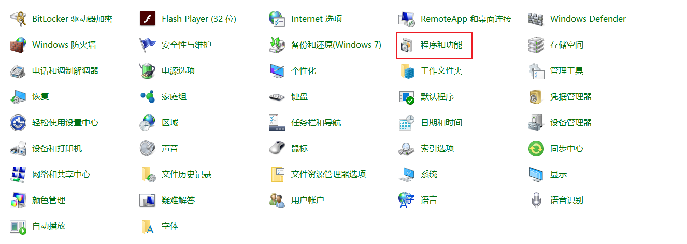
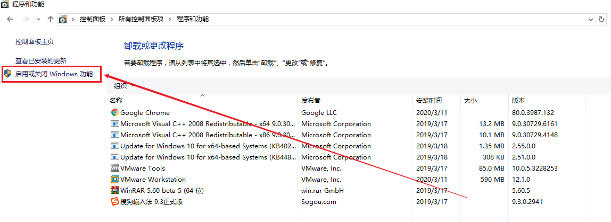
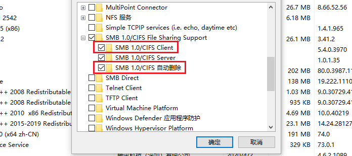
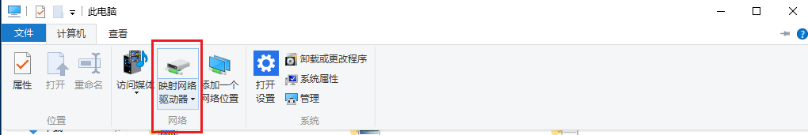
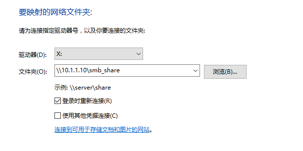
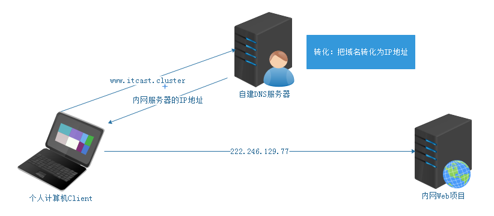
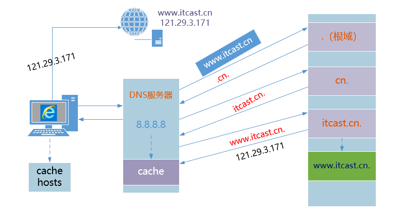
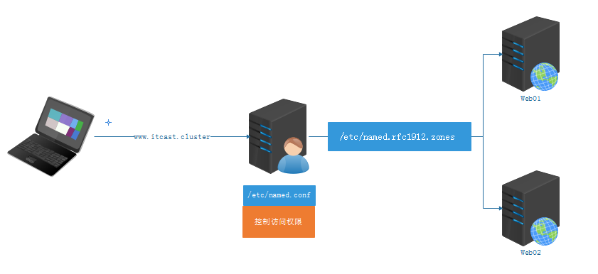
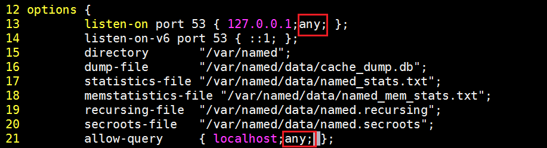
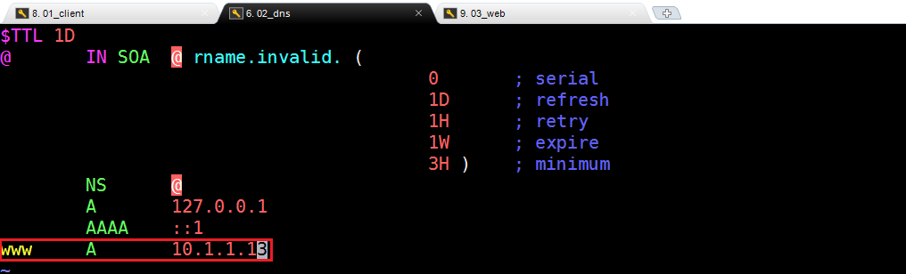

# SAMBA文件共享与DNS域名服务

# 一、SAMBA文件共享

## 1、什么是SAMBA

SMB（Server Message Block）协议实现文件共享，也称为CIFS（Common Internet File System ）

是Windows和类Unix系统之间共享文件的一种协议

客户端==主要是Windows==；支持多节点同时挂载以及并发写入

主要用于windows和Linux下的文件共享、打印共享

实现==匿名与本地用户==文件共享

## 2、SAMBA主要进程

smbd进程 	   控制发布共享目录与权限、==负责文件传输==   ==TCP  139 445==

nmbd进程       用于名称解析netbios   ==UDP 137 138== ; 基于NETBIOS协议获得计算机名称——>解析为相应IP地址，实现信息通讯 

 NetBIOS是Network Basic Input/Output System的简称，一般指用于局域网通信的一套API  

## 3、SAMBA环境准备

第一步：从模板机中克隆一台Linux服务器，叫做SAMBA

第二步：更改主机名称与IP地址

```powershell
# hostnamectl set-hostname samba.itcast.cn
# su

# vim /etc/sysconfig/network-scripts/ifcfg-ens33
BOOTPROTO=none
IPADDR=10.1.1.10
NETMASK=255.255.255.0
GATEWAY=10.1.1.2
DNS1=8.8.8.8
DNS2=114.114.114.114
# systemctl restart network
扩展：如果是多张网卡，建议使用ifdown ens33以及ifup ens33实现重启网络操作
```

第三步：关闭防火墙与SELinux

```powershell
# systemctl stop firewalld
# systemctl disable firewalld

# setenforce 0
# vim /etc/selinux/config
SELINUX=disabled
```

第四步：配置yum源

```powershell
# yum clean all
# yum makecache
```

## 4、SAMBA软件安装（服务器搭建）

```powershell
# yum install samba -y
# rpm -qa |grep ^samba
```

> SAMBA也是一个C/S架构的软件，Client主要是Windows

## 5、了解smb的配置文件

```powershell
# vim /etc/samba/smb.conf
[global]  全局选项
	workgroup = MYGROUP                 定义samba服务器所在的工作组
	server string = Samba Server Version %v         smb服务的描述
	log file = /var/log/samba/log.%m            日志文件
	max log size = 50                   日志的最大大小KB  
	security = user             认证模式：share匿名|user用户密码|server外部服务器用户密码
	passdb backend = tdbsam         密码格式
	load printers = yes         加载打印机
	cups options = raw          打印机选项
[homes]                 局部选项（共享名称）
	comment = Home Directories      描述
	browseable = no      隐藏共享名称
	writable = yes      可读可写
[printers]      共享名称
	comment = All Printers       描述
	path = /var/spool/samba  本地的共享目录
	browseable = no  隐藏
	guest ok = no ——>   public = no  需要帐号和密码访问
	writable = no  ——>  read only =yes 不可写 
	printable = yes      打印选项
[share]
	path = /dir1
	guest ok = no
	writable = yes
```

## 6、SAMBA综合案例

搭建一个SAMBA服务，共享一个目录/samba/share,客户端使用user01/123通过windows或者Linux可以在该目录里创建文件删除文件

第一步：SAMBA服务器环境准备

更改主机名称、IP地址、关闭防火墙、SELinux、配置YUM源

第二步：安装SAMBA软件

```powershell
# yum install samba -y
# rpm -aq|grep  ^samba
```

第三步：查询SAMBA生成文件列表（rpm  -ql）

```powershell
# rpm -ql samba
/usr/sbin/smbd
/usr/sbin/nmbd

/usr/lib/systemd/system/smb.service
/usr/lib/systemd/system/nmb.service
```

第四步：在服务器端创建一个共享目录

```powershell
# mkdir /samba/share -p
```

第五步：编辑/etc/smb.conf配置文件，实现SAMBA共享

```powershell
# vim /etc/samba/smb.conf
...
[smb_share]
        comment = samba service
        path = /samba/share
        guest ok = no
        writable = yes
或者
[samba_share]
        path = /samba/share
        public = no
        writable = yes

备注：guest ok === public
```

第六步：创建一个user01用户，然后添加到samba认证中，设置密码为123

```powershell
# useradd user01
# smbpasswd -a user01
New SMB password:123
Retype new SMB password:123
Added user user01.
```

以上操作完成后，则SAMBA系统中增加了一个user01的账号以及123的密码

第七步：启动nmb与smb服务

```powershell
# systemctl start nmb
# systemctl start smb
```

第八步：基于Windows或Linux实现文件共享

Windows：

① 首先安装SAMBA支持Windows + X，选择控制面板



② 找到Windows功能选项



③ 安装SAMBA功能（客户端）



④ 进入计算机（我的电脑），找到映射网络驱动器



设置SAMBA服务器的地址信息：

 

10.1.1.10 => Linux服务器的IP地址

smb_share => SAMBA标签

> 挂载完成后，目录不可写？答：主要原因在于/samba/share目录没有写入权限

```powershell
# setfacl -m u:user01:rwx /samba/share
```

第九步：基于Linux或Linux实现文件共享

```powershell
# smbclient -L 10.1.1.10 -U user01
```

使用smbclient查看目录信息

```powershell
# smbclient //10.1.1.10/smb_share -U user01
```

把SAMBA挂载到Linux系统（类似NFS）

```powershell
# mkdir /u01
# mount.cifs -o user=user01,pass=123 //10.1.1.10/smb_share /u01
```

访问控制说明：

```powershell
控制读写权限
	writable = yes/no
	readonly = yes/no

如果资源可写，但只允许某些用户可写，其他都是只读
write list = admin, root, @staff（用户组）
read list = mary, @students

控制访问对象
	valid users = tom,mary,@itcast
	invalid users = tom
注意：以上两个选项只能存在其中一个

网络访问控制：
hosts deny = 192.168.0.   拒绝某个网段
hosts allow = 192.168.0.254  允许某个IP
hosts deny = all  拒绝所有
hosts allow = 192.168.0. EXCEPT 192.168.0.254  允许某个网段，但拒绝某个单个IP
注意：deny和allow同时存在，allow优先
```

## 7、总结

1. ftp 局域网和外网都可以
2. nfs  局域网  挂载方式访问  mount.nfs  侧重于Linux与Linux之间
3. samba 局域网  直接访问(smbclinet)挂载的方式mount.cifs  侧重于Windows与Linux之间

# 二、DNS域名管理系统

## 1、任务背景



解析内网域名，能够访问内网web应用。把 www.itcast.cluster   解析到内网服务器IP

## 2、DNS概述

**DNS（domain name system ） 域名管理系统**

- 域名：

由特定的格式组成，用来表示互联网中==某一台计算机或者计算机组的名称==，能够使人更方便的访问互联网，而不用记住能够被机器直接读取的IP地址。

计算机 => IP地址，互联网中的计算机都是通过IP地址进行互相访问的。(IP地址过于复杂)

域名：代替IP实现计算机的访问（高级 => 上层应用，底层还是IP地址）

每个域名 =>  DNS服务器  => 对应的IP地址

### ☆ DNS的正向解析

域名的==正向解析==

将主机域名转换为对应的IP 地址，以便网络程序能够通过主机域名访问到对应的服务器主机

**域名——>IP**		A记录

### ☆ DNS的反向解析

域名的==反向解析==

将主机的IP地址转换为对应的域名，以便网络（服务）程序能够通过IP地址查询到主机的域名

**IP——>域名**		PTR记录

## 3、DNS的结构

```powershell
域名：www.itheima.com
DNS结构：www.itheima.com.  =>  从右向左解析
```


### ☆ 根域（.）

- 在整个 DNS 系统的最上方一定是 . (小数点) 这个 DNS 服务器 (称为 root)，也叫”根域“。
- 根域 （13台 全世界只有13台。1个为主根服务器，放置在美国。其余12个均为辅根服务器，其中9个放置在美国，欧洲2个，位于英国和瑞典，亚洲1个，位于日本。）

### **☆ 一级域名<顶级域|国家域>**

com net edu gov org cc  io| cn uk us ru ja ko 

.com ： 商业公司

.net  ：互联网公司

.edu ：教育（中小学、高中、大学...）

.gov ：政府

.io	：存储设备，redis

.cn   ：中国域名（国家域）

### ☆ **二级域名**(自己购买管理)

qq.com**.**   baidu.com.    google.com. 

### **☆ 域名机构**

收费（新网|万网）
老牌免费域名：TK顶级域名、TK域名DNS、TK域名商

## 4、DNS工作原理



如果询问一次得到结果  递归查询    C-S
如果询问多次得到结果  迭代查询    S-S 

**一次递归 多次迭代 **

## 5、dig工具使用

```powershell
# dig +trace www.itcast.cn	  追踪DNS的解析过程
# dig www.itcast.cn			  正向解析
# dig -x IP地址			    反向解析
```

# 三、DNS服务器的搭建

## 1、DNS服务器端软件

DNS 的==域名解析==都是 **==udp/53==** . 主从之间的==数据传输==默认使用**==tcp/53==**

DNS服务器端软件：

==Bind==是一款开放源码的DNS服务器软件，Bind由美国加州大学Berkeley（伯克利）分校开发和维护的，全名为Berkeley Internet Name Domain它是目前世界上使用最为广泛的DNS服务器软件，支持各种unix平台和windows平台。BIND现在由互联网系统协会（Internet Systems Consortium）负责开发与维护。

## 2、DNS服务器搭建

### ☆ 第一步：环境准备

| 编号 | 主机名称         | IP地址    | 备注信息                       |
| ---- | ---------------- | --------- | ------------------------------ |
| 1    | client.itcast.cn | 10.1.1.11 | client客户端，用于测试         |
| 2    | dns.itcast.cn    | 10.1.1.12 | dns服务器，用于实现域名解析    |
| 3    | web.itcast.cn    | 10.1.1.13 | web服务器，用于搭建内部web服务 |

① 更改主机名称与IP地址

```powershell
# hostnamectl set-hostname client.itcast.cn
# hostnamectl set-hostname dns.itcast.cn
# hostnamectl set-hostname web.itcast.cn

# su

# vim /etc/sysconfig/network-scripts/ifcfg-ens33
BOOTPROTO=none
IPADDR=10.1.1.11/10.1.1.12/10.1.1.13
更改UUID编号的后3位，必须是唯一的
```

② 使用MX进行连接

③ 关闭防火墙与SELinux

```powershell
# systemctl stop firewalld
# systemctl disable firewalld

# setenforce 0
# vim /etc/selinux/config
SELINUX=disabled
```

④ 配置YUM源（有网配置公网YUM源、无网就配置光盘或自建YUM源）

```powershell
# yum clean all
# yum makecache
```

### ☆ 第二步：安装DNS软件

DNS服务器：

```powershell
# yum install bind -y
```

安装完毕后，可以使用rpm  -q查询是否安装成功：

```powershell
# rpm -q bind

# rpm -ql bind
# 日志轮转文件
/etc/logrotate.d/named
# 配置文件目录
/etc/named
# 主配置文件
/etc/named.conf
# zone文件,定义域
/etc/named.rfc1912.zones
# 服务管理脚本
/usr/lib/systemd/system/named.service
# 二进制程序文件
/usr/sbin/named
# 检测配置文件
/usr/sbin/named-checkconf
# 检测域文件
/usr/sbin/named-checkzone
# 根域服务器
/var/named/named.ca
# 正向解析区域文件模板
/var/named/named.localhost
# 反向解析区域文件模板
/var/named/named.loopback
# dns服务器下载文件的默认路径
/var/named/slaves
# 进程pid
/var/rum/named
```

> find主要用来搜索计算机中的文件，rpm主要用来检查计算机中是否安装过某个软件

### ☆ 第三步：DNS正向解析配置(域名=>IP)



/etc/named.conf主要配置访问权限控制（哪些IP或哪些主机可以访问DNS服务器）

/etc/named.rfc1912.zones主要定义域名如何解析（正向解析），解析到具体哪个IP地址

① 对named.conf以及named.rfc1912.zones进行备份

```powershell
cp /etc/named.conf /etc/named.conf.bak
cp /etc/named.rfc1912.zones /etc/named.rfc1912.zones.bak
```

② named.conf主配置文件详解（访问权限控制）

```powershell
# vim /etc/named.conf
```

添加任何主机都可以访问的权限：



③ zones子配置文件详解（域名应该指向哪个IP地址）

```powershell
# vim /etc/named.rfc1912.zones
...
zone "itcast.cluster" IN {
        type master;
        file "itcast.cluster.zone";
        allow-update { none; };
};
```

> 扩展 => vim => ：19，23  co  42，把19-23行，copy到42行的后面

④ 在/var/named目录创建itcast.cluster.zone文件定义正向解析

```powershell
# cd /var/named
# cp -p named.localhost itcast.cluster.zone
```


> 扩展：-p代表复制文件时保留文件的原有属性

⑤ 编辑itcast.cluster.zone文件，定义域名的指向

```powershell
# vim itcast.cluster.zone
```



> 扩展：zone文件的格式说明

```powershell
zone文件详解
# $TTL  缓存的生存周期
# @ = zonename = itcast.com  当前域
# IN  互联网
# SOA 开始授权
# NS  dns服务端	nameserver
# A   ipv4 正向
# AAAA IPV6
# CNAME 别名
# MX  邮件交互记录  5 数字代表优先级 数字越小优先级越高

# 0       ; serial    更新序列号	
# 1D      ; refresh   更新间隔（从服务器下载数据）
# 1H      ; retry     失败重试
# 1W      ; expire    区域文件的过期时间
# 3H )    ; minimum   缓存的最小生存周期

# D Day、H Hour、W Week
```

### ☆ 第四步：检查named.conf与zones文件

```powershell
# named-checkconf /etc/named.conf
# named-checkconf /etc/named.rfc1912.zones

检查itcast.cluster.zone文件
# cd /var/named
# named-checkzone itcast.cluster.zone itcast.cluster.zone
```

### ☆ 第五步：启动DNS服务（named）

```powershell
# systemctl restart named
# netstat -tnlp |grep named
```

## 3、Web服务搭建

```powershell
# yum install httpd -y
# systemctl start httpd

# echo 'DNS Test ...' > /var/www/html/index.html
```

## 4、测试DNS服务器的正向解析

Client：客户端服务器操作

### ☆ 添加DNS服务器

```powershell
# 临时
echo 'nameserver 10.1.1.12' > /etc/resolv.conf
注：电脑重启，网络刷新restart network，VMware挂起，临时DNS都会失效

# 永久添加
vim /etc/sysconfig/network-scripts/ifcfg-ens33
DNS=10.1.1.12
```

### ☆ 使用nslookup检测正向解析是否生效

```powershell
# nslookup www.itcast.cluster
```

### ☆ 使用elinks命令行浏览器或curl来实现访问

```powershell
# yum install elinks -y
# elinks
输入www.itcast.cluster
```

```powershell
# curl http://www.itcast.cluster
```

