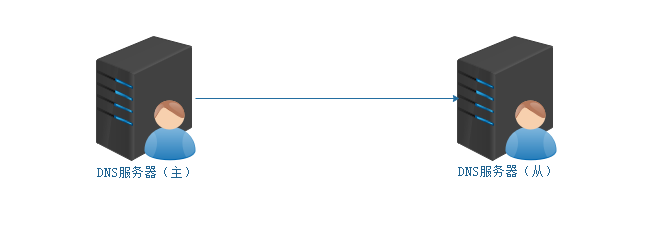
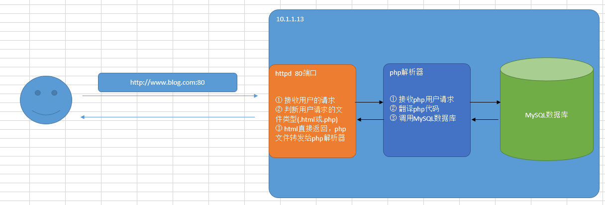
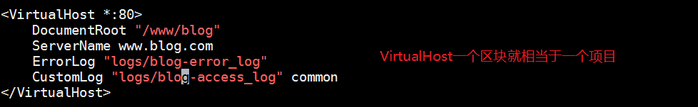
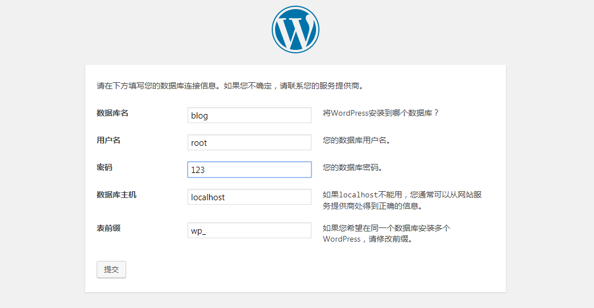

# DNS域名管理系统与LAMP编译安装

# 一、DNS域名管理系统

## 1、DNS两种解析

正向解析：把域名解析为对应的IP地址

反向解析：把IP地址解析为对应的域名

## 2、DNS的反向解析

目标：把10.1.1.13这个IP地址通过DNS服务器指向www.itcast.cluster域名

第一步：开启网络的访问权限控制

```powershell
# vim /etc/named.conf
12 options {
13         listen-on port 53 { 127.0.0.1;any; };
14         listen-on-v6 port 53 { ::1; };
15         directory       "/var/named";
16         dump-file       "/var/named/data/cache_dump.db";
17         statistics-file "/var/named/data/named_stats.txt";
18         memstatistics-file "/var/named/data/named_mem_stats.txt";
19         recursing-file  "/var/named/data/named.recursing";
20         secroots-file   "/var/named/data/named.secroots";
21         allow-query     { localhost;any;};
```

第二步：在zones文件中定义zone文件

```powershell
# vim /etc/named.rfc1912.zones
49 zone "1.1.10.in-addr.arpa" IN {
50         type master;
51         file "10.1.1.zone";
52         allow-update { none; };
53 };
```

第三步：cd /var/named进入到DNS zone配置文件目录，复制named.loopback文件

```powershell
# cd /var/named
# cp -p named.loopback 10.1.1.zone
```

第四步：编辑10.1.1.zone文件，把IP地址=>10.1.1.13指向www.itcast.cluster域名

```powershell
$TTL 1D
@       IN SOA  @ rname.invalid. (
                                        0       ; serial
                                        1D      ; refresh
                                        1H      ; retry
                                        1W      ; expire
                                        3H )    ; minimum
        NS      @
        A       127.0.0.1
        AAAA    ::1
        PTR     localhost.
#增加一条反向解析，把10.1.1.13 => PTR => www.itcast.cluster
13      PTR     www.itcast.cluster
```

第五步：检查与客户端测试

DNS服务器：

```powershell
# named-checkconf /etc/named.conf
# named-checkconf /etc/named.rfc1912.zones

# cd /var/named
# named-checkzone 10.1.1.zone 10.1.1.zone

# systemctl restart named
```

客户端检测：

```powershell
# echo 'nameserver 10.1.1.12' > /etc/resolv.conf
# nslookup 10.1.1.13
www.itcast.cluster.1.1.10.in-addr.arpa.
```

## 3、VMware与CentOS7网络的小bug

DNS的临时配置方式 => echo  'nameserver 10.1.1.12' > /etc/resolv.conf

> 注：当VMware关闭或者挂起时，临时设置的DNS会被重置


CentOS7版本中，有的时候，在网络配置时，明明设置了静态IP，但是无论重启网络、重启网卡，其设置的IP地址都没有生效。

```powershell
# ifconfig ens33

# ip a
2: ens33: <BROADCAST,MULTICAST,UP,LOWER_UP> mtu 1500 qdisc pfifo_fast state UP group default qlen 1000
    link/ether 00:0c:29:68:d8:bb brd ff:ff:ff:ff:ff:ff
    inet 10.1.1.29/24 brd 10.1.1.255 scope global noprefixroute dynamic ens33
       valid_lft 1656sec preferred_lft 1656sec
    inet 10.1.1.11/24 brd 10.1.1.255 scope global secondary ens33
       valid_lft forever preferred_lft forever
    inet6 fe80::20c:29ff:fe68:d8bb/64 scope link 
       valid_lft forever preferred_lft forever
```

> 出现以上问题的主要原因在于图形化界面中的NetworkManager服务没有关闭！

解决方案：

```powershell
# systemctl stop NetworkManager
# systemctl disable NetworkManager
```

## 4、多域DNS服务器搭建

需求：搭建一个DNS服务器，可以同时解析test.net和heima.cc域

| 编号 | 域名         | IP地址    |
| ---- | ------------ | --------- |
| 1    | www.test.net | 10.1.1.13 |
| 2    | bbs.heima.cc | 10.1.1.13 |

第一步：更改named.conf文件，设置网络访问权限

```powershell
# vim /etc/named.rfc1912.zones
49 zone "1.1.10.in-addr.arpa" IN {
50         type master;
51         file "10.1.1.zone";
52         allow-update { none; };
53 };
```

第二步：更改named.rfc1912.zones，添加test以及heima域

```powershell
# vim /etc/named.rfc1912.zones
...
zone "test.net" IN {
        type master;
        file "test.net.zone";
        allow-update { none; };
};

zone "heima.cc" IN {
        type master;
        file "heima.cc.zone";
        allow-update { none; };
};
```

第三步：进入/var/named目录，复制named.localhost

```powershell
# cd /var/named
# cp -p named.localhost test.net.zone
# cp -p named.localhost heima.cc.zone
```

第四步：编辑test.net.zone与heima.cc.zone文件

```powershell
# vim test.net.zone
...
www 	A	 10.1.1.13

# vim heima.cc.zone
...
bbs		A	 10.1.1.13
```

第五步：检测配置文件，然后启动named服务（重启）

```powershell
# named-checkconf /etc/named.conf
# named-checkconf /etc/named.rfc1912.zones

# cd /var/named
# named-checkzone test.net.zone test.net.zone
# named-checkzone heima.cc.zone heima.cc.zone

# systemctl restart named
```

## 5、ntp服务器搭建

基础班ntp回顾：

```powershell
# ntpdate cn.ntp.org.cn
```

虽然以上方式，可以实现对时间的校对！但是由于需要连接外网，其同步需要消耗一定的时间，那有没有更好的解决办法呢？

第一步：准备一台NTP时间服务器

| 编号 | 主机名称      | IP地址     | 备注信息          |
| ---- | ------------- | ---------- | ----------------- |
| 1    | ntp.itcast.cn | 10.1.1.100 | NTP内网时间服务器 |

> 扩展：在原有基础上，记住要关闭NetworkManager服务

第二步：安装ntp服务软件

```powershell
# yum install ntp -y
```

第三步：更改配置文件，开启ntp服务

```powershell
# vim /etc/ntp.conf
13 restrict 127.0.0.1
14 restrict ::1
# 手工添加10.1.1.0网段，范围10.1.1.1 ~ 10.1.1.254
15 restrict 10.1.1.0 mask 255.255.255.0
```

第四步：启动ntpd服务

```powershell
# ntpdate cn.ntp.org.cn
# systemctl restart ntpd
```

到此NTP时间服务器配置完毕，以后所有的计算机都可以直接使用ntpdate同步此NTP服务器

DNS-MASTER、DNS-SLAVE

```powershell
# ntpdate 10.1.1.100
```

> 10.1.1.100是内网NTP时间服务器的IP地址

> 除此以外，我们还可以使用计划任务，定期进行时间的同步(针对所有的客户端)

```powershell
# crontab -e
*/2 * * * * /usr/sbin/ntpdate 10.1.1.100 &>/dev/null
```

## 6、DNS主从部署



主从部署的核心思路：

```powershell
1. master和slave的系统时间保持一致
2. slave服务器上安装相应的软件（系统版本、软件版本保持一致）
3. 根据需求修改相应的配置文件（master和slave都应该去修改）
4. 主从同步的核心是slave同步master上的区域文件（zone文件）
```

> master：主	slave：从

第一步：准备一台slave从服务器(略)

① 克隆 ② 更改主机名称以及IP地址（更改UUID编号、关闭NetworkManager）③ 关闭防火墙与SELinux ④ 配置YUM源

| 编号 | 主机名称        | IP地址    | 备注信息          |
| ---- | --------------- | --------- | ----------------- |
| 1    | slave.itcast.cn | 10.1.1.14 | dns slave从服务器 |

第二步：更改主dns服务器，允许其他的从服务器下载同步资源

```powershell
# vim /etc/named.conf
12 options {
13         listen-on port 53 { 127.0.0.1;any; };
14         listen-on-v6 port 53 { ::1; };
15         allow-transfer {10.1.1.14; };	=>  允许从服务器的IP地址过来同步资源
16         directory       "/var/named";
17         dump-file       "/var/named/data/cache_dump.db";
18         statistics-file "/var/named/data/named_stats.txt";
19         memstatistics-file "/var/named/data/named_mem_stats.txt";
20         recursing-file  "/var/named/data/named.recursing";
21         secroots-file   "/var/named/data/named.secroots";
22         allow-query     { localhost;any;};


# systemctl restart named
```

第三步：SLAVE从服务器配置

```powershell
# yum install bind -y

# vim /etc/named.conf
12 options {
13         listen-on port 53 { 127.0.0.1;any; };
14         listen-on-v6 port 53 { ::1; };
15         directory       "/var/named";
16         dump-file       "/var/named/data/cache_dump.db";
17         statistics-file "/var/named/data/named_stats.txt";
18         memstatistics-file "/var/named/data/named_mem_stats.txt";
19         recursing-file  "/var/named/data/named.recursing";
20         secroots-file   "/var/named/data/named.secroots";
21         allow-query     { localhost;any; };

# vim /etc/named.rfc1912.zones
zone "test.net" IN {
        type slave;
        file "slaves/test.net";
        masters { 10.1.1.12; };
};

zone "heima.cc" IN {
        type slave;
        file "slaves/heima.cc";
        masters { 10.1.1.12; };
};

# 检测配置文件是否有错（略）
# named-checkconf ...

# systemctl restart named
```

第四步：在Client客户端，把Slave从服务器的IP设置为DNS

```powershell
# echo 'nameserver 10.1.1.14' > /etc/resolv.conf
# nslookup www.test.net
```

# 二、LAMP源码构建

## 1、项目背景

为企业内部的开发人员，部署一套“预发布系统”，要求其环境与线上环境一模一样。

由于项目是基于PHP + MySQL进行开发设计的，所以我们需要选配环境。

LAMP = Linux + Apache + MySQL + PHP

LNMP = Linux + Nginx + MySQL + PHP

经过开发人员的沟通确认 => LAMP作为预发布环境！


## 2、任务要求

- ==**源码**部署LAMP环境==，和生产保持一致
- 静态资源文件同步生产环境（生产发生改变立马同步到预发布平台）

## 3、环境准备

系统环境：CentOS7.6

软件环境：AMP（Apache、MySQL以及PHP）

```powershell
Apache——>2.4.37（2.2与2.4）
MySQL——>5.6.31（5.5、5.6与5.7）
PHP——>7.2.17（5.2、5.4、5.6、7.0、7.1、7.2）
```

## 4、系统环境

| 编号 | 主机名称      | IP地址    | 备注信息       |
| ---- | ------------- | --------- | -------------- |
| 1    | web.itcast.cn | 10.1.1.13 | LAMP预发布环境 |

① 更改主机名称、配置IP地址（静态IP、更改UUID编号、关闭NetworkManager）

② 关闭防火墙、SELinux

③ 配置YUM源（有网配公网，没网配光盘或自建YUM源）

## 5、依赖软件安装

```powershell
# yum install cmake pcre-devel ncurses-devel openssl-devel libcurl-devel
```

## 6、AMP软件安装注意事项



编译安装顺序：

```powershell
Linux+Apache(2.4)+MySQL(5.6.31)+PHP(7.2.17)

Apache——>MySQL——>PHP 或者  MySQL——>Apache——>PHP
```

# 三、编译安装MySQL软件

## 1、安装需求

| 软件版本     | 安装目录         | 数据目录              | 端口 |
| ------------ | ---------------- | --------------------- | ---- |
| mysql-5.6.31 | /usr/local/mysql | /usr/local/mysql/data | 3306 |

## 2、MySQL安装详解

第一步：创建一个mysql系统账号（没有这个账号mysql无法运行）

```powershell
# useradd -r -s /sbin/nologin mysql
```

第二步：对软件进行解压

```powershell
# tar xf mysql-5.6.31.tar.gz
# cd mysql-5.6.31
```

第三步：使用cmake配置MySQL的安装向导

```powershell
# vim cmake.sh
cmake . \
-DCMAKE_INSTALL_PREFIX=/usr/local/mysql/ \
-DMYSQL_DATADIR=/usr/local/mysql/data \
-DENABLED_LOCAL_INFILE=1 \
-DWITH_INNOBASE_STORAGE_ENGINE=1 \
-DMYSQL_TCP_PORT=3306 \
-DDEFAULT_CHARSET=utf8mb4 \
-DDEFAULT_COLLATION=utf8mb4_general_ci \
-DWITH_EXTRA_CHARSETS=all \
-DMYSQL_USER=mysql

# chmod +x cmake.sh
# ./cmake.sh
```

第四步：make && make install

```powershell
# make && make install
```

第五步：更改目录权限以及初始化数据库

```powershell
# chown -R mysql.mysql /usr/local/mysql

# cd /usr/local/mysql
删除/etc/my.cnf文件，如果不删除此文件，会导致初始化失败
# rm -f /etc/my.cnf
初始化就是给mysql数据库一些初始化的数据（如账号、密码、数据文件，ll data）
# ./scripts/mysql_install_db --user=mysql
# ll data
这个目录如果产生了一个mysql的文件夹就代表初始化成功了
```

第六步：把mysql的启动脚本copy到/etc/init.d目录下，起一个名称叫做mysql

```powershell
# cp support-files/mysql.server /etc/init.d/mysql
# service mysql start
```

第七步：设置密码与环境变量

```powershell
# cd /usr/local/mysql
# bin/mysqladmin -u root password '123'
```

> 生产环境下，密码一定要越复杂越好

第八步：把/usr/local/mysql/bin目录添加到环境变量

```powershell
# echo 'export PATH=$PATH:/usr/local/mysql/bin' >> /etc/profile
# source /etc/profile

# mysql -uroot -p
Enter password:123
mysql> exit;
```

# 四、编译安装Apache软件

## 1、源码安装依赖软件apr

```powershell
安装apr软件：
# tar xf apr-1.5.2.tar.bz2
# cd apr-1.5.2
# ./configure && make && make install

安装apr-util软件：
# tar xf apr-util-1.5.4.tar.bz2
# cd apr-util-1.5.4/
# ./configure --with-apr=/usr/local/apr/bin/apr-1-config    指定软件apr的路径
# make && make install
```

## 2、编译安装Apache软件（重点）

第一步：解压软件

```powershell
# yum remove httpd -y

# tar xf httpd-2.4.37.tar.bz2
# cd httpd-2.4.37
```

第二步：编写apache.sh脚本进行软件安装

```powershell
# vim apache.sh
./configure \
--enable-modules=all \
--enable-mods-shared=all \
--enable-so \
--enable-rewrite \
--with-pcre \
--enable-ssl \
--with-mpm=prefork \
--with-apr=/usr/local/apr/bin/apr-1-config \
--with-apr-util=/usr/local/apr/bin/apu-1-config
```

第三步：给予x权限，然后make && make  install

```powershell
# chmod +x apache.sh
# ./apache.sh

# make && make install
```

第四步：运行Apache软件

```powershell
# cd /usr/local/apache2/
# bin/apachectl
```


# 五、源码安装PHP软件

## 1、安装说明

第一步：对软件进行解压缩

```powershell
# tar xf php-7.2.17.tar.xz
# cd php-7.2.17
```

第二步：对php源码进行一个配置

```powershell
# vim php.sh
./configure \
--with-apxs2=/usr/local/apache2/bin/apxs \
--with-mysqli \
--with-pdo-mysql \
--with-zlib \
--with-curl \
--enable-zip \
--with-gd \
--with-freetype-dir \
--with-jpeg-dir \
--with-png-dir \
--enable-sockets \
--with-xmlrpc \
--enable-soap \
--enable-opcache \
--enable-mbstring \
--enable-mbregex \
--enable-pcntl \
--enable-shmop \
--enable-sysvmsg \
--enable-sysvsem \
--enable-sysvshm \
--enable-calendar \
--enable-bcmath

# chmod +x php.sh
# ./php.sh
```

第三步：解决PHP依赖关系

```powershell
configure: error: libxml2 not found. Please check your libxml2 installation.
```

出现以上提示，代表php与其他软件存在依赖关系：

```powershell
# yum install libxml2-devel -y
```

除了以上这个依赖以外，还存在其他依赖：

```powershell
# yum install libjpeg-devel libpng-devel freetype-devel -y
```

第四步：编译+安装

```powershell
# make && make install
```

第五步：检查php有没有安装成功

```powershell
# ls /usr/local/apache2/modules/libphp7.so
```

## 2、配置Apache与PHP

第一步：打开Apache的配置文件

```powershell
# vim /usr/local/apache2/conf/httpd.conf
209行 ServerName localhost:80
```

第二步：配置Apache语言支持（支持中文）

```powershell
159行 LoadModule negotiation_module modules/mod_negotiation.so 此模块打开注释
483行 Include conf/extra/httpd-languages.conf  打开此选项，扩展配置文件就生效了
...
```

第三步：开启对PHP的支持

```powershell
166行 LoadModule php7_module modules/libphp7.so
AddHandler php7-script .php		
AddType text/html .php
```

第四步：添加index.php默认首页

```powershell
//默认主页加上index.php,并放在index.html前,支持php的首页文件
<IfModule dir_module>
270行    DirectoryIndex index.php index.html
</IfModule>
```

第五步：让Apache优先支持中文

```powershell
# vim /usr/local/apache2/conf/extra/httpd-languages.conf
19行 DefaultLanguage zh-CN	  打开注释，默认语言集改为中文
78行 LanguagePriority zh-CN en ca cs da de el eo es et fr he hr it ja ko ltz nl nn no pl pt pt-BR ru sv tr zh-TW		语言集优先集，把zh-CN 写到前面
```

设置完成后，重启Apache软件

```powershell
# cd /usr/local/apache2
# bin/apachectl -k restart
# bin/apachectl -k restart

备注：如果还不行，直接pkill httpd，然后bin/apachectl启动
```

## 3、编写php测试脚本

```powershell
# cd /usr/local/apache2/htdocs				   htdocs就是apache的默认项目目录
# rm -f index.html
# vim index.php
<?php
        phpinfo();
?>
```

到此，LAMP源码编译安装就结束了！

# 六、使用LAMP部署Web项目

## 1、下载wordpress博客系统

wordpress-4.7.3-zh_CN.tar.gz

## 2、解压

```powershell
# tar xf wordpress-4.7.3-zh_CN.tar.gz
```

## 3、创建一个项目目录

```powershell
# mkdir /www
# mv wordpress /www/blog

# chown -R daemon.daemon /www/blog/
```

## 4、配置虚拟主机(一台服务器多个项目)

正常情况下：/usr/local/apache2/htdocs目录下（相当于/var/www/html）

一台服务器多个项目：使用虚拟主机

第一步：在httpd.conf配置文件中开启虚拟主机的配置文件

```powershell
# vim /usr/local/apache2/conf/httpd.conf
# Virtual hosts
494行 Include conf/extra/httpd-vhosts.conf		//打开加载虚拟主机配置文件
```

第二步：在/usr/local/apache2/conf/extra/httpd-vhosts.conf定义项目

```powershell
# vim /usr/local/apache2/conf/extra/httpd-vhosts.conf
```



第三步：重启Apache

```powershell
# cd /usr/local/apache2
# bin/apachectl -k stop
# bin/apachectl
```

## 5、在数据库中创建一个blog数据库

```powershell
# mysql -uroot -p
Enter password:123
mysql> create database blog default charset utf8;
```

## 6、在Windows中配置本地DNS

运行（Windows + R） => drivers + 回车：C:\Windows\System32\drivers\etc\hosts

Windows的DNS文件 => 可以劫持域名，自定义域名指向：

```powershell
10.1.1.13 www.blog.com
```

## 7、使用Google浏览器或Firefox浏览器安装博客

第一次访问：报403 Forbidden

原因：默认情况下，httpd不允许其他主机访问项目目录

解决方案：

```powershell
# vim /usr/local/apache2/conf/httpd.conf
```


配置数据库：



运行结果：

